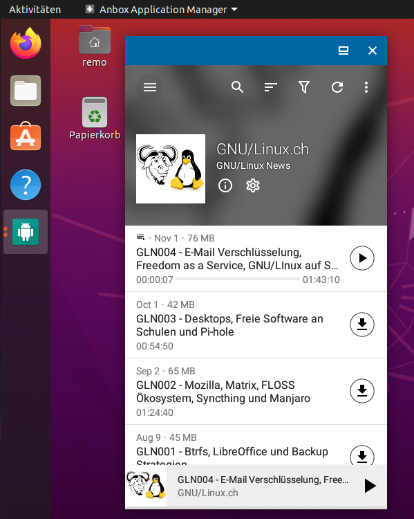

# Anbox - Android Apps auf GNU/Linux
[Anbox](https://anbox.io/) ermöglicht es, Android Apps auf deinem GNU/Linux System auszuführen. Dazu packt Anbox das Android Betriebssystem in einen Container, abstrahiert den Hardwarezugriff und integriert zentrale Systemdienste in ein GNU/Linux System. Jede Android Anwendung wird wie jede andere native Anwendung in das Betriebssystem integriert.
Um das zu erreichen, verwendet Anbox Standard Linux Technologien wie Container (LXC), um das Android Betriebssystem vom Host zu trennen. Jede Androidversion ist für diesen Ansatz geeignet, und die Macher von Anbox versuchen, mit der neuesten verfügbaren Version des Android Open Source Project Schritt zu halten. 


Die folgenden Funktionen bietet Anbox:

* Open Source - Der gesamte Quellcode ist als Open Source verfügbar und unter den Bedingungen der Apache- und GPLv3-Lizenz lizenziert.
* Keine Einschränkungen - Da auf Anbox ein ganzes Android System läuft, kann konzeptionell jede Anwendung ausgeführt werden.
* Sicher - Anbox packt Android Anwendungen in eine dicht verschlossene Box ohne direkten Zugriff auf die Hardware oder deine Daten.
* Performant - Anbox läuft mit Android ohne Hardware Virtualisierung und überbrückt nahtlos die Funktionen zur Hardwarebeschleunigung.
* Integriert - Enge Integration mit dem Host Betriebssystem, um eine reichhaltige Funktionspalette zu bieten.
* Konvergent - Anbox skaliert über verschiedene Formfaktoren hinweg ähnlich wie Android. Sie funktioniert auf einem Laptop und einem Mobiltelefon.

## Installation
Die [Installation](https://docs.anbox.io/userguide/install.html#install-the-anbox-snap) von Anbox auf einem normalen Linux System ist einfach und unkompliziert, solange das System Snaps unterstützt. Aus diesem Grund habe ich Anbox in einer Ubuntu 20.04 VM (mit [GNOME Boxes](https://gnulinux.ch/manjaro-in-gnome-boxes-ausprobiert)) ausprobiert da ich Fedora nutzte und normalerweise keine Snaps verwende.

```
sudo snap install --devmode --beta anbox
```
## Apps installieren
Um Apps in den von Anbox bereitgestellten Android Container zu [installieren](https://docs.anbox.io/userguide/install_apps.html) wird derzeit die Sideloading Funktionalität verwendet, die Android zur Verfügung stellt. Dazu muss die Android Debug Bridge (ADB) auf dem Host-System installiert werden.

```
sudo apt install android-tools-adb
```

Sobald ADB installiert ist, sind wir bereit, Android Apps zu installieren.

Anbox bietet keine Funktionalität um Android Apps herunterzuladen. Man muss sie von einer anderen Quelle im Internet herunterladen. Viele Open-Source-Projekte bieten auf den Projektseiten eine APK Datei zum Download an. Auf der Website von [F-Droid](https://f-droid.org/) können auch alle Anwendungen als APK heruntergeladen werden.
Sobald man das APK Paket hat, kann mit dem folgenden Befehl die App in den Android Container installieren:

```
adb install antennapod.apk
```
## Anwendungen starten
Nun kann über das Anwendungsmenu von Betriebssystem Anbox gestartet werden.


Sobald Anbox offen ist, kann die zuvor installierte App geöffnet werden.



