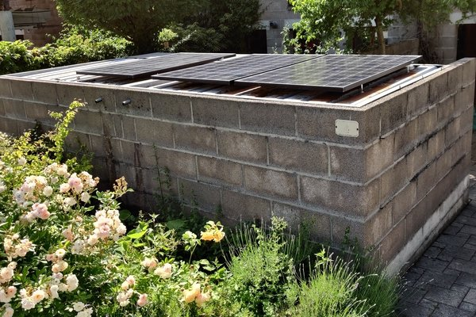
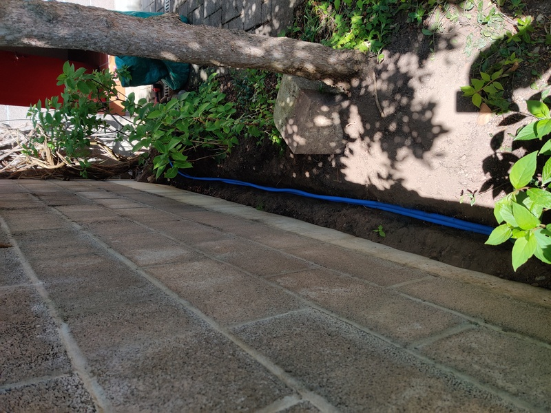
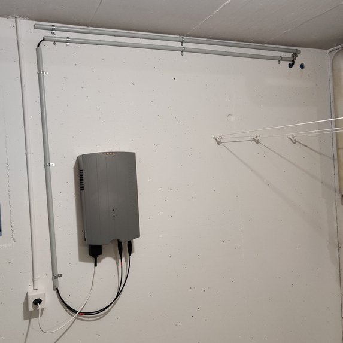
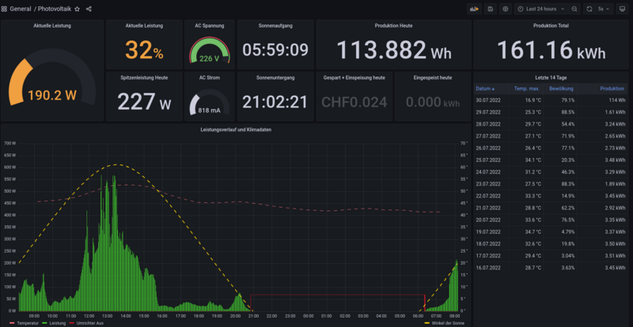

# Plug-&-Play-Photovoltaikanlagen 
Vor einiger Zeit wurde im Talk über die Energiekrise und den Mangel an Gas, Öl und Strom im nächsten Winter gesprochen.
Das hat mich motiviert, euch kurz über Plug-&-Play-Photovoltaikanlagen zu informieren und euch meine Anlage vorzustellen. 

Ganz im Sinne der [Hackethik](https://www.ccc.de/de/hackerethik), Misstraue Autoritäten – fördere Dezentralisierung, passt das Thema auch gut zur freien Gesellschaft und zu unserer Community. Natürlich wird Open Source Software benutze.

## Was ist eine Plug-&-Play-Photovoltaikanlagen?
Eine Plug-&-Play-Photovoltaikanlage, dies ist die offizielle Bezeichnung des Eidgenössischen Starkstrominspektorat (ETSI), ist eine steckbare Photovoltaikanlage zur dezentralen Energieeinspeisung in das elektrische Netz. Im Internet findet sich auch häufig die Bezeichnung Balkonsolaranlage oder Guerilla-Solaranlage. Diese Anlagen sind netzgekoppelt, wie die allermeisten Photovoltaikanlage, und können nicht als Inselanlage, z.B. für Notstrom, betrieben werden. Grundsätzlich könnte man seine Balkonsolaranlage auch mit einem Stromspeicher betreiben. Die Wirtschaftlichkeit ist dann aber sehr fragwürdig.

## Normative Anforderungen
In der Ausgabe [No. 148 2020 von CHECK Das Magazin des VSEK](https://www.vsek.ch/download/download/VSEK_CHECK_148_web.pdf) auf der Seite 31 gibt es einen sehr guten Artikel und auch das [Papier vom ETSI bezüglich Steckbare Photovoltaikanlagen](https://www.esti.admin.ch/inhalte/pdf/MUB/Deutsch/Mitteilungen/2014_2013/2014-07_plug-play_d.pdf) geben sehr genaue Auskünfte  zu den technischen und normativen Anforderungen in der Schweiz.

Kurz zusammengefasst müssen folgende Punkte beachtet werden:
- Maximal 600 W AC Leistung (auch eine Abriegelung auf dem Wechselrichter ist zulässig)
- Für die PV-Anlage muss eine Konformitätserklärung vorhanden sein
- Es muss eine Fehlerstrom-Schutzeinrichtung (PRCD, Typ B, 30 mA) oder allstromsensitive Fehlerstrom-Überwachungseinheit (RCMU) im Wechselrichter vorhanden sein (IEC / EN 62109-1 / -2 sowie VDE-AR-N 4105)
- Es muss ein frei steckbares Erzeugnis im Sinne der NEV sein

Sind alle Anforderungen erfüllt, ist die Betreiberin verpflichtet, die Balkonsolaranlage der Netzbetreiberin schriftlich zu melden. Die Netzbetreiberin darf die Anlage nicht verbieten. Ich habe eine kurze Meldung verfasst, mit den Angaben zu meinem Hausanschluss sowie den Datenblättern und Konformitätserklärungen der Komponenten. Anschliessend musste ich noch ein technisches Anschlussgesuch (TAG) ausfüllen, was eigentlich nicht vorgeschrieben wäre, und der Betrieb wurde abgesegnet. Danke dem TAG, gibt es aber bei uns in der Gemeinde auch für Plug-&-Play-Photovoltaikanlagen eine Einspeisevergütung.

## Technik
Aus Sicht der Nachhaltigkeit war es mir wichtig, so viele Secondhand Komponenten wie möglich zu verwenden. Über die bekannten Internetauktionshäuser und Handelsplattformen in der Schweiz sowie von einem lokalen Solarteure habe ich die Solarpanels und den Wechselrichter gekauft. Das Kleinmaterial habe ich über meinen Arbeitgeber beim Elektrogrosshandel erstanden. 

- 3 x 280 W Monokristalline Solarmodule (20.- CHF)
- Mastervolt SOLADIN 1000 WEB (200.- CHF)
- Kleinmaterial wie Kabel, Stecker, etc. (100.- CHF)
- Shelly Plus1PM (20.- CHF)

Im Vergleich zu komplett fertigen Balkonsolaranlagen aus dem Fachhandel, könnte ich meine Komponenten sehr günstig erstehen.

## Installation
Da ich eine elektrotechnische Ausbildung abgeschlossen habe, bin ich imstande solche Installationen selbst zu machen. Alle Installationen am Stromnetz oder bei hohen Spannungen an der Gleichstromseite sollten immer von Fachpersonal gemacht werden. Es besteht Lebensgefahr! Wenn keine Fachkenntnisse vorhanden sind, sollte eine steck-fertige Anlage aus dem Fachhandel gekauft werden.

Auf der Südseite unseres Hauses haben wir ein Velohäuschen das fast den ganzen Tag gut besonnt ist. Ich habe mich dazu entschieden, die Solarmodule flach auf das Dach zu legen, da dies mit sehr wenig Aufwand verbunden war. Das Dach hat eine Neigung von ca. 5°, damit das Regenwasser abfliessen kann. Da es leider kein Stromanschluss im Velohäuschen gab, mussten wir noch Installationsrohre verlegen.

Den Wechselrichter musste ich bei 600 W Ausgangsleistung abriegeln, damit ich die normativen Anforderungen erfülle. Allerdings bringen die 10 Jahre alten Solarmodule mit insgesamt 840 W auch nur selten mehr als die erlaubten 600 W Leistung.

## Monitoring
Der Wechselrichter ist von Hause aus WLAN-fähig und konnte seine Messdaten an ein Solarportal der Herstellerin senden. Allerdings wurde dieses Solarportal vor ein paar Jahren eingestellt. Der Wechselrichter bietet sonst keine andere Möglichkeit die Prozessdaten abzurufen! Das ist wieder einmal ein Negativbeispiel für ein [Vendor-lock-in](https://de.wikipedia.org/wiki/Lock-in-Effekt). Zum Glück lässt sich der Wechselrichter auch ohne die Cloud der Herstellerin betreiben.

Natürlich interessieren mich aber die Leistungsdaten der PV-Anlage. Als günstige und einfache Lösung bin ich auf die Geräte von Shelly gestossen. Auf diese könnte auch eine freie Firmware geflasht werden. Darauf habe ich aus Zeitgründen verzichtet. Die Geräte sprechen aber von Hause aus [MQTT](https://de.wikipedia.org/wiki/MQTT) und können ohne Cloud im lokalen Netzwerk betrieben werden. Da ich sowieso schon einen Stack für diverse Monitorings betreibe ([InfluxDB](https://de.wikipedia.org/wiki/InfluxDB), [Telegraf](https://www.influxdata.com/time-series-platform/telegraf/), [Mosquitto](https://wiki.eclipse.org/Mosquitto) und [Grafana](https://de.wikipedia.org/wiki/Grafana)) habe ich das ganze auch mit integriert und ein Dashboard dazu gebaut. Auf dem Dashboard sind die Leistungsdaten, Wetterinformation sowie einige Berechnungen ersichtlich.

## Fazit
Bis Dato haben wir 48 Betriebstage und durchschnittlich 3.35 kWh pro Tag produziert. Das deckt ca. 30 bis 50 % von unsrem Tagesbedarf. Während der Sonnenstunden wird die Grundlast von ca. 150 W problemlos gedeckt. Während den Mittags- und Nachmittagsstunden bei moderaten Temperaturen werden die 600 W locker erreicht. Wir haben unser Verhalten dahin angepasst, dass wir zu den Spitzenleistungszeiten die Grossverbraucher wie die Waschmaschine oder Geschirrwaschautomat einschalten. So kann der Eigenverbrauch optimiert werden. Dadurch dass ich drei Solarmodule verwende und eine recht grosse Fläche habe, ist der Ertrag auch bei diffusen Lichtverhältnissen ziemlich gut. Das bring bei schlechten Wetterverhältnissen ein Vorteil.

Als Hausbesitzer, sofern es die finanziellen Verhältnisse zulassen, sollte eigentlich eine grosse Photovoltaikanlage auf dem Dach installiert werden. Und zwar auf so viel Fläche wie möglich. Ist dies aber nicht möglich, ist eine Balkonsolaranlage ein günstiger und auch für Mieter machbarer Beitrag zur Energiewende. Ich bin der Meinung, dass jede kWh aus erneuerbaren Energien zählt!

Da ich alles selbst zusammengebaut habe und sehr günstig an meine Komponenten gekommen bin, rechne ich mit einer Amortisation nach bereit zwei bis drei Jahren.
