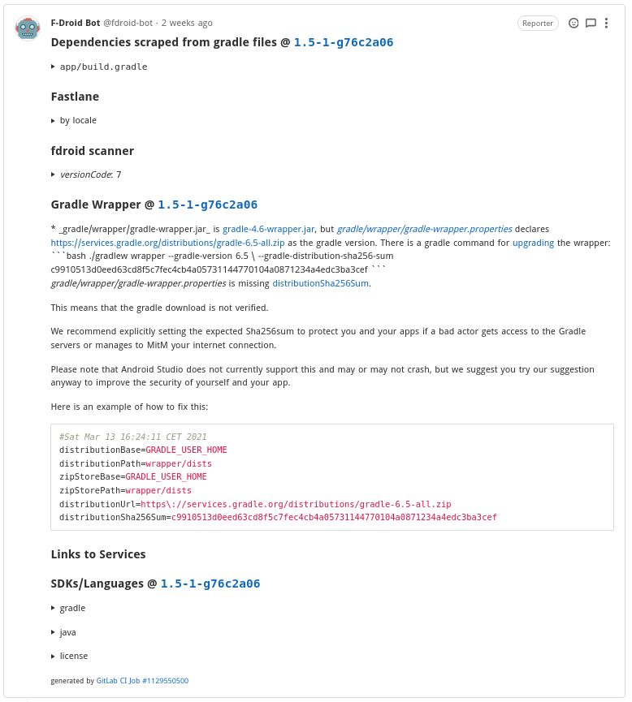

# Wie du eine App bei F-Droid veröffentlichst

In meinem [letzten Artikel]() habe ich kurz meine erste Android-App [Headi](https://f-droid.org/de/packages/com.headi.app/) vorgestellt. Als ich im Redaktionsteam von meiner App erzählte, hat mich Ulf auf die spannenden Artikel von [Izzy](https://www.izzysoft.de/izzy), ein Maintainer von F-Droid und Betreiber des [IzzyOnDroid](https://apt.izzysoft.de/fdroid/) Repo's, aufmerksam gemacht. In diesem Artikel möchte ich kurz meine Erfahrung mit dem Veröffentlichen meiner App und einen Leitfaden dazu mit euch Teilen.

## Erste Schritte
Ehrlich gesagt, es war nicht gerade einfach, die Prozesse hinter F-Droid zu durchschauen. Es ist zwar viel [Dokumentation](https://f-droid.org/de/docs/) vorhanden, aber es war für mich nicht gerade verständlich und bei vielem hatte ich das Gefühl, es sei veraltet. Da hat mir der Artikel ["F-Droid für fortgeschrittene Anwender und für Entwickler"](https://android.izzysoft.de/articles/named/fdroid-intro-2?lang=de) insbesondere der Abschnitt ["Für Entwickler: Prozess der Integration einer App in F-Droid"](https://android.izzysoft.de/articles/named/fdroid-intro-2?lang=de#rfp) von Izzy sehr geholfen.

Als Erstes sollte man sicherstellen, dass die App die Veröffentlicht werden soll, die folgenden [Aufnahmekriterien](https://f-droid.org/de/docs/Inclusion_Policy/) erfüllt. F-Droid formuliert es so (es was gekürzt und übersetzt):

>Anmerkung:
>
>* Wir können keine Apps mit Googles proprietären "Play-Services" bauen. 
>* Wir können keine Apps bauen, die proprietäre Tracking Analyse-Abhängigkeiten wie Crashlytics und Firebase verwenden.
>* Wir können keine Apps mit proprietären Werbebibliotheken bauen. Wir haben nichts gegen Werbung (siehe [AntiFeatures](https://f-droid.org/wiki/page/AntiFeatures)), aber sie muss auf eine FLOSS-kompatible Weise bereitgestellt werden.
>* Wir können keine Anwendungen bauen, die Non-Free-Buildtools benötigen, einschliesslich Oracles JDK oder einige Pre-Release-Toolchains.
>
>Zusätzlich:
>
>* Der Quellcode der Anwendung muss in einem öffentlich zugänglichen Versionskontrollsystem gepflegt werden.
>* Die Software sollte keine zusätzlichen ausführbaren Binärdateien herunterladen.
>* Die Software sollte ihre eigene eindeutige Android-Paket-ID verwenden. 
>* Obwohl es nicht ideal ist, können "nicht-funktionale" Assets (z.B. Artworks) unter weniger freizügigen Lizenzen als funktionaler Code akzeptiert werden.
>* Markenzeichen dürfen nicht verletzt werden, und alle anderen rechtlichen Anforderungen müssen beachtet werden.
>* F-Droid nimmt keine API-Schlüssel an.
>* Binäre Abhängigkeiten wie JAR-Dateien müssen durch quellbasierte Versionen ersetzt oder aus einem vertrauenswürdigen Repository verwendet werden.
>
>Idealerweise:
>
>* Releases sollten eindeutig gekennzeichnet sein.

Hier möchte ich auch noch auf die [Zusammenfassung der Aufnahmekriterien](https://android.izzysoft.de/articles/named/fdroid-intro-2?lang=de#acceptance) von Izzy verweisen, da diese etwas einfacher Verständlich sind.

## Request for Packaging
Wenn die App die du veröffentlichen willst, die obigen Aufnahmekriterien erfüllt, kannst du ein "Request for Packaging" (Anfrage für's Paketieren) erstellen. Es ist nämlich so, dass F-Droid alle App's die im Store erhältlich sind, aus dem Quellcode selbst kompiliert und danach Signiert. Beim Google Play Store hingegen, kompiliert und signiert der Entwickler seine App selbst. Der Antrag dient dazu, dass einerseits ein Mitglied des F-Droid Teams die App überprüfen kann und andererseits aus den Angaben eine Metadaten-Datei zu der App erstellt werden kann. Diese Metadaten-Datei wird im später für das Erstellen der App benötigt.

Bei der "Anfrage für's Paketieren" muss im Repo "Request for Packaging" ein neues [Issue](https://gitlab.com/fdroid/rfp/-/issues) eröffnet werden. Dazu muss die vorhandene Vorlage vollständig ausgefüllt werden.

Nachdem die "Anfrage für's Paketieren" gespeichert wurde, kommt binnen Stunden der F-Droid Bot vorbei und prüft die Angaben. Dazu durchkämmt er den Source Code der App und teilt seine Ergebnis als Beitrag im eröffneten Issue.

Falls es Probleme gibt, sind diese im Bericht vom F-Droid Bot zu sehen. Nachdem der Bot seinen Arbeit verrichtet hat, setzt sich ein freundliches Teammitglied von F-Droid mit dir in Verbindung und hilft allfällige Probleme zu beheben und beantwortet Fragen.

Der ganze Verlauf zum [Issue #1680](https://gitlab.com/fdroid/rfp/-/issues/1680) meiner App kann natürlich eingesehen werden.

**Tipp: Damit du zukünftig die Beschreibungen und Screenshots deiner App einfach selbst ändern kannst, sollte du von Beginn an die [Fastlane](https://gitlab.com/snippets/1895688) Struktur in deinem Projekt pflegen.**

## Metadaten-Datei
Bei der Metadaten-Datei handelt es sich um eine `yml` Datei, die, wie der Name schon sagt, Metainformation wie Autor und Lizenz zu der App enthält. Der Build-Server von F-Droid versucht in jedem Build-Zyklus für jede Metadaten-Datei die entsprechende App zu erstellen, falls es eine neue Version gibt.

Sind allfällige Probleme behoben und alle Daten vorhanden, erstellt ein Teammitglied von F-Droid die Metadaten-Datei zu deiner App. Dabei prüft er auch, ob die App erstellt werden kann und sie wird auf einem Gerät getestet.

Im [merge request #8684](https://gitlab.com/fdroid/fdroiddata/-/merge_requests/8684) ist schön zu sehen, was im Hintergrund passiert ist:

1. Ein merge request für die [Metadaten-Datei](https://gitlab.com/fdroid/fdroiddata/-/merge_requests/8684/diffs) wurde eröffnet
2. Der F-Droid Bot lief nochmals durch
3. Das Teammitglied von F-Droid hat die [verwendeten Bibliotheken](https://gitlab.com/fdroid/fdroiddata/-/merge_requests/8684#note_539399574) überprüft und die benötigten Berechtigungen.
4. Die App wurde auf einem Gerät überprüft. Auch wurde überprüft, ob die App [Netzwerkverkehr](https://gitlab.com/fdroid/fdroiddata/-/merge_requests/8684#note_539406967) hat.

Sobald die Metadaten-Datei in das [Data Repo](https://gitlab.com/fdroid/fdroiddata) gemerged wurde, wird die App beim nächsten Build-Zyklus erstellt und in den Index aufgenommen.

Wie man bei diesem transparenten Prozess sehr gut sieht, wird jede App sehr genau überprüft. Schadsoftware wird es hier schwierig haben.

## Erstellen und veröffentlichen der App
Nun wartet man natürlich ungeduldig bis seine App im F-Droid Store erscheint.