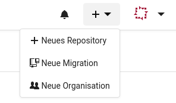
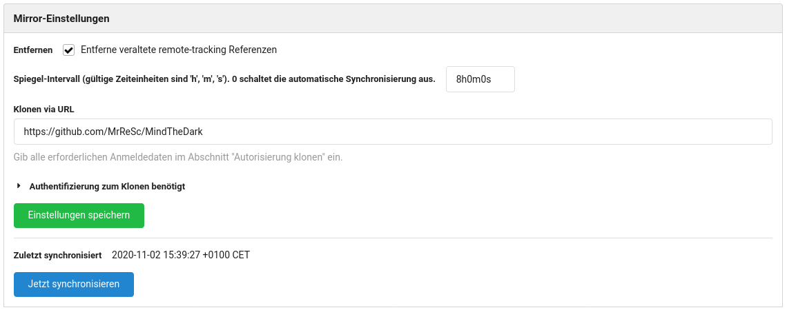

# GitHub Repositories zum selbst gehostetem Gitea spiegeln
Wie man am Beispiel von `youtube-dl` gesehen hat, kann es sehr schnell gehen und der eigene Zugang zu einem Dienstanbieter wird gesperrt. Ich habe dies als Anlass genommen um von meinem GitHub Repositories ein Backup anzulegen.


Zuerst wollte ich mit GitHub [Actions](https://github.com/features/actions) und [Git Sync](https://github.com/wei/git-sync) bei jedem neuen `push` das ganze Repository zu einem anderen Hoster synchronisieren. Das hat grundsätzlich auch funktioniert. Allerdings sollte man dann aus Sicherheitsgründen für jedes neue Repository ein neues [Schlüsselpaar](https://de.wikipedia.org/wiki/Asymmetrisches_Kryptosystem) erstellen und man muss die Actions einrichten. Diese Lösung hat zusätzlich den grossen Nachteil, dass GitHub theoretisch auch Kontrolle über das gespiegelte Repository hat, da der Private-Key bei GitHub liegt. Somit wäre ein Verfahren, das nach einem Pull-Prinzip funktioniert eleganter.

Bei meiner Recherche habe ich herausgefunden, dass [Gitea](https://gitea.io/en-us/) genau diese Funktionalität hat. Just am selben Tag wurde in [Binärgewitter Talk #264](https://blog.binaergewitter.de/2020/10/29/binaergewitter-talk-number-264-das-python2-von-php/) genau das angesprochen.

## Gitea selbst hosten
Das selbst Hosten bringt zusätzlich den Vorteil, dass alle Daten auch in meinen automatischen Backups enthalten sind.

Ich möchte meine Gitea Instanz nur in meinem lokalen Netzwerk verfügbar machen. Ich arbeite weiterhin mit GitHub. Somit muss ich mich nicht um die Sicherheit kümmern, da alles hinter der Firewall läuft.

Ich habe Gitea als Docker Container laufen. Gitea stellt eine einfache [Anleitung](https://docs.gitea.io/en-us/install-with-docker/) zur Verfügung. Ich habe mich für die [Basis](https://docs.gitea.io/en-us/install-with-docker/#basics) Variante entschieden. Somit ist keine zusätzliche Datenbank nötig, es wird eine `SQLlite3` Datenbank verwendet.

Mit der folgenden `docker-compose.yml` Datei läuft die Gitea Instanz in wenigen Sekunden.

```
version: "3"

networks:
  gitea:
    external: false

services:
  server:
    image: gitea/gitea:1
    container_name: Gitea
    environment:
      - USER_UID=1000
      - USER_GID=1000
    restart: always
    networks:
      - gitea
    volumes:
      - ./data:/data
      - /etc/TZ:/etc/timezone:ro
      - /etc/localtime:/etc/localtime:ro
    ports:
      - "3000:3000"
      - "222:22"
```
Nun kann das Webinterface aufgerufen (`http://IP-ADRESSE:3000`) und die Grundeinstellungen gemacht werden.

## Repository spiegeln
Im Webinterface kann nun oben rechts mittels dem `+` Symbol ein Repository migriert werden.



Nachdem das Quellen Repository eingegeben wurde ist es wichtig, dass beim `Mirgrationstyp` der Haken gesetzt wird.


Nachdem die Migration abgeschlossen ist, war's das eigentlich schon. In den Einstellungen ist ersichtlich, dass das Spiegeln alle zehn Minuten ausgeführt wird.



