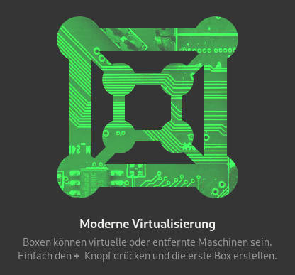

# Manjaro in Gnome Boxes ausprobieren

Ich bin langjähriger Fedora Benutzer, trotzdem ist es immer interessant mal eine andere Distro anzuschauen, weswegen ich mir nun Manjaro mit Gnome Boxes angeschaut habe.

Bei der Desktopumgebung Gnome, die Fedora standardmässig nutzt, ist das Programm [Gnome Boxes](https://wiki.gnome.org/Design/Apps/Boxes) (auf Deutsch "Gnome Boxen") dabei. Es kann als Remotedesktop Client benutzt werden oder um virtuelle Maschinen (VM) zu verwalten. Für die virtuellen Maschinen wird im Hintergrund [QEMU](https://en.wikipedia.org/wiki/QEMU), [KVM](https://en.wikipedia.org/wiki/Kernel-based_Virtual_Machine), und [libvirt](https://en.wikipedia.org/wiki/Libvirt) verwendet.

## VM erstellen
Gnome Boxes bietet die Möglichkeit, direkt ISO’s herunterzuladen. Natürlich kann man auch eine beliebige ISO Datei verwenden.

Dadurch ist das herunterladen, zuweisen der Ressourcen und starten der Live Version binnen Minuten erledigt. Vorausgesetzt, man hat eine gute und stabile Internetverbindung.

## Eigenschaften der VM bearbeiten
In der neusten Version von Gnome Boxes 3.38 ist es möglich, auch das XML mit der `libvirt` Konfiguration zu bearbeiten. So kann das ganze Potenzial der Virtualisierung ausgeschöpft werden. Dies ist allerdings für einen Distro Test nicht wirklich notwendig.

