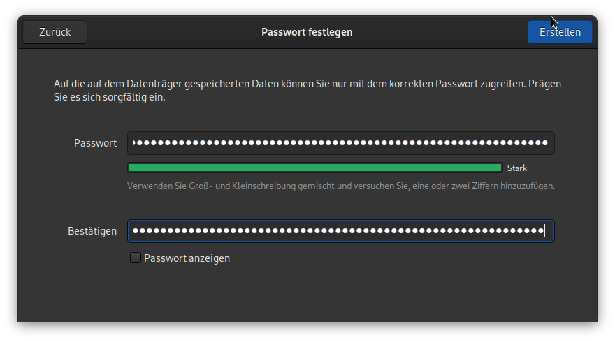

# USB Datenträger - Frühlingsputz mit GNOME Disks
Während den letzten zwei Dekaden haben sich einige USB-Sticks und SD Karten in unserem Haushalt gesammelt. Allerdings hat die Benutzung dieser in den letzten Jahren stark abgenommen. Nun war es an der Zeit, die nicht mehr benötigten Speichermedien, dem Elektrorecycling zuzuführen.
Da ich aber keinesfalls möchte, das jemand ohne Forensik Kenntnisse allfällige Daten auf den Speichermedien wieder herstellen kann, wollte ich alle Speichermedien sicher löschen. Als Entscheidungshilfe welche der USB-Stick ich behalten möchte, wollte ich auch die Lese- und Schreibleistung der USB-Sticks messen.


## GNOME Disks 
Nach kurzer Recherche hat sich herausgestellt, dass das Programm [GNOME Disks](https://de.wikipedia.org/wiki/Gnome_Disks) (deutsch Laufwerke), alle meine Bedürfnisse erfüllt und es auf meinem System (Fedora 33) schon installiert ist. GNOME Disks (`gnome-disk-utility`) ist bei den meisten GNOME basierenden Desktop Umgebungen schon standardmässig mit dabei.

### Lese- und Schreibleistung messen
Die Lese- und Schreibleistung von USB-Sticks und SD Karten können sehr stark variieren. Dies ist von verschieden Faktoren abhängig. Mit GNOME Disks kann die Lese- und Schreibleistung sehr einfach gemessen werden. Dazu muss das entsprechende Laufwerk ausgewählt werden und über das Menü kann der Leistungstest gestartet werden.
Ich habe dazu die Standardeinstellungen verwendet und die Resultate aufgeschrieben.


### Speichermedien sicher löschen
Ich bin kein Experte was [Dateisysteme](https://de.wikipedia.org/wiki/Dateisystem) und die Speicherung von Daten anbelangt. Grundsätzlich ist es aber so, dass Dateisysteme einen Index pflegen, in dem verzeichnet wird, wo welche Dateien auf dem Datenträger gespeichert sind. Wenn nun eine Datei gelöscht wird, wird einfach der Eintrag im Index gelöscht und der Speicherplatz kann von neuen Daten überschrieben werden. Solange das aber nicht geschehen ist, ist die gelöschte Datei noch vorhanden aber das Betriebssystem kann sie nicht mehr finden.

Um das zu testen, habe ich ein USB-Stick mit GNOME Disks mit der Einstellung `Schnell` formatiert. Dazu muss das entsprechende Laufwerk ausgewählt werden und über das Menü kann das Laufwerk formatiert werden.


Danach konnte ich mit [photorec](https://de.wikipedia.org/wiki/PhotoRec) (`dnf install testdisk `) die Daten problemlos wiederherstellen. Das Betriebssystem und somit der Benutzer konnten die Dateien allerdings nicht mehr sehen.

```
PhotoRec 7.1, Data Recovery Utility, July 2019
Christophe GRENIER <grenier@cgsecurity.org>
https://www.cgsecurity.org

Disk /dev/sda1 - 8052 MB / 7679 MiB (RO) - IS917 innostor
     Partition                  Start        End    Size in sectors
   P FAT32                    0   0  1  1022 198 44   15726592

Destination /home/remo/Downloads/photorec/recup_dir

Pass 1 - Reading sector    4723456/15726592, 542 files found
Elapsed time 0h00m24s - Estimated time to completion 0h00m55
tx?: 271 recovered
exe: 172 recovered
ttf: 40 recovered
txt: 39 recovered
png: 15 recovered
reg: 2 recovered
bmp: 1 recovered
gif: 1 recovered
wim: 1 recovered
```

Dasselbe vorgehen habe ich mit der Einstellung `Langsam` wiederholt. Das Formatieren dauert natürlich viel länger, da der ganze Datenträger mit Nullen überschrieben wird.


Nun konnte ich mit `photorec` keine Dateien wiederherstellen.

```
PhotoRec 7.1, Data Recovery Utility, July 2019
Christophe GRENIER <grenier@cgsecurity.org>
https://www.cgsecurity.org

Disk /dev/sda1 - 8052 MB / 7679 MiB (RO) - IS917 innostor
     Partition                  Start        End    Size in sectors
   P FAT32                    0   0  1  1022 198 44   15726592


0 files saved in /home/remo/Downloads/photorec/recup_dir directory.
Recovery completed.
```

## Verschlüsselung
Die meisten meiner Datenträger sind verschlüsselt. Dadurch entfällt die Datenschutz-Problematik, wenn der Datenträger nicht mehr in meinem Besitz ist. Durch die Verschlüsselung sind die Daten so gut geschützt, dass sie nicht wieder hergestellt werden können ohne den passenden Schlüssel. Das Verschlüsseln von z. B. USB-Stick kann auch mit GNOME Disks gemacht werden. Beim Formatieren des Laufwerks kann die entsprechende Option ausgewählt werden.




Wenn nun das Laufwerk eingehängt wird, muss das Passwort eingegeben werden.

