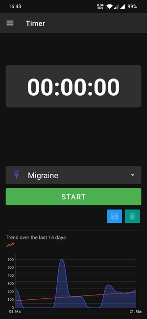
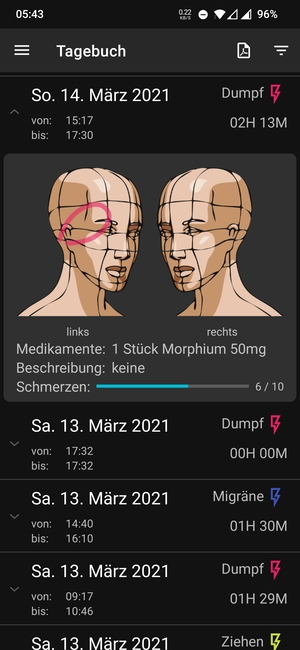
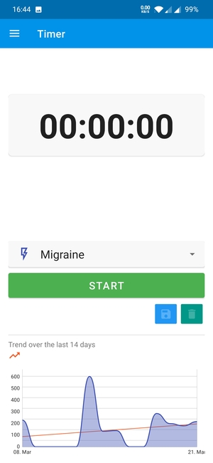
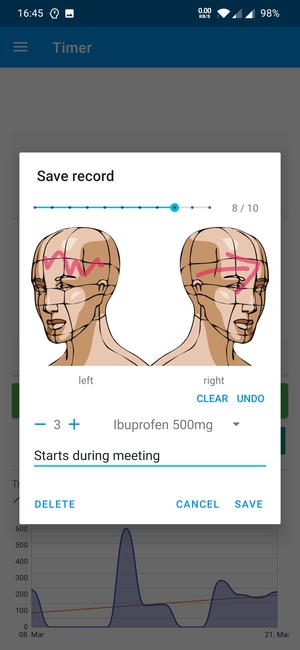
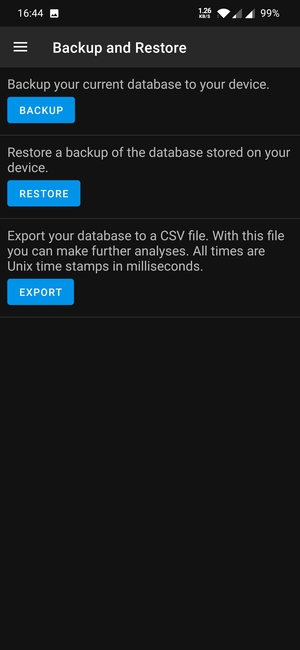

# Headi - Aufruf zum Testen

In den letzten zwei Monaten habe ich neben Arbeit und Familie meine erste Android-App gebaut. 

Headi (Headache Diary) ist eine App um Kopfschmerzen zu protokollieren. Da es sich dabei um sehr sensible Daten handelt, werden keine Daten an irgendwelche Cloud-Dienste übertragen. Alle Daten werden nur lokal gespeichert. Headi benötigt auch keine Berechtigungen. Headi bietet eine einfache Analyse der aufgezeichneten Daten. Die Aufzeichnungen können auch als CSV-Datei zur weiteren Analyse der Daten exportieren. Um ein Backup zu erstellen, kann die ganze Datenbank exportiert werden.

Ich habe die App, dank wertvollen Tipps einiger Redakteure, im F-Droid Store veröffentlicht. Allerdings ist die App noch nicht vollständig getestet. Auch gibt es sie erst in deutscher und englischer Sprache.

Es wäre schön, wenn einige von euch die App Installieren würden, und die Funktionen durchtesten. Feedback und Bug Reports können auf der GitHub Projektseite [https://github.com/MrReSc/Headi](https://github.com/MrReSc/Headi) hinterlassen werden.

## Beitragen
Headi ist ein Open-Source-Projekt. Die App steht unter der `MIT` Lizenz. Wenn du auch etwas dazu beitragen wills, würde ich mich sehr darüber freuen. Folgend findest du einige Ideen, was du beitragen könntest:

* Headi braucht noch Übersetzungen. Du kannst helfen, Headi in deine Sprache zu übersetzen. Alles, was du tun musst, ist, einen Account bei [Crowdin](https://crwd.in/headi) zu erstellen und die Texte zu übersetzen.
* Weitere Analysen der Daten in der App wären sinnvoll. Wenn du Ideen hast, teile diese doch mit mir. Wenn du programmieren kannst, kannst du sie implementieren.
* Es gibt noch einiges Potenzial, um das Design zu verbessern.
* Wenn du gut zeichnen kannst, wären schönere Bilder für die Regionen auf dem Kopf sehr willkommen.
* Eine Exportfunktion des Tagebuchs in ein PDF, das für den Arztbesuch genutzt werden kann, wäre auch eine gute Funktion.
* Es sind auch noch keine Unit-Tests implementiert worden. Wenn du gerne Tests programmierst, würde ich mich über diese freuen.
* Mit GitHub Actions könnte man CI/CD implementieren. Das wäre auch toll.

## Screenshots

  
    &nbsp; &nbsp; &nbsp; &nbsp;
  
    &nbsp; &nbsp; &nbsp; &nbsp;
  

  
    &nbsp; &nbsp; &nbsp; &nbsp;
  
    &nbsp; &nbsp; &nbsp; &nbsp;
  

  
    &nbsp; &nbsp; &nbsp; &nbsp;
  

