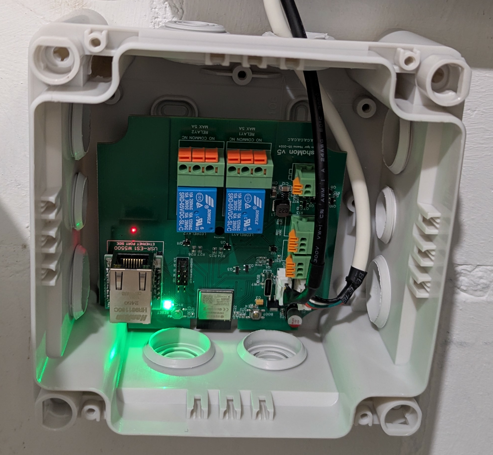

# Wärmepumpen-Steuerung – ganz ohne Cloud

Wie im Ausblick [einer meiner letzten Artikel](https://gnulinux.ch/frei-energie-ganz-ohne-esoterik) angekündigt, haben wir inzwischen unsere alte Gasheizung durch eine Luft-Wasser-Wärmepumpe ersetzt. Bei der Umsetzung war mir besonders wichtig, die Anlage lokal ohne Cloud-Anbindung überwachen und steuern zu können. Daher suchte ich gezielt nach einer Wärmepumpe, die sich in Home Assistant integrieren lässt. Meine Wahl fiel auf eine Panasonic Aquarea der Generation L. Nicht zuletzt, weil es mit dem Open-Source-Projekt [HeishaMon](https://github.com/Egyras/HeishaMon) eine Möglichkeit gibt, diese Geräte lokal auszulesen und zu regeln. In diesem Erfahrungsbericht zeige ich, wie ich die Wärmepumpe mit HeishaMon in Betrieb genommen habe und welche Vorteile mir die Integration ins heimische Netzwerk bringt.

## HeishaMon: Wärmepumpe lokal auslesen und steuern

Panasonic bietet für die Aquarea-Reihe zwar eine eigene Cloud-Lösung ("Comfort Cloud") an, doch ein Cloud-Zwang kam für mich nicht infrage. HeishaMon ist eine freie Alternative, welche die interne Schnittstelle der Panasonic-Wärmepumpe nutzt, um alle Daten lokal bereitzustellen. Das HeishaMon-Projekt hat die proprietäre Protokollkommunikation der Aquarea H/J/K/L-Serien Reverse-Engineered und stellt diese Informationen über MQTT und JSON/HTTP im lokalen Netzwerk zur Verfügung. Dadurch lassen sich sämtliche Sensorwerte der Wärmepumpe (Temperaturen, Betriebszustände, Drücke etc.) in Echtzeit auslesen und sogar Steuerbefehle senden. 
Zusätzlich bietet HeishaMon die Möglichkeit, einen S0-Zähler anzuschliessen, um den Stromverbrauch oder die Wärmeabgabe präzise zu messen. Mit HeishaMon ersetzt man praktisch das originale Internet-Modul von Panasonic durch eine eigene, offene Lösung.

Die Wärmepumpe liefert über die interne Schnittstelle auch Spannung (5 V), um ein kleines Mikrocontroller-Modul direkt zu speisen. HeishaMon läuft typischerweise auf einem ESP8266/ESP32-basierten Board. Ich habe mich dieses Mal entschieden, kein eigenes Board zu löten, sondern die empfohlene Hardware fertig zu kaufen. Fündig wurde ich beim Entwickler [TheHogNL](https://www.tindie.com/products/thehognl/heishamon-communication-pcb/), der eine fertige HeishaMon-Platine inklusive Pegelwandler anbietet. Dieses Board wurde direkt mit der aktuellen Firmware geliefert.

## Installation: In 30 Minuten einsatzbereit

Die Inbetriebnahme von HeishaMon war erfreulich unkompliziert. Zunächst verbindet man das kleine Board über ein mitbestelltes Kabel mit der Wärmepumpe. In meinem Fall musste ich lediglich den Stecker am Kommunikationsport der Aquarea einstecken. Nach dem Einschalten spannt HeishaMon ein temporäres WLAN auf, mit dem man sich zur Konfiguration verbindet. Über die Weboberfläche auf '192.168.4.1' habe ich anschliessend mein WLAN und die MQTT-Broker-Daten eingetragen. Das war schon alles.Wenige Augenblicke später begann das Modul, die ersten Daten der Heizung an meinen MQTT-Server zu senden. Die gesamte Installation dauerte kaum 30 Minuten.

Ein grosser Vorteil dieser Lösung ist, dass sie parallel zum Panasonic-System nutzbar ist. Wer also die offizielle Panasonic-App (CZ-TAW1-Modul) weiterverwenden möchte, kann HeishaMon auch im Listen-Only-Modus betreiben. Dabei hört HeishaMon nur passiv mit und greift nicht in die Steuerung ein. Ich persönlich habe jedoch komplett auf die eigene Lösung umgestellt und das Netzwerkkabel aus dem CZ-TAW1-Modul ausgesteckt.

## Integration in Home Assistant

Dank HeishaMon konnte ich meine Wärmepumpe nahtlos in Home Assistant einbinden. Über die [HeishaMon Integration](https://github.com/kamaradclimber/heishamon-homeassistant/) werden alle Sensorwerte und Einstellmöglichkeiten der Aquarea automatisch als Entitäten in Home Assistant angelegt. So bekomme ich z. B. Vorlauf- und Rücklauftemperaturen, Aussentemperatur, Betriebsmodus, Fehlermeldungen und viele weitere Datenpunkte übersichtlich angezeigt. Auch Steuerbefehle wie das Ändern der Soll-Temperatur oder das Aktivieren des Heiz-/Kühlmodus können nun direkt lokal gesendet werden.

Um die Performance der Wärmepumpe im Blick zu behalten, habe ich zusätzlich einen Wärmezähler und einen Stromzähler integriert. Der Wärmezähler (Kamstrup Multical 303) misst die abgegebene Wärmeenergie und funkt diese per Wireless M-Bus ins Netzwerk. Parallel erfasst ein Shelly Pro 3EM den Stromverbrauch der Wärmepumpe. Aus Wärmeabgabe und Stromaufnahme kann ich so live den COP (Coefficient of Performance) berechnen und nachvollziehen, wie effizient die Pumpe gerade arbeitet. Die genaue Einbindung des Multical 303 habe ich bereits in einem separaten [Artikel](https://gnulinux.ch/integration-des-multical-303-in-home-assistant-via-wireless-m-bus) beschrieben.

## Intelligente Heizungssteuerung mit PV-Anbindung

Mit allen Daten in Home Assistant lässt sich unsere Heizungssteuerung nun dynamisch an externe Faktoren anpassen. Ein zentrales Ziel ist es, möglichst viel Solarstrom direkt für Heizung/Kühlung zu nutzen, anstatt ihn einzuspeisen. Dafür habe ich mehrere Automatisierungen umgesetzt:

- **Sommer (Kühlbetrieb):** Die Kühlfunktion der Wärmepumpe wird nur aktiviert, wenn genügend Überschuss aus unserer PV-Anlage verfügbar ist und heisses Wetter bevorsteht. Die Vorlauftemperatur wird abhängig des Taupunktes geregelt. So bleibt das Haus angenehm kühl, ohne dass wir Netzstrom beziehen müssen. Bei aufziehendem Gewitter oder wolkigem Wetter schaltet sich die Kühlung automatisch ab.

- **Übergangszeit:** Im Frühling und Herbst nutze ich das Gebäude als thermischen Speicher. Überschüssiger Solarstrom wird gezielt in Wärme umgewandelt. Home Assistant hebt temporär die Raum-Solltemperatur leicht an, solange die PV-Anlage mehr liefert, als verbraucht wird. Die Betonmasse des Hauses speichert diese Wärme. Fällt die Sonne weg, kann die Heizung eine Weile aussetzen, ohne Komforteinbussen.

- **Winter:** In der kalten Jahreszeit läuft die Wärmepumpe hauptsächlich über Netzstrom. Allerdings gibt es selbst im Winter sonnige Tage mit viel PV-Leistung. Erkennt das System eine solche Phase, wird automatisch die Heizkurve geringfügig erhöht. Dadurch wird das Haus in den Sonnenstunden etwas stärker beheizt (wiederum als Wärmespeicher), und wir müssen abends und in der Nacht weniger zuheizen.

All diese Szenarien wären ohne lokale Datenhoheit kaum realisierbar. Proprietäre Cloud-Systeme bieten oft nur begrenzte Steuerungsmöglichkeiten und könnten Änderungen durch den Hersteller unterliegen. Mit meiner selbstgehosteten Lösung kann ich hingegen kreativ werden und die Wärmepumpe optimal auf unsere Bedürfnisse sowie die aktuelle Wetter- und Energielage abstimmen.

## Fazit

Die Kombination aus Panasonic Aquarea Wärmepumpe und HeishaMon hat sich für mich als Volltreffer erwiesen. Schon nach kurzer Zeit möchte ich die lokale Transparenz und Kontrolle nicht mehr missen. Die Installation war schnell erledigt und absolut anfängerfreundlich. HeishaMon stellt alle relevanten Informationen der Heizung bereit und macht sie im eigenen Netzwerk nutzbar. Gerade in Kombination mit einer Photovoltaik-Anlage spielt das System seine Stärken aus. Die Wärmepumpe wird zum flexiblen Verbraucher, der genau dann arbeitet, wenn genug selbst erzeugter Strom vorhanden ist. Gleichzeitig behalten wir die Effizienz im Blick und bleiben unabhängig von Cloud-Diensten oder Herstellervorgaben.

Ich hoffe, die Wärmepumpe im Winter optimal einstellen und betreiben zu können. Dank Home Assistant habe ich alle relevanten Messwerte gespeichert und kann sie im Frühling auswerten.

