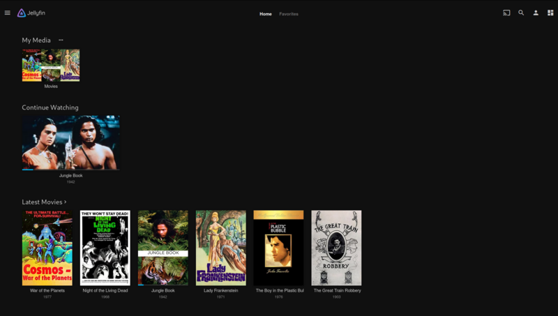

# Jellyfin - Selfhosted Media Server

Schon vor einiger Zeit habe ich alle meine CD's, DVD's und Blu-ray's [gerippt](https://de.wikipedia.org/wiki/Rippen) und die Silberscheiben aus Platzgründen entsorgt. Bis vor ca. 6 Monaten nutze ich ein Intel NUC mit einer [LibreElec](https://libreelec.tv/) Installation, um diese Medien von meinem NAS abzuspielen. Das hat auch immer wunderbar funktioniert. Parallel zu Kodi nutzte ich auch immer noch einen [Chromecast](https://de.wikipedia.org/wiki/Chromecast), um von verschiedenen Quellen auf meinen TV streamen zu können. Nun sind wir umgezogen und ich wollte keine unnötigen Geräte mehr haben. Also habe ich mich nach eine Lösung umgeschaut, um die Medien von meinem NAS via Chromecast abspielen zu können und bin mit [Jellyfin](https://jellyfin.org/) fündig geworden. Folgend möchte euch Jellyfin kurz vorstellen.


Jellyfin ist eine Multimedia-Anwendung, um digitale Mediendateien zu organisieren, zu verwalten und auf vernetzte Geräten abzuspielen. Jellyfin besteht zum einen aus einer Server-Anwendung, die auf einem Rechner mit Microsoft Windows, macOS, GNU/Linux oder in einem Docker-Container installiert ist. Des Weiteren wird eine Anwendung benötigt, die auf einem [Client-Gerät](https://jellyfin.org/clients/) wie einem Smartphone, Tablet, Smart-TV, Streaming Media Player, einer Spielekonsole oder in einem Webbrowser läuft. Jellyfin kann auch Medien an DLNA- und Chromecast-fähige Geräte streamen. Es ist eine freie und quelloffene (GPLv2) Software-Abspaltung von [Emby](https://en.wikipedia.org/wiki/Emby). Jellyfin ist in `C#` geschrieben und basiert `.NET Core`.



Jellyfin hat eine Benutzerverwaltung und dank der Client-Server-Architektur können problemlos mehrere Clients gleichzeitig Medien streamen. Jellyfin ist erweiterbar, und es gibt optionale Plugins von Drittanbietern, die zusätzliche Funktionen bieten. Das Projekt unterhält ein offizielles Repository, jedoch müssen Plugins nicht im offiziellen Repository gehostet werden, um installierbar zu sein.


## Installation
Wer mich schon ein wenig kennt, der kann erahnen, dass der Server bei mir als Docker-Container läuft. Nachstehend findet ihr noch meine `docker-compose.yml` Datei für einen schnellen Start.

```
version: "2.1"
services:
  jellyfin:
    image: lscr.io/linuxserver/jellyfin
    container_name: Jellyfin
    mem_limit: 3072m
    environment:
      - PUID=1000
      - PGID=1000
      - TZ=Europe/Zurich
    volumes:
      - ./config:/config
      - /volume1/Media/Serien/Watched:/data/tvshows
      - /volume1/Media/Filme/Watched:/data/movies
      - /volume1/Media/Musik:/data/music
    ports:
      - 8096:8096
      - 7359:7359/udp #Allows clients to discover Jellyfin on the local network.
    devices:
      - /dev/dri:/dev/dri #Intel GPU for hardware accelerated
    restart: always
```

Nach einem `docker-compose up -d` kann der Webclient unter `http://host-ip:8096/` im Browser aufgerufen werden.

Es gibt auch einen [Demo-Server](https://demo.jellyfin.org/stable), auf dem man alles ausprobieren kann. Der Benutzername lautet `demo` und es wird kein Passwort benötigt.


Quelle: [https://jellyfin.org/](https://jellyfin.org/)

Quelle: [https://en.wikipedia.org/wiki/Jellyfin](https://en.wikipedia.org/wiki/Jellyfin)

