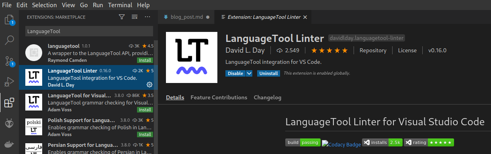
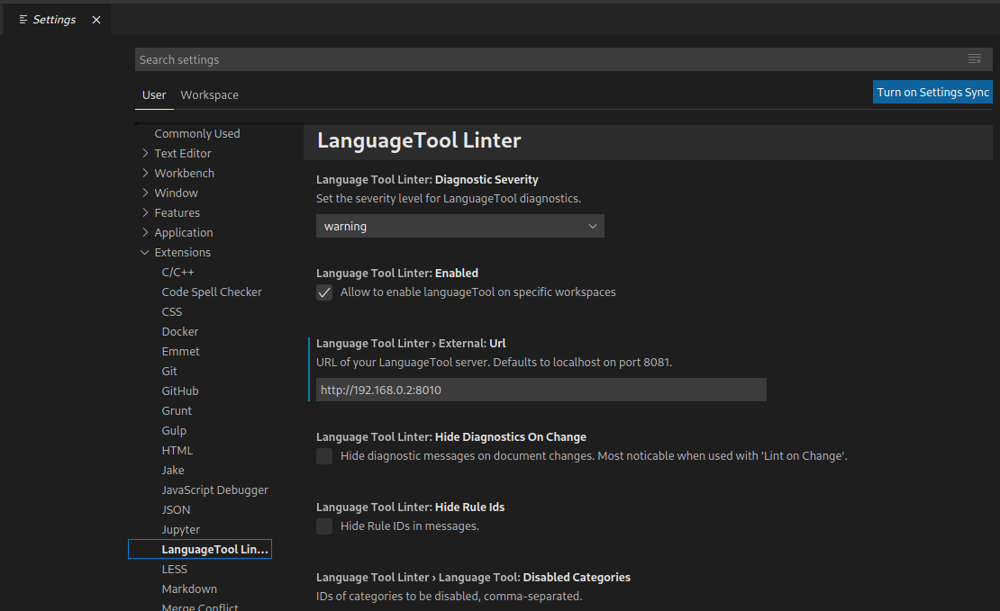
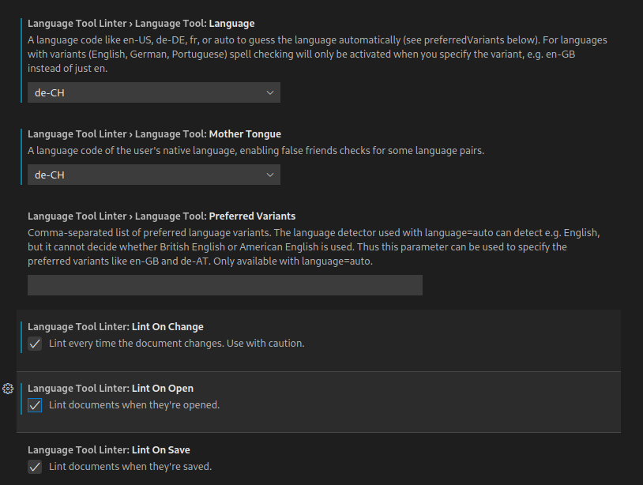

# LanguageTool in VS Code
Ich schreibe alle meine Artikel in Markdown und als Editor verwende ich VS Code. Viele aus der GNU/Linux.ch Redaktion benutzen [LanguageTool](https://en.wikipedia.org/wiki/LanguageTool) (LT) in der einen oder anderen Form um Ihre Texte zu korrigieren.


LanguageTool ist ein kostenloses und quelloffenes Grammatikprüfprogramm, und alle seine Funktionen stehen zum Herunterladen zur Verfügung. Die LanguageTool-Website ist an das proprietäre Schwesterprojekt LanguageTool Plus angeschlossen, das eine verbesserte Fehlererkennung für Englisch und Deutsch sowie eine leichtere Überarbeitung längerer Texte nach dem Open-Core-Modell ermöglicht. 

LanguageTool gibt es als Browser Add-on für die gängigen Browser (Firefox, Chrome, Edge, Opera), es lässt sich in das Office-Programm Deiner Wahl einbinden (LibreOffice, MS Word, Google Docs und OpenOffice), es gibt eine [öffentliche API](https://dev.languagetool.org/public-http-api) die benutzt werden kann und man kann einen eigenen LanguageTool-Server betreiben. Die Software steht unter der `GNU LGPL v2.1+` Lizenz.

Im folgenden Artikel zeige ich mein Setup für meinen spezielle Use Case. Es gibt sicher viele Einstellungen, die ich nicht behandelt habe. Um den Server aufzusetzen, sollte man sich mit Docker ein wenig auskennen. Anwenderkenntnisse reichen aus.

## LanguageTool Erweiterung für VS Code installieren
Ich verwende die Erweiterung [LanguageTool Linter](https://marketplace.visualstudio.com/items?itemName=davidlday.languagetool-linter) von David L. Day. Am einfachsten ist es, die Erweiterung direkt in VS Code zu suchen und zu installieren.



Alternativ kann die Erweiterung auch mit dem folgenden Befehl im Suchfeld (`Ctrl+P`) installiert werden:
```
ext install davidlday.languagetool-linter
```

Die Standardeinstellungen werden wahrscheinlich nicht funktionieren, aber sie sind dazu da, um sicherzustellen, dass die Verwendung der öffentlichen API von LanguageTool freiwillig erfolgt.

Für einen ersten Test kann man der [Option drei der Anleitung](https://github.com/davidlday/vscode-languagetool-linter#option-3-public-api-service) folgenden und die öffentliche API verwenden.

## Einrichten der Erweiterung und des Servers
Da das Nutzen der öffentlichen API einige [Einschränkungen](https://dev.languagetool.org/public-http-api) mit sich bringt und ich auch nicht möchte, dass sensible Texte bei einem Dienst im Internet landen, betreibe ich den [LanguageTool Server](https://hub.docker.com/r/erikvl87/languagetool) in einem Docker Container bei mir im lokalen Netzwerk.

### Server
LanguageTool kann auf grosse [n-gram](https://dev.languagetool.org/finding-errors-using-n-gram-data) Datensätze zurückgreifen, um Fehler bei Wörtern zu erkennen, die oft verwechselt werden.
Um diese Daten nutzten zu können, müssen sie zuerst [heruntergeladen](https://languagetool.org/download/ngram-data/) und entpackt werden. Die n-gram Daten gibt es für Deutsch, Englisch, Spanisch, Französisch und Niederländisch. Ich habe nur die deutschen `n-gram` Daten heruntergeladen. Der Container muss auf diese Daten zugreifen können.

Die Struktur sieht bei mir wie folgt aus:


Um den Container zu starten, nutzte ich die folgende `docker-compose` Datei. Die Datei sollte den Namen `docker-compose.yml` haben, so muss beim Starten nicht auf eine spezifische Datei verwiesen werden, wenn der `docker-compose up` Befehl in diesem Verzeichnis ausgeführt wird.
Wichtig ist, dass der Pfad zu den `n-gram` Daten angepasst wird, falls diese verwendet werden. Wenn die `docker-compose` Datei und die `n-gram` Daten im selben Verzeichnis liegen, kann der relative Pfad `./ngrams` verwendet werden.

```
version: "3"

services:
  languagetool:
    image: erikvl87/languagetool
    container_name: LanguageTool
    restart: always
    ports:
        - 8010:8010  # Using default port from the image
    environment:
        - langtool_languageModel=/ngrams  # OPTIONAL: Using ngrams data
        - Java_Xms=512m  # OPTIONAL: Setting a minimal Java heap size of 512 mib
        - Java_Xmx=1g    # OPTIONAL: Setting a maximum Java heap size of 1 Gib
    volumes:
        - ./ngrams:/ngrams
```
LanguageTool wird Standardmässig mit einer minimalen Java heap size (`-Xms`) von 256 MB und einer maximalen heap size (`-Xmx`) von 512 MB gestartet. Ich habe diese Standardwerte überschreiben, indem ich die Umgebungsvariablen `Java_Xms` und `Java_Xmx` gesetzt habe.

Nun kann der Server mit dem Befehl `sudo docker-compose up -d` gestartet werden.

### LanguageTool
Wenn der Server läuft, muss nun die Erweiterung in VS Code eingerichtet werden. Mit dem Shortcut `Ctrl+,` öffnet sich das Einstellungsmenü von VS Code. Im Untermenü `Extensions -> LanguageTool Linter` muss der zuvor eingerichtete Server eingestellt werden. Die Serveradresse ist die IP des Servers und der Port des Docker Containers. Bei mir ist das `http://192.168.0.2:8010`. Wenn der Docker Container auf dem lokalen Rechner gestartet wurde und nicht auf einem Server, muss man die IP-Adresse des `localhost` nehmen. Dann wäre die Adresse `http://127.0.0.1:8010`.



Unter anderem kann man noch die Sprache und das Verhalten vom LT Linter einstellen. Bei mir sieht es wie folgt aus:



## Ergebnis
Sobald ich nun ein Markdown Dokument offen habe, wird die Rechtschreibung konstant überprüft und mögliche Fehler markiert sowie ein Quick Fix angezeigt, wenn ich mit dem Mauszeiger über die markierte Stelle fahre.


Die Erkennung von Fehlern geht über reine Grammatik hinaus, was echt erstaunlich gut funktioniert. Es funktioniert um Längen besser als MS Word oder LibreOffice.

Der eigene LT Server bietet sicher noch potenzial für weitere Setups wie z. B. das Firefox Add-on oder im LibreOffice. Allerdings benötige ich das nicht.

Die Performance ist ziemlich gut, ich spüre keinen Unterschied zur öffentlichen API. Allerdings hat mein Server auch einen Read und Write SSD Chache und mein Netzwerk ist ziemlich flott.


