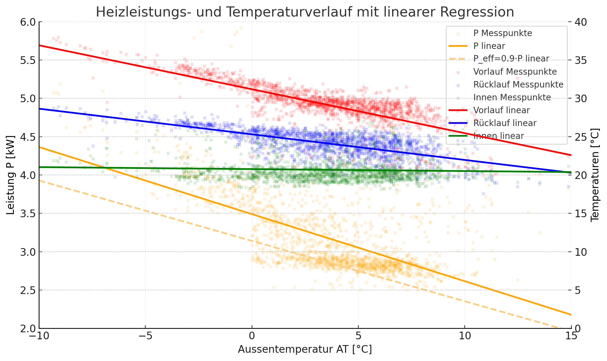
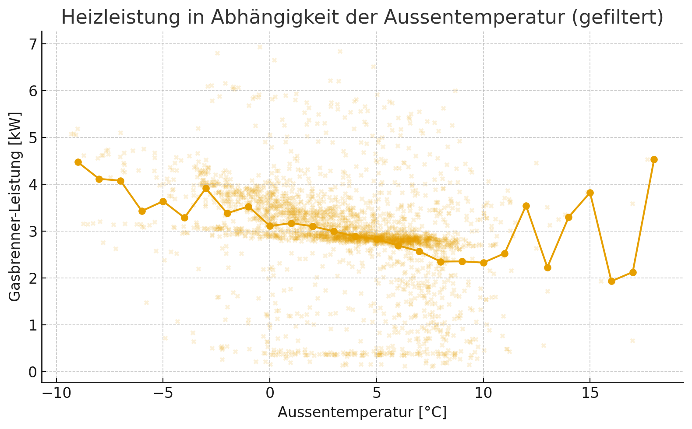
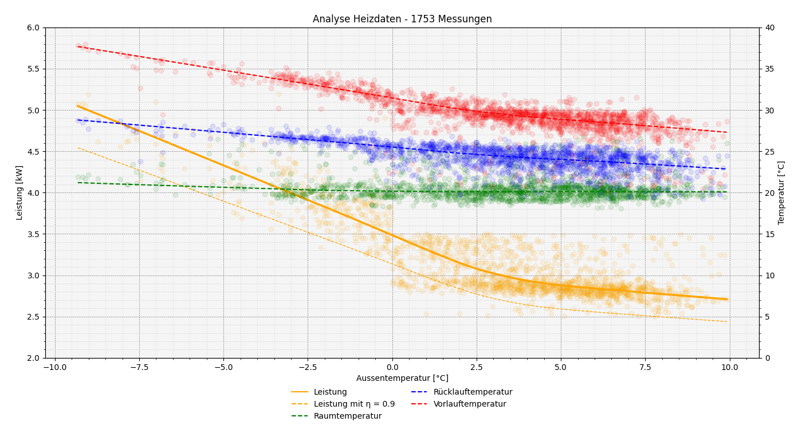
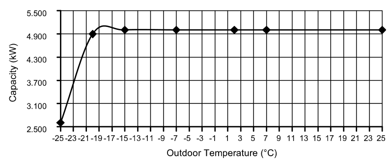
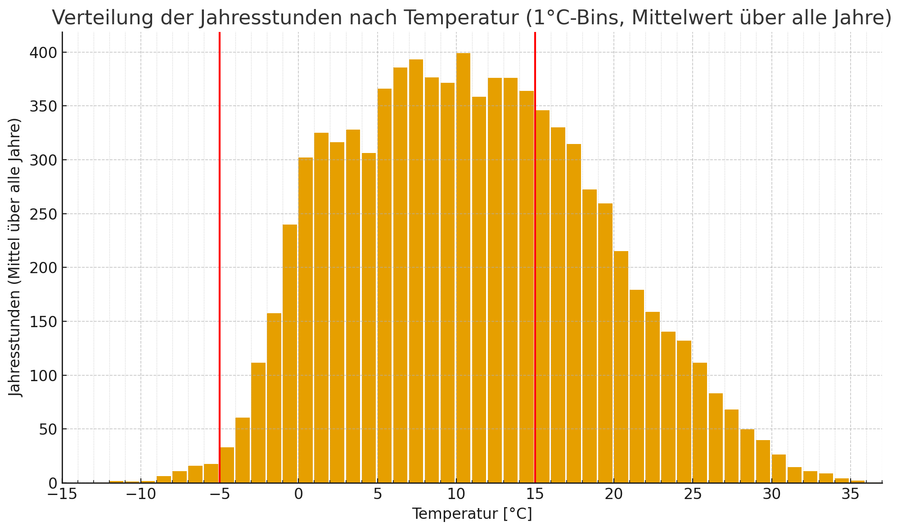

# Heizlastanalyse mit Home Assistant und offenen Messdaten

Die Umstellung von fossiler Heizung auf Wärmepumpe ist eine Investition in die nächsten zwanzig Jahre. Als Ingenieur möchte ich solche Entscheidungen nicht nach Bauchgefühl treffen, sondern auf Messdaten und einfachen physikalischen Zusammenhängen. Für die Auslegung einer Wärmepumpe benötigt man die [Heizlast](https://de.wikipedia.org/wiki/Heizlast) des Gebäudes. Liegt keine aktuelle Heizlastberechnung mehr vor, kann man sie aus dem realen Verhalten der bestehenden Heizung empirisch bestimmen.

In diesem Artikel zeige ich, wie ich die Heizlast unseres Hauses aus dem Gasverbrauch und einigen Temperaturmessungen abgeleitet habe. Die Methode kombiniert

* einen optischen Gaszähler mit [AI on the Edge](https://github.com/jomjol/AI-on-the-edge-device)
* Home Assistant als Datensammler
* CSV Export und Analyse mit etwas Ingenieurhirn und einem LLM als Werkzeug
* offene Wetterdaten von Meteo Schweiz

Das ist bewusst kein Ersatz für eine normgerechte Heizlastberechnung. Es ist eine pragmatische, datenbasierte Abschätzung, die für die Auswahl einer passenden Wärmepumpe sehr hilfreich ist.

## Hinweis zu LLM und Werkzeugkette

Die Diagramme habe ich mit ChatGPT erstellt. Für mich sind LLM Werkzeuge, ähnlich wie ein Compiler oder ein Tabellenkalkulationsprogramm. Die kognitive Leistung kommt weiterhin vom Menschen. Als erfahrener Softwareentwickler könnte ich alle Auswertungen auch selbst programmieren. Für einmalige, projektbezogene Analysen ist der Zeitaufwand dafür jedoch relativ hoch.

Ein LLM kann Daten filtern, einfache Regressionen berechnen und Diagramme erstellen. Die Interpretation der Resultate und vor allem die Plausibilitätsprüfung müssen aber zwingend beim Menschen bleiben. Wer diese Verantwortung abgibt, arbeitet unsauber.

## Messung des Gasverbrauchs mit AI on the Edge und Umrechnung in Leistung

### Projektüberblick

[AI on the Edge](https://github.com/jomjol/AI-on-the-edge-device) ist ein Open Source Projekt, das mit einem kleinen ESP32 Modul und einer Kamera analoge Zähler optisch ausliest. Viele Gaszähler haben Ziffernwalzen oder Zählwerke mit gut erkennbaren Markierungen. Das Modul macht in einem einstellbaren Intervall ein Foto, erkennt den Stand des Zählers mit Bildverarbeitung und publiziert den Zählerstand zum Beispiel per MQTT.

Vorteile 
* keine elektrische Modifikation am Gasgerät nötig
* auch bei alten Kesseln einsetzbar
* Daten können direkt in Home Assistant übernommen werden

Im Betrieb erhält man eine Zeitreihe des Gaszählerstandes `V` in Kubikmetern.

### Von Volumenstrom zu thermischer Leistung

Um die Heizlast abzuschätzen, interessiert nicht nur der Gasverbrauch pro Tag, sondern die momentane Leistung der Heizung.

Aus den aufgezeichneten Zählerständen `V(t)` kann man einen Volumenstrom bestimmen
* Volumenänderung: `ΔV=V(t2)−V(t1)` in Kubikmetern
* Zeitintervall: `Δt=t2−t1 in` Stunden
* Volumenstrom: `V˙=ΔV/Δt` in Kubikmetern pro Stunde

Der Gasversorger gibt auf der Rechnung den Brennwert `H` in Kilowattstunden pro Kubikmeter an (ca. 11 kWh/m3). Damit ergibt sich die momentane thermische Leistung des Kessels zu `P=V˙*H`.

Wenn `V˙` in Kubikmetern pro Stunde und `H` in Kilowattstunden pro Kubikmeter angegeben sind, erhält man `P` direkt in Kilowatt.

In Home Assistant legt man sich dafür typischerweise zwei Sensoren an
* ein Sensor für den Zählerstand in Kubikmetern
* ein Template Sensor, der daraus einen Volumenstrom und anschliessend die Leistung berechnet

Damit steht die thermische Leistung des Gasbrenners als Zeitreihe zur Verfügung.

## Datensammlung mit Home Assistant

Home Assistant eignet sich sehr gut als zentrales Messsystem für das Heizungsprojekt. Neben dem Gasverbrauch interessieren insbesondere
* Vorlauftemperatur der Heizung
* Rücklauftemperatur der Heizung
* Aussentemperatur
* Innentemperatur in einem Referenzraum
* berechnete Heizleistung aus dem Gasverbrauch

Diese Grössen lassen sich mit üblichen Sensoren erfassen. Die Werte werden in Home Assistant als Entitäten geführt. Für unsere Auswertung ist wichtig, dass die historischen Daten über einen längeren Zeitraum verfügbar sind.

Home Assistant speichert standardmässig Langzeitstatistiken mit einer stündlichen Auflösung. Für die Bestimmung der Heizlast ist diese Auflösung ausreichend, solange das Heizsystem träge genug ist und keine zu schnellen Lastsprünge auftreten. Bei Gasthermen, die auch Brauchwarmwasser aufbereiten, entstehen jedoch kurze Phasen mit maximaler Kesselleistung. Diese Ereignisse müssen später in der Auswertung erkannt und herausgefiltert werden.

Wichtig ist ausserdem, dass die Heizkurve während des Messzeitraums nicht laufend verändert wird. Sonst überlagert man die physikalischen Zusammenhänge mit der eigenen Regelstrategie.

## Export als CSV und Analyse mit Hirn und Plotten mit ChatGPT

### CSV Export aus Home Assistant

Für die Auswertung wählt man in Home Assistant im Bereich Verlauf den gewünschten Zeitraum, typischerweise einen oder mehrere kältere Monate mit durchgehendem Heizbetrieb. In der Verlaufsansicht fügt man alle relevanten Entitäten hinzu
* Heizleistung des Kessels
* Vorlauf und Rücklauf
* Innen und Aussentemperatur

Im Menü der Verlaufsansicht kann der Datensatz als CSV exportiert werden. Dieses CSV enthält pro Entität Spalten mit Zeitstempel und Messwert.

Die Datei sollte man sich zuerst in einem Editor oder Tabellenkalkulationsprogramm ansehen. In meinem Fall war gut zu erkennen

* Phasen mit Brauchwarmwasserbereitung, in denen der Kessel konstant mit rund 12 Kilowatt arbeitet
* Zeitbereiche, in denen zusätzlich mit dem Schwedenofen geheizt wurde
* einzelne Ausreisser durch Messfehler oder Kommunikationsprobleme

Diese Punkte müssen in der weiteren Auswertung berücksichtigt werden.

### Filtern und Plotten mit ChatGPT

Das Filtern der Daten und das Erstellen erster Diagramme lässt sich heute direkt mit einem LLM erledigen, ohne selbst Python oder R zu programmieren. Wichtig ist, dass der Prompt klar beschreibt, welche Berechnungen durchgeführt und welche Daten verworfen werden sollen.

Ein ausführlicher Prompt könnte zum Beispiel so aussehen

```
Ich habe hier einige CSV Dateien mit Daten von einem Winterheizbetrieb mit der Gasheizung. Kannst du mir zwei Plots erstellen? Einer mit polynomialen und einer mit linearen Regressionslinie und allen Messpunkten (Messpunkte mit geringer Deckkraft und als kleine Kreise dargestellt). Für alle physikalischen Grössen eine Regressionslinie erstellen. Auf der linken Y-Achse (Bereich 2–6 kW, Textfarbe schwarz) soll die Leistung P sein (Orange), auf der X-Achse (Bereich –10 °C bis +15°C) ist die Aussentemperatur AT. Auf der rechten Y-Achse (Bereich 0…40 °C positiv Werte, wichtig) sollen die Temperatur von Vor- und Rücklauf (vlt rot, rlt, blau) und die Innentemperatur (grün) sein. Die Leistungsdaten P müssten noch bereinigt werden. Die Ausschläge > 6 kW und alle Werte < 2.5 kW sollen nicht berücksichtigt werden. Auf alle Messpunkte mit einer Leistung > 4 kW bei einer Aussentemperatur von > 0 °C sollen nicht berücksichtigt werden. Auf alle Messpunkte mit einer Leistung < 3.5 kW bei einer Aussentemperatur von < 0 °C sollen nicht berücksichtigt werden. Auch die Ausschläge der Vorlauftemperatur vlt und der Rücklauftemperatur rlt > 40°C sollen nicht berücksichtigt werden. Zusätzlich hätte ich gerne noch eine Leistungskurve "Peff" (hell Orange gestrichelt) mit dem Faktor 0.9. Legende rechts oben.
```

Mit einem solchen Prompt erhält man eine komplette Auswertung mit Diagramm und numerischen Werten. Die Parameter und Filterbedingungen muss man natürlich an das eigene System anpassen. In meinem Datensatz waren zum Beispiel trotz Filtern noch Punkte enthalten, in denen zusätzlich mit Holz geheizt wurde. Solche Effekte sieht man in der Visualisierung und kann sie im Zweifel noch einmal nachschärfen.



Für einen schnellen ersten Eindruck genügt oft schon ein viel kürzerer Prompt

```
Das sind Daten von einem Winter mit Gasheizung. Ich benötige eine Kurve mit der Leistung der Gasheizung in abhängigkeit der Aussentemperatur. Bitte filtere die Lesitungsdaten vorher. Es hat viele unplausible werde drin.
```

Damit erhält man nicht die perfekte Datenreinigung, aber meist eine erstaunlich brauchbare erste Abschätzung.


### Grenzen der automatischen Auswertung

In meinem Fall war der Datensatz aus mehreren Gründen suboptimal

* Brauchwarmwasser wurde mit derselben Gastherme bereitet, teilweise mit voller Kesselleistung
* die zeitliche Auflösung von einer Stunde verschmiert schnelle Lastwechsel
* bei Aussentemperaturen über 0 Grad wurde häufig zusätzlich mit dem Schwedenofen geheizt

ChatGPT hat die Daten zwar gefiltert und geplottet. Einige unplausible Datenpunkte blieben aber im Datensatz. Zusätzlich habe ich eine zweite Kurve eingezeichnet, bei der ich von einem Wirkungsgrad der Gastherme von 0.9 ausgegangen bin. Das hilft, die thermische Energieabgabe an das Heizsystem von der im Gas enthaltenen Energiemenge zu unterscheiden.

Ein Detail am Rande. In einem der erzeugten Diagramme war die rechte y Achse mit negativen Werten beschriftet, obwohl die Temperatur positiv war. Solche formalen Fehler muss man erkennen und entsprechend interpretieren. Ein LLM generiert Grafikcode, überprüft aber nicht jede Achsenkonvention.

Ich habe die Auswertung später noch einmal manuell mit einer eigenen Python Umgebung wiederholt und eine lokal gewichtete lineare Regressionslinie eingesetzt. Das Resultat wurde optisch sauberer und die Filterung präziser, dafür hat mich diese Variante einen ganzen Abend gekostet. Für eine pragmatische Abschätzung reicht die schnellere Analyse mit LLM in vielen Fällen aus. Entscheidend ist wie immer die Plausibilitätsprüfung.


## Aussentemperatur am eigenen Ort berücksichtigen

Mit der beschriebenen Methode kennt man nun die Heizlast des Gebäudes als Funktion der Aussentemperatur. Für die Auswahl einer Wärmepumpe reicht das allein noch nicht. Wichtig ist, die lokalen klimatischen Bedingungen zu berücksichtigen.

Es ist wenig sinnvoll, eine Wärmepumpe konsequent auf eine Aussentemperatur auszulegen, die statistisch fast nie auftritt. Gleichzeitig soll sie auch an sehr kalten Tagen noch genügend Leistung liefern, mindestens mit Unterstützung eines elektrischen Heizstabs.

### Heizungsbauer und Überdimensionierung

In der Praxis werden Wärmeerzeuger häufig deutlich überdimensioniert. Das reduziert zwar das Risiko, dass es jemals kalt im Haus wird, schadet aber der Effizienz der Wärmepumpe. Viele Geräte laufen dann im Teillastbereich mit häufigen Starts und Stopps. Das führt zu schlechteren Jahresarbeitszahlen und höherem Verschleiss.

Eine leicht unterdimensionierte Wärmepumpe ist in vielen Fällen sinnvoller. Im Extremfall kann ein elektrischer Heizstab für wenige Stunden pro Jahr zugeschaltet werden. In meinem konkreten Projekt hat die Wärmepumpe eine thermische Nennleistung von 5 Kilowatt bis etwa minus 15 Grad. Zusätzlich steht ein Heizstab mit 3 Kilowatt zur Verfügung.


### Jahresstunden pro Temperaturbereich mit Meteo Schweiz

Um das sinnvoll zu dimensionieren, lohnt sich ein Blick auf die Statistik der Aussentemperatur. Meteo Schweiz stellt auf dem [Open Data Portal](https://www.meteoswiss.admin.ch/services-and-publications/applications/ext/download-data-without-coding-skills.html#lang=en&mdt=normal&pgid=&sid=&col=&di=&tr=&hdr=) historische Temperaturreihen von vielen Messstationen zur Verfügung. Für die eigene Auslegung wählt man eine Station mit ähnlicher Höhenlage und möglichst in der Nähe des Wohnorts und lädt sich die CSV Datei herunter.

Die Auswertung kann man wiederum einem LLM übergeben. Ein typischer Prompt könnte so aussehen

```
Ich hätte gerne eine Kurve mit dem Durchschnitt über alle Jahre. Bitte als Balkendiagramm. X-Achse 1 °C. Y-Achse: Jahresstunden. Beschriftung X-Achse in 5 °C Schritten. Tiefste Temperatur -15 °C. Gitternetz aber für 1°C. Bei -5°C eine senkrechte rote Linie einzeichnen. Bei 15° C bitte eine senkrechte rote Linie einzeichnen. Zwischen den Balken soll eine kleine Lücke sein, damit sie visuell besser erkennbar sind.
```

Das resultierende Diagramm zeigt sehr anschaulich, wie selten wirklich tiefe Temperaturen auftreten. In vielen Lagen in der Schweiz gibt es nur wenige Stunden pro Jahr mit Temperaturen unter minus 10 Grad. Die Wärmepumpe sollte daher vor allem im Bereich von ungefähr minus 5 bis plus 15 Grad effizient arbeiten und gut modulieren können.


Aus der Kombination von Heizlastkurve und Temperaturhäufigkeit lässt sich abschätzen
* welche thermische Leistung bei moderaten Minusgraden dauerhaft bereitstehen muss
* wie viel Reserveleistung mit einem Heizstab für sehr kalte Ausnahmetage sinnvoll ist

## Fazit

Mit den beschriebenen Auswertungen kann man die Auslegung einer neuen Wärmepumpe auf den aktuellen Zustand des eigenen Gebäudes abstimmen. Statt pauschal zu überdimensionieren, basiert die Entscheidung auf Messdaten des bestehenden Systems und realen Temperaturstatistiken.

Dabei sollte man geplante energetische Sanierungen nicht vergessen. Eine Dachsanierung oder neue Fenster können die Heizlast schnell um zwanzig Prozent oder mehr reduzieren. Wer solche Massnahmen absehen kann, sollte sie in der Auslegung berücksichtigen und die Wärmepumpe eher auf den zukünftigen Zustand optimieren.

Besonders erfreulich ist, dass ein grosser Teil der benötigten Werkzeuge und Daten frei verfügbar ist
* AI on the Edge als Open Source Projekt für die Messung am Gaszähler
* Home Assistant als zentrale Plattform für Sensorik und Langzeitdaten
* frei verfügbare historische Wetterdaten von Meteo Schweiz

Hinzu kommt ein LLM als flexibles Analysewerkzeug, das Diagramme erstellt und einfache Modelle fitten kann. Für einmalige Projekte ist das oft effizienter als eine komplette Eigenimplementierung. Der entscheidende Schritt bleibt die kritische Plausibilitätsprüfung durch den Menschen.

So ausgerüstet können auch Heizungs Laien mit etwas technischem Interesse die relevanten Grössen ihrer Heizung verstehen und eine Wärmepumpe wählen, die weder übertrieben gross noch riskant knapp dimensioniert ist.

Ich bin kein Heizungsprofi und dieser Artikel ersetzt keine fachgerechte Heizlastberechnung. Die beschriebene Methode ist eine vereinfachte ingenieurmässige Abschätzung und berücksichtigt sicher nicht alle Einflussfaktoren. Sie basiert auf einem System mit Fussbodenheizung und relativ konstanter Leistungsabgabe. Ob sich der Ansatz in gleicher Qualität auf Radiatorenheizungen übertragen lässt, kann ich nicht sicher beurteilen, die Ergebnisse sollten daher nur als grobe Orientierung dienen und vor einer Investitionsentscheidung durch eine Fachperson überprüft werden.


