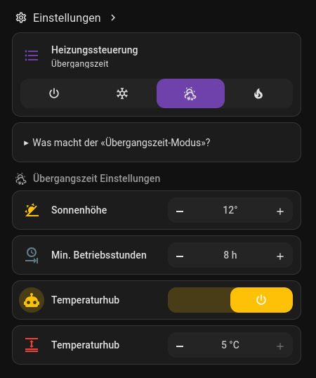
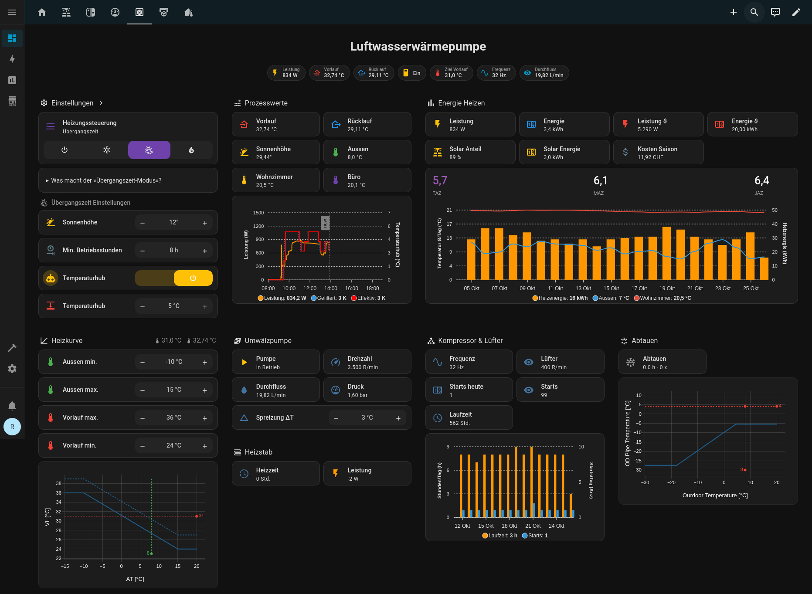
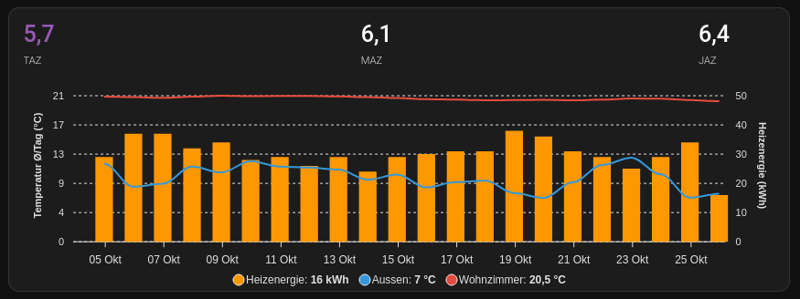

# Übergangszeit-Modus für Luft-Wasser-Wärmepumpen mit Home Assistant
## Ausgangslage

Das Szenario ist ein mittel gut isoliertes Reihenendhaus. Bei etwa 5 °C Aussentemperatur sinkt die Innentemperatur über Nacht in rund zwölf Stunden um etwa 0.5 bis 1 °C. Die beheizte Wohnfläche beträgt 150 m² mit Bodenheizung. Es gibt keinen Pufferspeicher, die Luft-Wasser-Wärmepumpe ist direkt mit der Bodenheizung verbunden. Eine Einzelraumregelung ist nicht im Einsatz. Auf dem Dach arbeitet eine [Photovoltaikanlage mit 15.6 kWp](https://gnulinux.ch/frei-energie-ganz-ohne-esoterik).

Die Steuerung erfolgt mit Home Assistant. [Heishamon](https://gnulinux.ch/waermepumpen-steuerung-ganz-ohne-cloud) dient als Schnittstelle zur Wärmepumpe.

## Ziel des Übergangszeit-Modus
In der Übergangszeit steht tagsüber oft ausreichend PV-Leistung zur Verfügung. Ziel ist es, möglichst kosteneffizient mit PV-Strom zu heizen und überschüssige Energie gezielt in der Gebäudemasse zu speichern. Die Raumtemperaturen sollen im Tagesverlauf innerhalb von ± 1 K schwanken. Die Anlage fährt weiterhin mit Heizkurve, damit die Aussentemperatur berücksichtigt bleibt. In der Nacht bleibt die Heizung aus.

## Funktionsprinzip
Der «Übergangszeit-Modus» nutzt die Sonnenhöhe als robusten Proxy für PV-Leistung:

 * Einschalten am Morgen:
Die Wärmepumpe startet, sobald die Sonne den konfigurierten Schwellwert «Sonnenhöhe» überschreitet. Ab diesem Zeitpunkt ist tendenziell genügend PV-Leistung verfügbar.

* Ausschalten am Abend:
Die Wärmepumpe schaltet ab, wenn die Sonne den Schwellwert wieder unterschreitet. Vor dem Abschalten müssen die minimalen Betriebsstunden erreicht sein. Im Frühherbst dominiert die Sonnenhöhe, im Spätherbst gewinnt die Mindestlaufzeit an Gewicht, weil die Tage kürzer werden. Der Betrieb reicht dann eher in den Abend, wenn der COP oft günstiger ist.

* Automatischer Temperaturhub:
Bei aktivem Temperaturhub hebt das System die Heizkurve proportional zum PV-Überschuss an. Der Anstieg ist durch einen maximalen Temperaturhub begrenzt. In der Übergangszeit kommt zusätzlich pauschal ein Zuschlag von + 2 K hinzu. So lässt sich thermische Energie in der Gebäudemasse speichern und unbeabsichtigtes Abschalten vermeiden.

## Beispielrechnung: 2 K Überhitzung über die Bodenplatte
Annahme: 150 m² Bodenfläche, 20 cm Beton, Laufzeit 8 h, COP = 5.

* Volumen Beton: 150 m² × 0.20 m = 30 m³
* Masse Beton: 30 m³ × 2300 kg/m³ ≈ 69 000 kg
* Spezifische Wärmekapazität Beton: ca. 0.84 kJ/(kg·K)
* Temperaturhub: 2 K

Thermische Energiemenge:
69 000 kg × 0.84 kJ/(kg·K) × 2 K = 115 920 kJ ≈ **32.2 kWh**

Mittlere thermische Leistung über 8 h:
32.2 kWh ÷ 8 h ≈ **4.0 kW**

Benötigte elektrische Energie bei COP = 5:
32.2 kWh ÷ 5 ≈ **6.44 kWh**

Mittlere elektrische Leistung:
6.44 kWh ÷ 8 h ≈ **0.80 kW**

Diese einfache Rechnung betrachtet nur die Bodenplatte. In der Praxis nehmen auch Estrich, Wände und Einrichtung Energie auf. Die gewählte Überhitzung von 2 K bleibt in der Regel komfortabel und hilft, kurze PV-Überschuss sinnvoll zu nutzen.

# Home-Assistant-Automationen
Die folgende Automation schaltet am Morgen in den Modus «Heat only» und startet die Wärmepumpe. Der Haupttrigger ist die Sonnenhöhe. Zusätzlich kann ein stabiler PV-Überschuss von mindestens 500 W über zehn Minuten als Startkriterium dienen wenn das Wetter sehr gut ist.

```yaml
alias: Übergangzeit Einschalten
description: ""
triggers:
  - trigger: numeric_state
    entity_id:
      - sun.sun
    attribute: elevation
    above: input_number.hpctl_transition_elevation_threshold
    alias: Sobald Sonnehöhe über Horizont > Schwellwert (Morgen)
    id: sunrise
  - trigger: numeric_state
    entity_id:
      - sensor.power_export
    for:
      hours: 0
      minutes: 10
      seconds: 0
    above: 500
    enabled: true
conditions:
  - condition: state
    entity_id: input_select.hpctl_mode
    state: Übergangszeit
  - condition: time
    before: "10:00:00"
    enabled: true
  - condition: state
    entity_id: switch.panasonic_heat_pump_main_heatpump_state
    state: "off"
    enabled: true
actions:
  - alias: Heat Only auwählen
    action: select.select_option
    metadata: {}
    data:
      option: Heat only
    target:
      entity_id: select.panasonic_heat_pump_main_operating_mode_state
  - wait_for_trigger:
      - trigger: state
        entity_id:
          - select.panasonic_heat_pump_main_operating_mode_state
        from: null
        to: Heat only
    timeout:
      hours: 0
      minutes: 0
      seconds: 10
      milliseconds: 0
  - action: switch.turn_on
    metadata: {}
    data: {}
    target:
      entity_id: switch.panasonic_heat_pump_main_heatpump_state
mode: single
```
Die Ausschalt-Automation beendet den Betrieb am Abend, wenn die Sonnenhöhe wieder unter den Schwellwert fällt. Alternativ greift ein Template-Trigger, sobald die minimalen Betriebsstunden erreicht sind. Beim Ausschalten setzt die Automation den Heizkurven-Offset auf 0 K zurück. So startet der nächste Tag ohne Altlasten.

```yaml
alias: Übergangszeit Ausschalten
description: >-
  Die LWWP wird ausgeschaltet wenn:

  * Die Sonnenhöhe den Schwellwert unterschreitet (Anfangs Herbst relevant ->
  Keine Leistung mehr vom Dach, Betriebsstunden vorher erreicht)

  * Die Minimalen Betriebsstunden erreicht sind (Spät Herbst relevant da Tage
  immer kürzer werden, besser am Abend längerer Betrieb da besserer COP)
triggers:
  - trigger: numeric_state
    entity_id:
      - sun.sun
    attribute: elevation
    below: input_number.hpctl_transition_elevation_threshold
    alias: Sonnenhöhe < Schwellwert (Abend)
    id: sonne
  - trigger: template
    value_template: >+
        

      


      {{ betriebsstunden_ist >= betriebsstunden_soll }}

    alias: Minimale Betriebsstunden erreicht
    id: stunden
conditions:
  - condition: state
    entity_id: input_select.hpctl_mode
    state: Übergangszeit
  - condition: template
    value_template: |2
          
        

        {{ betriebsstunden_ist >= betriebsstunden_soll }}
    alias: Min. Betriebsstunden erreicht
    enabled: true
  - condition: numeric_state
    entity_id: sun.sun
    attribute: elevation
    below: input_number.hpctl_transition_elevation_threshold
    alias: Sonnenhöhe < Schwellwert (Abend)
actions:
  - action: switch.turn_off
    metadata: {}
    data: {}
    target:
      entity_id: switch.panasonic_heat_pump_main_heatpump_state
  - wait_for_trigger:
      - trigger: state
        entity_id:
          - switch.panasonic_heat_pump_main_heatpump_state
        from: null
        to: "off"
    timeout:
      hours: 0
      minutes: 0
      seconds: 10
      milliseconds: 0
  - action: number.set_value
    metadata: {}
    data:
      value: "0"
    target:
      entity_id: number.panasonic_heat_pump_main_z1_heat_request_temp
    enabled: true
    alias: Heizkurve Temperaturhub zurücksetzen
mode: single
```

## Heizkurven-Offset abhängig vom PV-Überschuss

Der Temperaturhub der Heizkurve folgt dem PV-Überschuss. Die Berechnung ist so ausgelegt, dass bei maximal verfügbarer elektrischer Leistung der Wärmepumpe der konfigurierte maximale Offset erreicht wird.

```yaml
# LWWP Heizkurve Offset abhängig von Solarüberschuss
- name: "LWWP Heizkurve Temperaturhub"
  unique_id: lwwp_heizkurve_temperaturhub
  unit_of_measurement: "K"
  device_class: temperature
  state: >
    {# Maximal erlaubter Offset der Heizkurve (K), kommt aus Helper #}
    

    {# COP-Absicherung:
      - Sensor liefert gelegentlich 0/ungültig -> setze min. 1
      - zusätzlich -1, weil der Sensor tendenziell zu hoch misst (Kompensation)
      - Ergebnis wird nicht kleiner als 1 zugelassen, um Division durch 0 zu vermeiden #}
    

    {# Maximale elektrische Leistungsaufnahme der WP (W):
      max. thermische Leistung / COP = max. elektrische Leistung #}
    

    {# Aktuelle elektrische Leistung der WP (W) #}
    

    {# Steigung (K pro Watt PV-Überschuss), so dass bei "max_hp_power" der "max_offset" erreicht würde #}
    

    {# PV-Überschuss/Netzeinspeisung (W). #}
    

    {# Zusatz-Offset in der Übergangszeit (K):
      - wenn Modus "Übergangszeit" aktiv -> +2 K
      - sonst 0 K #}
    

    {# Vorläufiger Offset gemäss PV-Überschuss + Modusaufschlag #}
    

    {# Begrenzungslogik:
      1) Deckelung: wenn berechneter Offset "max_offset" übersteigt ODER
          wenn noch genügend PV-Überschuss vorhanden ist, um die WP auf ihre
          Maximalleistung (elektrisch) zu bringen
          -> setze auf "max_offset".
      2) Sonst, wenn Offset im (0, max_offset) liegt und COP > 1 (robust),
          -> gebe den berechneten Offset aus.
      3) In allen anderen Fällen -> 0 K. #}
    
      {{ max_offset | round(2) }}
    
      {{ offset | round(2) }}
    
      0
    
  attributes:
    # dies ist ein workaround. Nur wenn dieser Sensor eine Änderung erfährt, dann wird auch der Filter dazu upgedatet.
    last_update: "{{ now().strftime('%Y-%m-%d %H:%M:%S') }}"
```

Aus der maximalen thermischen Heizleistung der Wärmepumpe und dem bereinigten COP ergibt sich die maximale elektrische Aufnahmeleistung. Die Steigung verknüpft PV-Überschuss in Watt mit dem Heizkurven-Offset in Kelvin. Liegt PV-Überschuss vor, steigt der Offset linear, zusätzlich kommen in der Übergangszeit pauschal + 2 K hinzu. Sobald entweder der berechnete Offset den Maximalwert erreicht oder die PV-Leistung ausreichen würde, um die Wärmepumpe auf ihre maximale elektrische Leistung zu bringen, greift die Deckelung. Bei unplausiblen COP-Werten gibt der Sensor 0 K aus. Dadurch bleibt die Anlage berechenbar.

## Dashboard
Das Dashboard dient vor allem der Prozesswertüberwachung und der Analyse. Zusätzlich erlaubt es wenige gezielte Einstellungen sowie das Umschalten der Betriebsmodi. Welche Prozesswerte sich langfristig als wirklich aussagekräftig erweisen, erprobe ich im laufenden Betrieb.






## Ergebnisse vom 7. September bis 25. Oktober
* Elektrische Energie: 202 kWh (externe Messung mit Shelly Pro 3em)
* Thermische Energie: 1406 kWh ([externe Messung mit WMZ](https://gnulinux.ch/integration-des-multical-303-in-home-assistant-via-wireless-m-bus))
* COP: 6.9
* Durchschnittliche Aussentemperatur: rund 10 °C
* Kosten: 18.40 CHF bei einem Mix aus PV und Netzstrom
* Gaskosten zum Vergleich: 182 CHF
* PV-Anteil am Strom: 185 kWh, das entspricht rund 91.5 %

Über 49 Tage ergibt das im Mittel rund 4.1 kWh elektrische Energie pro Tag und etwa 28.7 kWh thermische Energie. Im direkten Kostenvergleich ergibt sich eine Einsparung von rund 90 % gegenüber Gas in dieser Periode. Der hohe PV-Anteil zeigt, dass die Regelung den Eigenverbrauch wirksam steigert.

## Hinweise und Grenzen
Die hier beschriebene Vorgehensweise ist auf mein Gebäude und meine Wärmepumpe abgestimmt. Das Haus ist realtiv gut gedämmt und die Wärmeabgabe erfolgt über eine Fussbodenheizung mit grosser Speichermasse. In einem schlecht isolierten Gebäude mit Radiatoren funktioniert der Ansatz nur begrenzt. Radiatoren benötigen höhere Vorlauftemperaturen und bieten weniger thermische Masse. Dadurch sinkt der COP und die Speicherkapazität im Gebäude ist kleiner. Die Temperaturschwankungen fallen eher grösser aus und der gewünschte Betrieb über den PV-Überschuss lässt sich weniger stabil halten. Wer eine ähnliche Strategie testen möchte, sollte die Grenzen des eigenen Systems kennen und die Parameter vorsichtig anpassen.

Ich bin kein Heizungspezialist. Meine Stärken liegen in der Softwareentwicklung und in der Elektrotechnik mit viel Erfahrung aus der Industrie. Es ist gut möglich, dass ich noch nicht alle Zusammenhänge kenne. Bei atypischer Hydraulik ist eine fachliche Prüfung sinnvoll.

## Fazit
Der Übergangszeit-Modus hat sich in der Praxis bewährt. Die Steuerung arbeitet nachvollziehbar, nutzt die Gebäudemasse zur Zwischenspeicherung und erreicht in der Übergangszeit einen hohen PV-Anteil bei geringen Kosten. Die Raumtemperaturen bleiben konstant innerhalb der Grenzen.




Für die kältere und dunklere Jahreszeit wird dieser Modus nicht mehr funktionieren. Erwiesenermassen lohnt sich eine Nachtabsenkung bei gut isolierten Gebäuden mit Luft-Wasser-Wärmepumpe nicht. Die spätere Sollwerterhöhung benötigt mehr Energie als in der Nacht eingespart wird. Für den Winter plane ich einen separaten Modus. Die Heizkurve wird bei PV-Überschuss moderat angehoben, was aber in dieser Jahreszeit selten vorkommt. Im Normalfall bleibt der Betrieb kontinuierlich und auf Komfort ausgelegt, ohne gezieltes Aufheizen zur Speicherung.