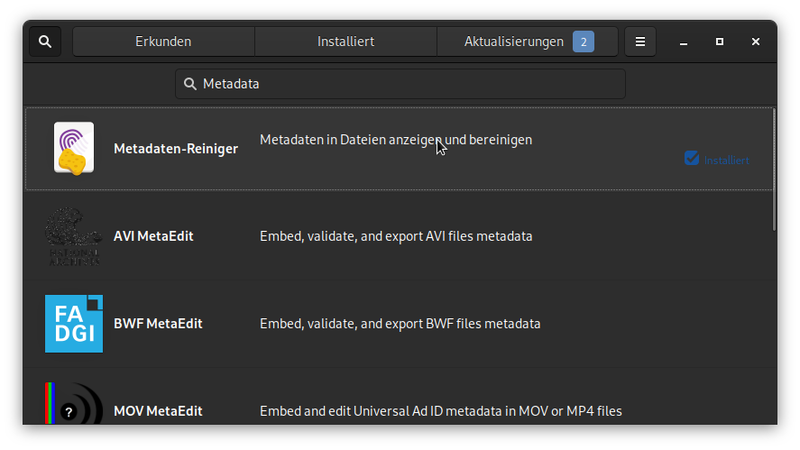
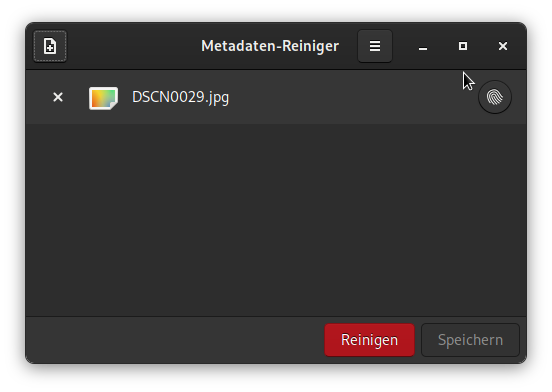
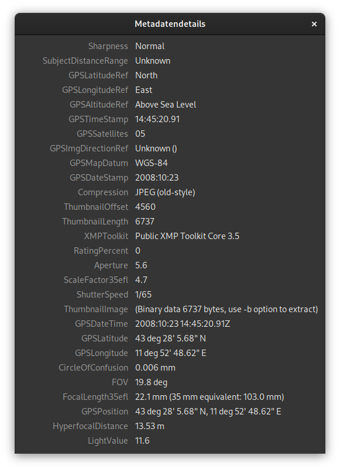
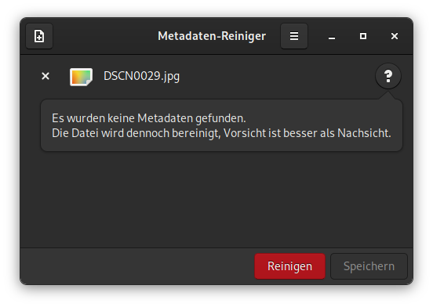

# Metadata Cleaner - Anzeigen und Bereinigen von Metadaten in Dateien

Metadaten in einer Datei können eine Menge über einem verraten. Kameras zeichnen Daten darüber auf, wann und wo ein Bild aufgenommen wurde und welche Kamera verwendet wurde. Office Anwendungen fügen Dokumenten und Tabellenkalkulationen automatisch Autoren- und Firmeninformationen hinzu. Vielleicht möchten man diese Informationen nicht preisgeben, wenn eine Datei weitergegeben oder auf Social Media veröffentlicht wird. Viele Internetdienste und Messanger entfernen zwar diese Information bevor eine Datei veröffentlicht wird, allerdings hat der jeweilige Dienst dann diese Information.

Mit dem Tool [Metadata Cleaner](https://gitlab.com/rmnvgr/metadata-cleaner) (deutsch Metadata Reiniger) kann man die Metadaten in Dateien anzeigen und sie so weit wie möglich loswerden.


Metadata Cleaner unterliegt der `GNU GENERAL PUBLIC LICENSE, v3` und der Quellcode ist auf [Gitlab](https://gitlab.com/rmnvgr/metadata-cleaner/-/tree/master) verfügbar.

## Installation
Metadata Cleaner ist als Flatpak auf [Flathub](https://flathub.org/apps/details/fr.romainvigier.MetadataCleaner) erhältlich. 
Flatpak ist standardmässig auf Fedora installiert. Um loszulegen, muss man nur [Flathub aktivieren](https://flatpak.org/setup/), danach können im Software Center alle Flatpak's von Flathub installiert werden.



Natürlich kann man Metadata Cleaner auch über die Kommandozeile installieren.
```
flatpak install flathub fr.romainvigier.MetadataCleaner
```

## Benutzung
Die Benutzung von Metadata Cleaner ist grösstenteils selbsterklärend. Wenn eine Datei mit dem `+` Button hinzugefügt wurde, können über den `Fingerabdruck` Button die Metadaten angezeigt werden.



Bei meinem [Testbild](https://github.com/ianare/exif-samples/blob/master/jpg/gps/DSCN0029.jpg) ist die Liste der Metadaten sehr Lang. Hier sieht man eindrücklich, wie viele Informationen zusätzlich zum eigentlichen Bild vorhanden sind. Für den Eigengebrauch der Bilder sind aber Metainformationen wie der Aufnahmeort und Zeit sehr nützlich. Allerdings müssen das Internetdienste oder andere Dritte nicht zwingend wissen.



Um nun die Metainformation zu entfernen, muss nur auf den roten `Reinigen` Button geklickt werden und danach auf `Speichern`. Es ist aber **Vorsicht** geboten. Wenn man die Metadaten auf der Originaldatei löscht, sind sie weg.



In den Einstellungen gibt es noch die Möglichkeit ein oberflächliches Bereinigen zu aktivieren. Im Tooltip steht Folgendes dazu:

>Standardmässig könnte der Bereinigungsprozess deine Dateien ein wenig verändern, um so viele Metadaten wie möglich zu entfernen. Zum Beispiel könnten Texte in PDF nicht mehr auswählbar sein, komprimierte Bilder könnten nochmals komprimiert werden... Bei einer oberflächlichen Reinigung könnten einige Metadaten übrigbleiben, dafür werden die Dateien nicht verändert werden.

Unter Umständen kann diese Einstellung Sinn ergeben. Nach dem Bereinigen kann man die Metadaten der Datei erneut einsehen und entscheiden, ob noch unerwünschte Information vorhanden sind.

Als Letztes möchte ich noch erwähnen, dass das Projekt sehr schnell auf mein [Bug Report](https://gitlab.com/rmnvgr/metadata-cleaner/-/issues/5) reagiert hat und das Problem behoben wurde.