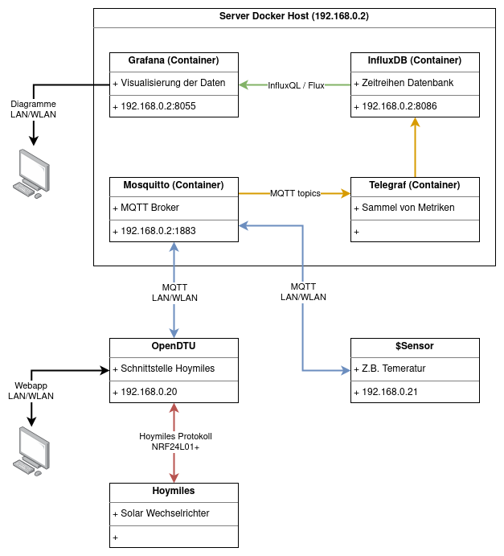
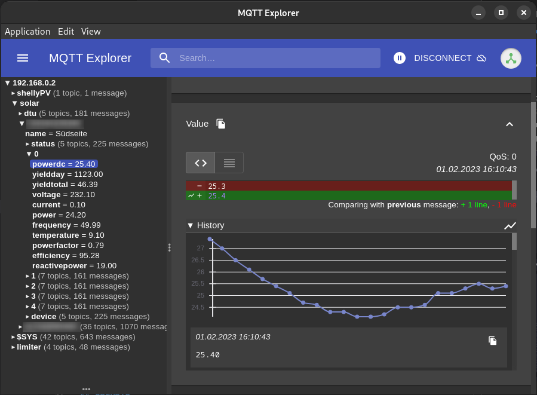
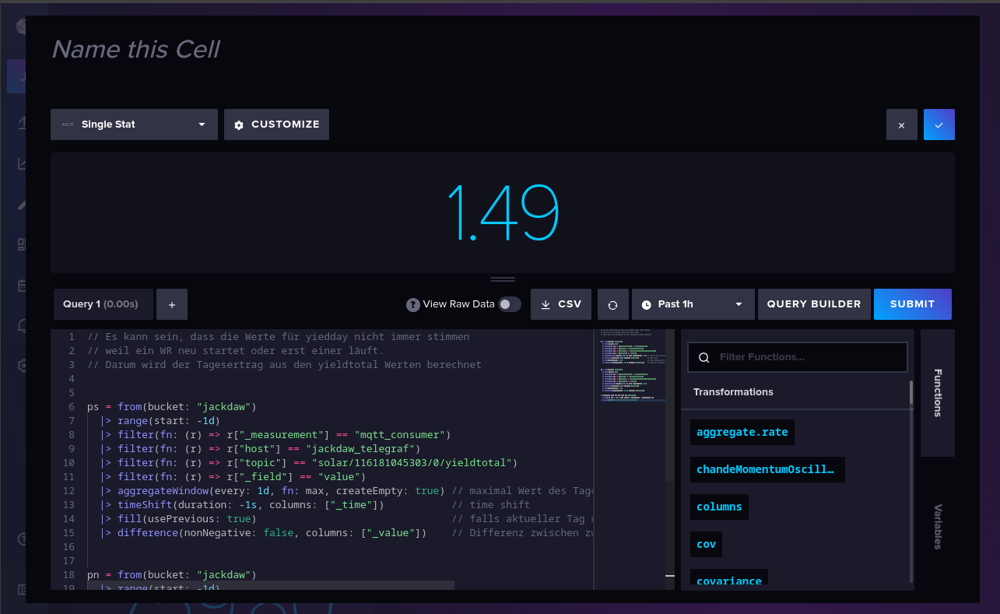
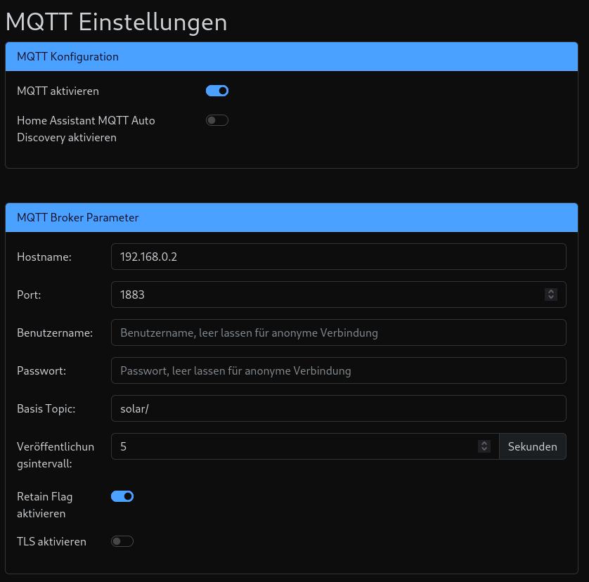
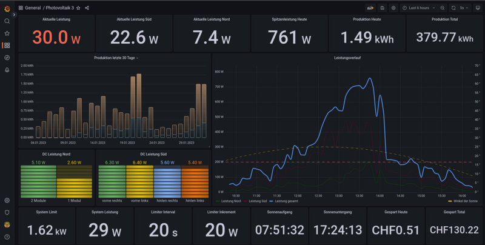

# Aufzeichnen und visualisieren von Metriken

Ich den Kommentaren meiner zwei Artikel zum Thema Balkonsolar ([Plug-&-Play-Photovoltaikanlagen](https://gnulinux.ch/plug-play-photovoltaikanlagen) und [My Love - OpenDTU](https://gnulinux.ch/opendtu-ertrags%C3%BCberwachung-von-hoymiles-wechselrichter-ohne-cloud)) wurde einige male nach einer Schritt-für-Schritt Anleitung für das Monitoring gefragt. Eine solche Anleitung zu schreiben, ist wirklich eine sehr grosse Arbeit. Dazu habe ich leider keine Zeit. Es wäre sehr schön, wenn eine Person aus der Communitiy die sich so ein System aufbaut, gleich einen Artikel dazu einreichen könnte.

Nichtsdestotrotz möchte ich eine Übersicht meines System vorstellen und die einzelnen Komponenten kurz Erklären sowie meine Konfiguationsdateien zu Download bereietstellen. Anahnd dieser Übersicht sollten sich im Internet genügend Anleitungen finden lassen.

Alle Serverdienste bereibe ich als Docker Container. Für mich bietet das den grossen Vorteil, dass ich alle Daten und Konfiguration an einem Ort speichern kann und die Beschreibung des Container auch gleiche meine Dokumenation dazu ist. Man kann sich auch alle Dienste konventionell installieren. Als Server kann man z.B. ein NAS, ein Raspberry Pi oder sonst einen PC verwenden der Docker unterstützt. Da der Server 24/7 läuft, bietet sich ein Sparsamer Rechner an.

Alle Dienste laufen nur lokal bei mir im Netzwerk und sind nicht über das Internet erreichbar. Daher habe ich keine besonderes Augenmerk auf die Sicherheit gelegt. Wenn die Dienste erreichbar sein sollen, müssen die Konfiguartion angepasst werden. Alternativ kann ein VPN Tunnel genutzt werden.



## Docker
[_Docker (Software) Wikipedia:_](https://de.wikipedia.org/wiki/Docker_(Software))

>Docker ist eine freie Software zur Isolierung von Anwendungen mit Hilfe von Containervirtualisierung.
>
>Docker vereinfacht die Bereitstellung von Anwendungen, weil sich Container, die alle nötigen Pakete enthalten, leicht als Dateien transportieren und installieren lassen. Container gewährleisten die Trennung und Verwaltung der auf einem Rechner genutzten Ressourcen.

Anleitungen und Beschreibungen für Anfänger finden sich im Internet genügend. Bevor man beginnt, sollte das Grundkonzept der Container, persistentes Speichern von Nutzdaten und `docker-compose` verstanden sein.

Ich kann nur dazu raten, einfach mal auszuprobieren. Da die Container isoliert vom Betriebssystem betrieben werden, bleiben nach dem Löschen auch keine Rückstände auf dem System liegen.

## MQTT und Mosquitto
[_MQTT Wikipedia:_](https://de.wikipedia.org/wiki/MQTT)

>MQTT (ursprünglich MQ Telemetry Transport) ist ein offenes Netzwerkprotokoll für Machine-to-Machine-Kommunikation (M2M), das die Übertragung von Telemetriedaten in Form von Nachrichten zwischen Geräten ermöglicht, trotz hoher Verzögerungen oder beschränkter Netzwerke. Entsprechende Geräte reichen von Sensoren und Aktoren, Mobiltelefonen, Eingebetteten Systemen in Fahrzeugen oder Laptops bis zu voll entwickelten Rechnern.

Wer schon mal etwas mit Heimautomatisierung beschäftig hat, wird sicher über dieses Protokoll gestolpert sein. Einfach gesagt, veröffentlicht (publish) ein Knoten eine Metrik zu einem Thema (topic). Ein anderer Knoten, der sich für dieses Thema interessiert, kann dieses abonieren (subscribe). Die vermittlung der Daten zwischen den beiden Knoten übernimmt ein Händler (broker). Dass heisst, die beiden Knoten müssen sich nicht direkt kennen. Sie senden und abonieren das Thema direkt beim Händler.

Als MQTT Broker nutze ich [Eclipse Mosquitto](https://mosquitto.org/) und zur Fehlersuche hat sich [MQTT Explorer](https://mqtt-explorer.com/) als sehr nützlich heruasgestellt.



## InfluxDB
[_InfuxDB Wikipedia:_](https://de.wikipedia.org/wiki/InfluxDB)

>InfluxDB ist ein Open Source Datenbankmanagementsystem (DBMS), speziell für Zeitreihen (engl. time series).

Die Datenbank läuft im Hintergrund. Ausser dem initialen Einrichten hat man nicht mehr viel mit der Datenbank direkt zu tun. Beim Einrichten sollte darauf geachtet werden auch eine `retention policie` zu erstellen. Diese beschreibt, wie lange alte Daten mit welcher Auflöung vorgehalten werden. InfluxDB bietet auch ein Frontend. Diese hat sich als sehr nützlich erwiesen, um die `Flux` Abfragen zu erstellen.



## Telegraf
Telegraf ist ein serverbasierter Dienst zum Sammeln und Senden von Metriken. Telgraf wird von der selben Firma wie die InfluxDB enwtickelt. In meinem Fall, habe ich die MQTT topics die mich interessieren via Telegraf abnoniert. Telegraf schreibt dann die Metriken in die InfluxDB. Telegraf ist ein sehr mächtiges Werkzeug. Es spricht nicht nur MQTT sondern kann aus allen möglichen Quellen Daten anzapfen und wenn nötig auch noch richtig formatieren. Ich habe zum Beispiel noch einen [LoRaWAN](https://de.wikipedia.org/wiki/Long_Range_Wide_Area_Network) Sensor dessen Daten ich über das [The Things Network](https://de.wikipedia.org/wiki/The_Things_Network) in der selben Datenbank speicheren. Zusätzlich dazu kommen noch die Wetterdaten von [OpenWeather](https://openweathermap.org/). Zwischen all diesen Daten können, wenn vorhanden, auch korelationen gefunden werden.

## OpenDTU
In OpenDTU können wir nun unseren MQTT Broker einstellen. 



In der Telegraf Konfiguration können bestimmte topics aboniert werden. Grundsätzlich könnte man auch einfach alles was vom OpenDTU kommt abonieren. Das generiert aber meist unötig viele Daten. Die [Beschreibung der MQTT topics](https://github.com/tbnobody/OpenDTU/blob/master/docs/MQTT_Topics.md) ist sehr ausfühlich.

```
[[inputs.mqtt_consumer]]
servers = ["tcp://192.168.0.2:1883"]

topics = [
    "solar/+/+/current",
    "solar/+/+/voltage",
    "solar/+/+/power",
    "solar/+/+/powerdc",
    "solar/+/+/yieldday",
    "solar/+/+/yieldtotal",
    "solar/+/+/powerfactor",
    "solar/+/+/frequency",
    "solar/+/+/temperature",
    "solar/+/+/irradiation",
    "solar/+/status/limit_absolute",
    "solar/+/status/reachable",
    "solar/+/status/producing",
    "solar/+/cmd/limit_nonpersistent_absolute",
]
 
data_format = "value"
data_type = "float"
```

## Grafana
[_Grafana Wikipedia:_](https://de.wikipedia.org/wiki/Grafana)

>Grafana ist eine plattformübergreifende Open-Source-Anwendung zur grafischen Darstellung von Daten aus verschiedenen Datenquellen wie z. B. InfluxDB, MySQL, PostgreSQL, Prometheus und Graphite.
>
>Die erfassten Rohdaten lassen sich anschließend in verschiedenen Anzeigeformen ausgeben. Diese können dann zu sogenannten Dashboards zusammengefügt werden. Die Anzeigemöglichkeiten und Datenquellen können zudem mittels Plug-ins erweitert werden.

Das Ziel der ganzen Übung ist das Grafana Dashboard mit den visualisierungen der Zeitreihen. Um die Daten aus der Datenbank abzufragen, kann entweder [InfluxQL oder Flux](https://grafana.com/docs/grafana/latest/datasources/influxdb/#select-a-query-language) gewählt werden. InfluxQL ist eine [SQL](https://de.wikipedia.org/wiki/SQL) ähnliche Abfragesprache und Flux ist eine funktionale Datenskriptsprache. Ich habe mich für Flux entschieden, da ich diese noch nicht kannte und es mich interessierte. Wie oben schon erwähnt, würde ich die Abfragen im Frontend der InfluxDB erstellen, da ich den Editor etwas besser finde.



