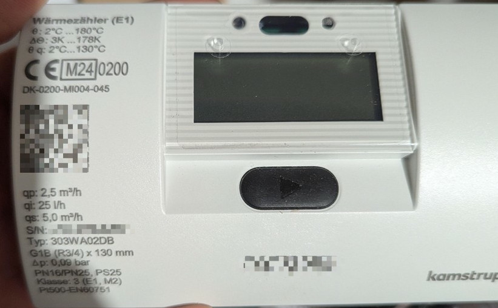
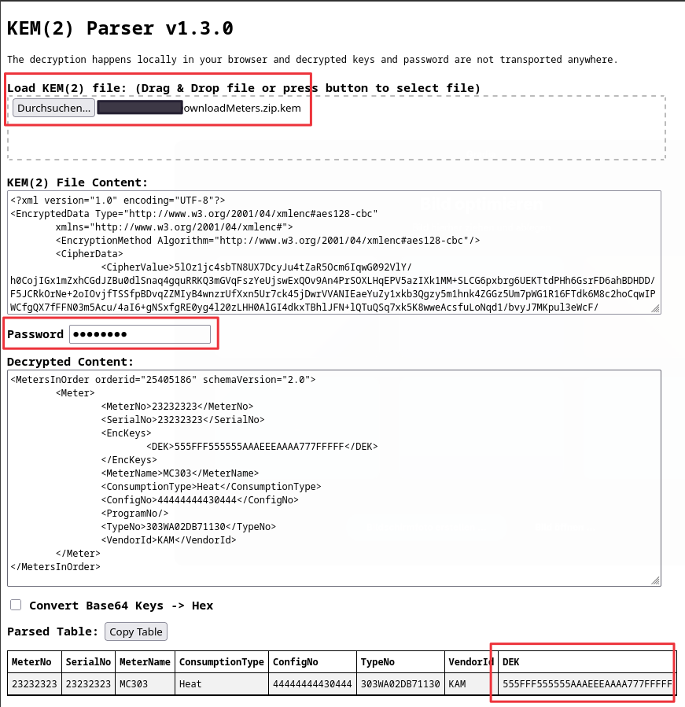
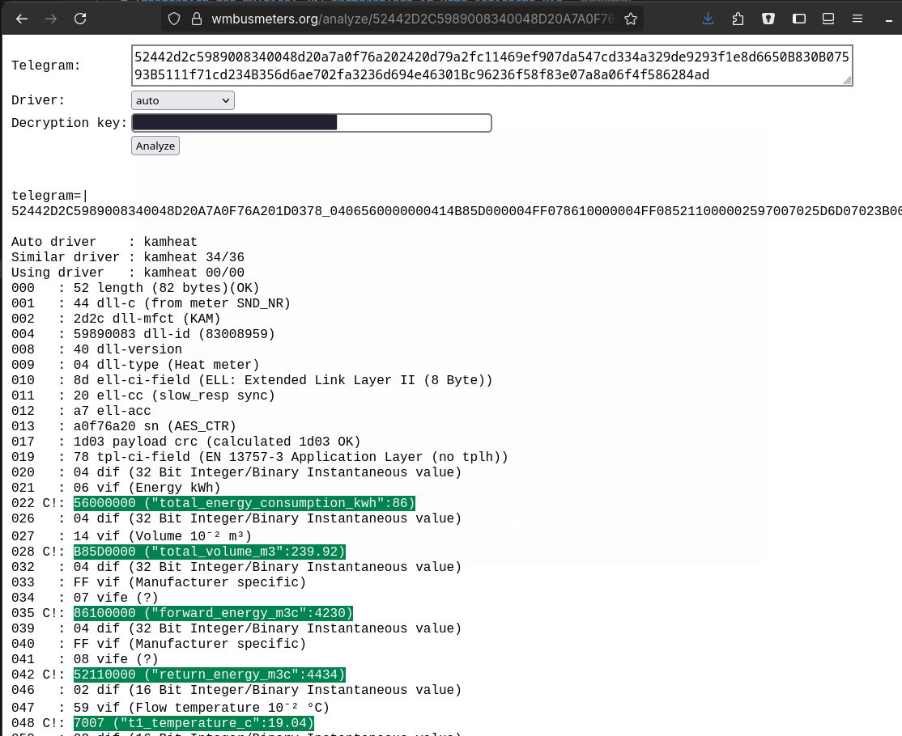
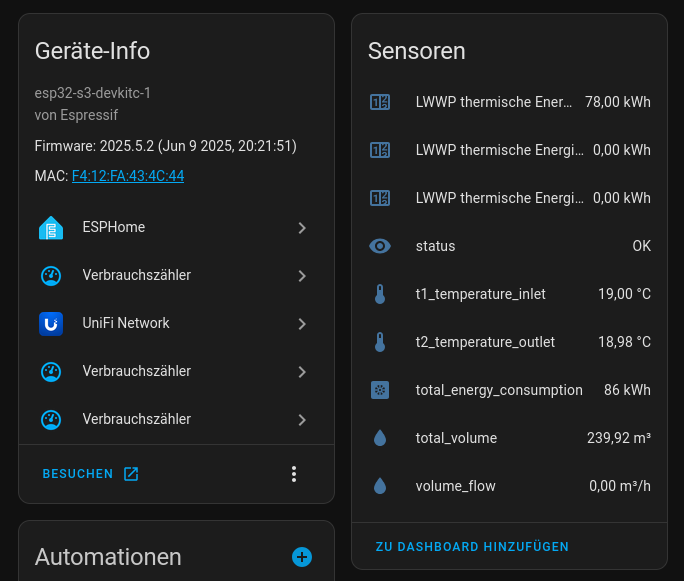

# Integration des Multical 303 Wärmezählers in Home Assistant via Wireless M-Bus

Die präzise Messung des Energieverbrauchs wird zunehmend wichtiger, besonders wenn man auf eine Wärmepumpe umsteigt, um die Effizienz des Heizsystems genau zu überwachen. Ein kostengünstiger Weg, dies zu erreichen, ist die Nutzung des Wärmezählers **Kamstrup Multical 303**, der seine Daten über Wireless M-Bus (wM-Bus) sendet. In diesem Artikel beschreibe ich, wie ich diesen Zähler in Home Assistant integriert habe, um die Messwerte direkt im Dashboard abzulesen.



## Was ist der Multical 303 und Wireless M-Bus?

In der Abbildung ist der kompakte Wärmezähler **Kamstrup Multical 303** zu sehen. Dieser Ultraschall-Wärmemengenzähler ist speziell für Heizsysteme konzipiert und misst die verbrauchte Wärmeenergie präzise. Der Multical 303 unterstützt sowohl den kabelgebundenen M-Bus als auch Wireless M-Bus für die Fernauslesung. Die drahtlose Übertragung erfolgt nach dem europäischen Standard EN 13757-4 (Wireless M-Bus) – das Gerät kann auf verschiedene wM-Bus-Modi (z.B. C1 oder T1 nach OMS-Standard) konfiguriert werden. Der wM-Bus nutzt dabei Frequenzen um **868 MHz**, welche in Europa lizenzfrei für Anwendungen freigegeben sind. Dadurch können die Zählerdaten ohne zusätzliche Verkabelung bequem per Funk übertragen werden.

In der Schweiz nutzen bereits viele Gas-, Wasser- und Stromversorger diesen wM-Bus, um ihre Zähler fernablesen zu können. Allerdings wird hierfür spezielle Hardware benötigt, da die Versorger ihre Systeme auf wM-Bus-fähige Zähler abgestimmt haben. Diese Technik ermöglicht es den Versorgern, Daten drahtlos und ohne den Einsatz von physischen Kabeln abzurufen, was für eine moderne Infrastruktur von Vorteil ist.

Der Vorteil des Multical 303 liegt in seinem attraktiven Preis-Leistungs-Verhältnis. Dennoch stellt sich die Frage, wie man diesen Zähler in ein bestehendes System integrieren kann, ohne teure professionelle Lösungen einsetzen zu müssen. Da der Zähler nach dem offenen wM-Bus-Standard funkt, bietet sich eine eigene Empfängerlösung an, die die Daten entschlüsselt und an Home Assistant weitergibt.

## Hardware: ESP32 und CC1101

Um die Kommunikation mit dem Multical 303 zu ermöglichen, habe ich einen **ESP32** Mikrocontroller in Kombination mit einem **CC1101**-RF-Modul verwendet. Der CC1101 ist ein Funktransceiver, der speziell für Sub-GHz-Frequenzen wie **868 MHz** geeignet ist und damit ideal für die wM-Bus-Kommunikation genutzt werden kann. Der ESP32 wiederum ist ein leistungsstarker Mikrocontroller mit WLAN, der sich hervorragend für IoT-Projekte eignet. Das CC1101-Modul wird dabei per SPI-Schnittstelle an den ESP32 angebunden (Stromversorgung 3,3 V, GND und einige GPIO-Pins für CS/MOSI/MISO/CLK/GDO), was eine einfache Hardware-Integration ermöglicht.

Da ich bereits einen **ESP32** zur Verfügung hatte, musste ich diesen nicht extra kaufen – das hat das Projekt zusätzlich kostengünstig gemacht. Für mich war es eine perfekte Möglichkeit, diesen bereits vorhandenen Mikrocontroller für das Projekt zu nutzen.

## Die Herausforderung mit wM-Bus

Ein wesentliches Hindernis bei der Nutzung des wM-Bus ist die **Verschlüsselung** der Kommunikation. Kamstrup versieht jeden Zähler mit einem individuellen AES-128-Schlüssel, der standardmässig nur mit der zugehörigen Ausleseausrüstung ausgelesen werden kann. Privaten Nutzern wird dieser Schlüssel vom Hersteller nicht ohne Weiteres mitgeteilt – das bedeutet, man muss ihn sich auf anderem Wege selbst beschaffen. In der Praxis erhält man vom Versorger oder Verkäufer meistens eine sogenannte **KEM-Datei** (Kamstrup Encryption Module), welche den Schlüssel enthält. Diese Datei ist ihrerseits verschlüsselt, sodass man zunächst an den eigentlichen Schlüssel gelangen muss. 

In meinem Fall stellte sich das zunächst als schwierig heraus. Mit etwas Geduld und freundlichem E-Mail-Verkehr mit dem Betreiber des Online-Shops, bei dem ich den Multical 303 erworben hatte, fand ich jedoch die Lösung. Der Verkäufer war sehr hilfsbereit und konnte für meinen Zähler die passende KEM-Datei aus dem Kamstrup-Portal herunterladen. Zusammen mit der Datei erhielt ich ein Passwort, das zum Entschlüsseln benötigt wird.

Die Entschlüsselung der KEM-Datei erfolgt mit dem **KEM File Parser** (kem_parser_v1_2.html) von Kamstrup, der als einfache HTML-Datei mit eingebettetem JavaScript bereitgestellt wird. Die Entschlüsselung passiert dabei lokal im Browser, es werden keine sensiblen Daten übertragen. Das vom Verkäufer gelieferte Passwort wird in das Tool eingegeben, woraufhin die Datei entschlüsselt wird und der eigentliche wM-Bus-Schlüssel zum Vorschein kommt. Nachdem das KEM-File auf diese Weise entschlüsselt war, konnte ich den hexadezimalen Schlüssel für die wM-Bus-Kommunikation extrahieren und für die weitere Konfiguration nutzen.



## Einrichtung in ESPHome

Mit dem entschlüsselten Schlüssel stand als nächstes die Konfiguration des ESP32 in **ESPHome** an. ESPHome ist eine Open-Source-Plattform, die eine einfache Integration von Mikrocontrollern (wie ESP32/ESP8266) in Home Assistant ermöglicht. Glücklicherweise gibt es für die [wM-Bus-Kommunikation bereits eine Community-Lösung](https://github.com/SzczepanLeon/esphome-components/tree/version_4) als ESPHome-Komponente. Ich folgte der Anleitung auf GitHub, um eine erste ESPHome-Konfiguration zu erstellen, die alle relevanten wM-Bus-Telegramme mitlauscht.

```yaml
wmbus:
  all_drivers: True
  log_all: True
```

Schon nach wenigen Minuten konnte ich im Log des ESP32 erste Datentelegramme meines Multical 303 erkennen. Es zeigte sich, dass der Zähler aus Energiespargründen nicht jedes Mal das vollständige Telegramm sendet. Die kurzen Telegramme enthielten nur Messwerte und konnten nicht entschlüsselt werden (Fehler "compressed and signature unknown"), daher wartete ich ein paar Sendezyklen ab, bis ein längeres Telegramm mit allen Infomationen empfangen wurde.

```log
[06:53:17][I][wmbus:106]: kamheat [0x83008959] RSSI: -62dBm T: 52442D2C5989008340048D20A7A0F76A202420D79A2FC11469EF907DA547CD334A329DE9293F1E8D6650B830B07593B5111F71CD234B356D6AE702FA3236D694E46301BC96236F58F83E07A8A06F4F586284AD (83) C1 B
```

Mit diesem vollständigen Datentelegramm und dem bekannten Schlüssel konnte ich anschliessend die Rohdaten entschlüsseln und analysieren. Hierfür nutzte ich das praktische Online-Tool auf [wmbusmeters.org](https://wmbusmeters.org/), in das man den Hex-Datenstring und den Schlüssel eingibt, um die dekodierten Werte zu erhalten.



## Die Konfiguration der Sensoren

Sobald das vollständige Telegramm entschlüsselt vorlag und die darin codierten Werte identifiziert waren, konnte ich in der ESPHome-Konfiguration die entsprechenden Sensoren für die Wärmemessung anlegen (hier findest du meine [Konfiguartion](https://github.com/MrReSc/BlogPosts/blob/main/Multical303/esphome-web-434c44.yaml)). Die ESPHome-Firmware liest nun die empfangenen wM-Bus-Telegramme des Multical 303 aus, entschlüsselt sie mit dem zuvor ermittelten Schlüssel und aktualisiert die Sensorwerte. Dank des nahtlosen Zusammenspiels über die ESPHome-API werden die Messwerte in Echtzeit an Home Assistant übertragen. Ich kann also direkt im Home Assistant beobachten, wie sich beispielsweise die momentane Wärmeleistung oder der Tagesverbrauch entwickeln.

```yaml
sensor:
  - platform: wmbus
    meter_id: !secret wmz_meter_id
    type: kamheat
    key: !secret wmz_key
    sensors:
      - name: "rssi"
        field: "rssi"
        accuracy_decimals: 0
        unit_of_measurement: "dBm"
        device_class: "signal_strength"
        state_class: "measurement"
        entity_category: "diagnostic"

      - name: "t1_temperature_inlet"
        field: "t1_temperature"
        accuracy_decimals: 2
        unit_of_measurement: "°C"
        device_class: "temperature"
        state_class: "measurement"
        icon: "mdi:thermometer"

      - name: "t2_temperature_outlet"
        field: "t2_temperature"
        accuracy_decimals: 2
        unit_of_measurement: "°C"
        device_class: "temperature"
        state_class: "measurement"
        icon: "mdi:thermometer"
```

Die Einbindung der Sensoren in ESPHome hat den grossen Vorteil, dass Home Assistant sich um nichts weiter kümmern muss – die Berechnungen (z.B. der Temperaturdifferenz) und die Dekodierung passieren dezentral auf dem ESP32. Home Assistant empfängt bereits fertig aufbereitete Sensorwerte, die sich wie bei jedem anderen ESPHome-Gerät nutzen lassen (für Automatisierungen, Visualisierungen im Dashboard, etc.).

## Integration in Home Assistant

Da ich bereits andere Geräte via ESPHome in Home Assistant eingebunden hatte, war die ESPHome-Integration in meinem Home Assistant System schon eingerichtet. (Wer dies noch nicht installiert hat, findet im Internet zahlreiche Anleitungen dazu.) Sobald der ESP32 mit der oben beschriebenen ESPHome-Konfiguration geflasht und ins WLAN eingebunden ist, meldet er sich automatisch bei Home Assistant. Tatsächlich wurde das neue Gerät umgehend von Home Assistant erkannt und unter *“Entitäten”* als verfügbar angezeigt – die automatische Discovery über ESPHome macht es möglich. Ich brauchte den Multical 303 also nur noch in Home Assistant hinzuzufügen und konnte sofort die Messwerte im Dashboard sehen. 



Es gibt auch eine direkte Integration des Multical 303 in Home Assistant über das wmbusmeters Addon. Allerdings wird hierfür ein USB-Dongle benötigt, der die Funkkommunikation des Zählers ermöglicht. Weitere Informationen zur Einrichtung findest du auf der GitHub-Seite des [wmbusmeters HA Addons](https://github.com/wmbusmeters/wmbusmeters-ha-addon).

## Fazit

Die Integration des Multical 303 Wärmezählers in Home Assistant ist zwar nicht ganz trivial, insbesondere wegen der verschlüsselten wM-Bus-Kommunikation, aber mit etwas Geduld und der richtigen Hardware ist sie gut machbar. Der kritischste Schritt war das Beschaffen und Entschlüsseln des AES-Schlüssels. Hat man diesen aber einmal vorliegen, fügt sich der Rest nahtlos zusammen. Die Kombination aus ESP32, CC1101 und ESPHome bietet eine kostengünstige und flexible Lösung zur präzisen Messung des Energieverbrauchs in einem modernen Heizsystem. Im Vergleich zu proprietären Auslesesystemen ist diese DIY-Lösung deutlich preiswerter und vollkommen unter eigener Kontrolle. Ich habe nun die Möglichkeit, die Effizienz meiner Wärmepumpe in Echtzeit zu überwachen und bei Bedarf Anpassungen vorzunehmen. Dadurch gewinne ich wertvolle Einblicke in mein Heizsystem und kann dessen Betrieb optimieren.

## Hinweis zu SzczepanLeon/esphome-components

Das Projekt [SzczepanLeon/esphome-components](https://github.com/SzczepanLeon/esphome-components/) wird aktuell überarbeitet. In der Version **5.x** wird der **CC1101** noch nicht unterstützt, aber es steht auf der TODO-Liste. Um den CC1101 zu verwenden, musst du eine Version **< 5** verwenden.


