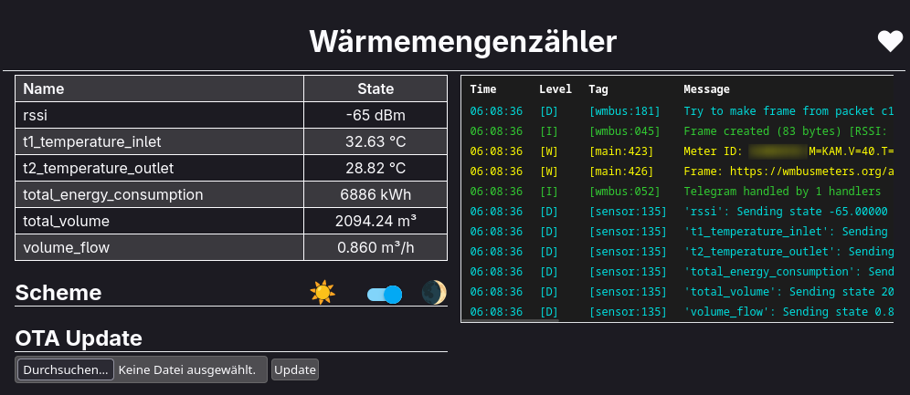

# Follow up: Multical 303 Wärmezählers Update mit SX1276

[Im letzten Artikel habe ich den Multical 303 mit ESP32 und CC1101](https://gnulinux.ch/integration-des-multical-303-in-home-assistant-via-wireless-m-bus) in Home Assistant integriert. Das lief stabil, bis ich das ESPHome Gerät aktualisieren wollte. Genau dort hat es bei mir geklemmt: Mit neueren ESPHome Versionen liess sich die Firmware zwar noch bauen, aber nach dem Update startete das Gerät nicht mehr.



## Kurz zu ESPHome und SzczepanLeon/esphome-components

ESPHome ist ein Open Source Projekt, mit dem sich Mikrocontroller wie ESP32 sehr direkt in Home Assistant integrieren lassen. Konfiguration und Build laufen dabei deklarativ über YAML.

[SzczepanLeon/esphome-components](https://github.com/SzczepanLeon/esphome-components/) ist ein Community Projekt, das unter anderem eine Wireless M-Bus Auswertung als externe ESPHome Komponenten bereitstellt. Es hängt damit nicht am ESPHome Kern, sondern wird als externes Komponenten Repository eingebunden.

## Warum das Update klemmt

Der Kern des Problems sind inkompatible Änderungen in ESPHome, oft als breaking changes bezeichnet. Das betrifft besonders Schnittstellen und interne Details, die externe Komponenten nutzen. Wenn ESPHome hier umbaut, muss das Community Projekt nachziehen, sonst bricht die Kompatibilität. Dass das nicht immer sofort passiert, kann einfach vorkommen.

## CC1101 und Version 5

Im ursprünglichen Artikel war bereits der [Hinweis](https://gnulinux.ch/integration-des-multical-303-in-home-assistant-via-wireless-m-bus#hinweis-zu-szczepanleonesphome-components) drin, dass die Version 5 den CC1101 nicht mehr abdeckt und man für CC1101 bei einer Version unter 5 bleiben muss.

Aktuell wird aber daran gearbeitet, CC1101 wieder in die 5er Version zu bringen. Dazu gibt es [Diskussionen](https://github.com/SzczepanLeon/esphome-components/issues/255?utm_source=chatgpt.com) und einen [Pull Request](https://github.com/IoTLabs-pl/ESPHome-Components/pull/11). Bei mir hat das trotzdem nicht funktioniert, ich konnte den Fehler nicht eingrenzen.

## Woher der SX1276 Pfad kommt

Mit [Version 5.0.0](https://github.com/SzczepanLeon/esphome-components/releases/tag/5.0.0) wurde das Projekt laut Release Notes grundlegend überarbeitet. Dort wird explizit ein vollständiger Rewrite genannt, der sich auf das IoTLabs Repository bezieht.

[IoTLabs hat zudem ein eigenes Wireless M-Bus Gateway](https://github.com/IoTLabs-pl/wM-Bus-Gateway) auf ESP32 Basis umgesetzt. Das Gateway Repository ist interessant, weil es einen kompletten Referenzaufbau zeigt und die Arbeitsschritte rund um ESPHome und Wireless M-Bus sauber beschreibt. In der IoTLabs Komponenten Sammlung ist der Funkteil aktuell klar auf SX1276 ausgerichtet.

## Umstieg auf SX1276 Hardware

Damit ich meine Geräte wieder sauber aktualisieren kann, habe ich den Funkteil umgestellt. Ich habe dafür ein SX1276 Breakout Board für ein paar Franken aus Fernost bestellt und den ESP32 behalten. Wichtig ist, die 868 MHz Variante für Europa zu nehmen.


## Warum direkt IoTLabs einbinden

Ich habe mich entschieden, direkt das [IoTLabs Repository](https://github.com/IoTLabs-pl/esphome-components) einzubinden. Es ist die Basis für das Gateway, die Komponenten sind dort nachvollziehbar dokumentiert und im Gateway Repository findet man zusätzlich hilfreiche ESPHome Konfigurationen als Ausgangspunkt.

## Meine ESPHome Konfiguration

Die Dekodierung des Schlüssels und das Vorgehen, um an den AES Key zu kommen, habe ich bereits im [vorherigen Artikel](https://gnulinux.ch/integration-des-multical-303-in-home-assistant-via-wireless-m-bus#die-herausforderung-mit-wm-bus) beschrieben. Hier geht es nur um die SX1276 Variante und das Einbinden der externen Komponenten.

<details>
  <summary>ESPHome Konfiguration:</summary>

```
# https://de.aliexpress.com/item/1005009627839052.html
# https://mischianti.org/wp-content/uploads/2021/07/ESP32-WeMos-LOLIN32-Lite-pinout-mischianti-low-1024x545.jpg.webp
# https://github.com/IoTLabs-pl/ESPHome-Components
# https://github.com/IoTLabs-pl/wM-Bus-Gateway

esphome:
  name: wmz-sx1276
  friendly_name: Wärmemengenzähler
  name_add_mac_suffix: false

esp32:
  board: lolin32_lite
  variant: ESP32
  framework:
    type: esp-idf

web_server:
  port: 80
  local: true

# Enable logging
logger:
  level: DEBUG

# Enable Home Assistant API
api:
  encryption:
    key: xxxxxxxxxxxxxxxxxxxxxxxxxxxxxxxx

# Allow Over-The-Air updates
ota:
  - platform: esphome
  - platform: web_server

wifi:
  ssid: !secret wifi_ssid
  password: !secret wifi_password
  #use_address: 192.168.0.29

time:
  - platform: sntp
    id: time_sntp
    timezone: Europe/Zurich
    servers:
     - 192.168.0.1

external_components:
  - source: 
      type: git
      url: https://github.com/IoTLabs-pl/ESPHome-Components
      ref: v1.0.6
    components:
      - wmbus_common
      - wmbus_radio
      - wmbus_meter
    refresh: 0s

spi:
  clk_pin:  GPIO18  # SX1276: SCK   (spi clk)
  miso_pin: GPIO19  # SX1276: MISO  (spi miso)
  mosi_pin: GPIO23  # SX1276: MOSI  (spi mosi)

wmbus_common:
    drivers:
      - kamheat

wmbus_radio:
  id: radio_component
  radio_type: SX1276
  cs_pin:     GPIO32  # SX1276: NSS   (spi ss)
  reset_pin:  GPIO33  # SX1276: REST
  irq_pin:    GPIO25  # SX1276: DI01  (wichtig DI01 nicht DIO0)
  on_frame:
    - then:
        - logger.log:
            level: WARN
            format: "Meter ID: %s"
            args: ["frame->meter_id().c_str()"]
        - logger.log:
            level: WARN
            format: "Frame: https://wmbusmeters.org/analyze/%s"
            args: ["frame->as_hex().c_str()"]

wmbus_meter:
  - id: wmz_meter
    radio_id: radio_component
    meter_id: !secret wmz_meter_id
    type: kamheat
    key: !secret wmz_key
    mode: C1

sensor:
  - platform: wmbus_meter
    parent_id: wmz_meter
    name: "rssi"
    field: "rssi_dbm"
    accuracy_decimals: 0
    unit_of_measurement: "dBm"
    device_class: "signal_strength"
    state_class: "measurement"
    entity_category: "diagnostic"

  - platform: wmbus_meter
    parent_id: wmz_meter
    name: "t1_temperature_inlet"
    field: "t1_temperature_c"
    accuracy_decimals: 2
    unit_of_measurement: "°C"
    device_class: "temperature"
    state_class: "measurement"
    icon: "mdi:thermometer"

  - platform: wmbus_meter
    parent_id: wmz_meter
    name: "t2_temperature_outlet"
    field: "t2_temperature_c"
    accuracy_decimals: 2
    unit_of_measurement: "°C"
    device_class: "temperature"
    state_class: "measurement"
    icon: "mdi:thermometer"

  - platform: wmbus_meter
    parent_id: wmz_meter
    name: "total_energy_consumption"
    field: "total_energy_consumption_kwh"
    accuracy_decimals: 0
    unit_of_measurement: "kWh"
    device_class: "energy"
    state_class: "total_increasing"
    icon: "mdi:heat-pump"

  - platform: wmbus_meter
    parent_id: wmz_meter
    name: "total_volume"
    field: "target_volume_m3"
    accuracy_decimals: 2
    unit_of_measurement: "m³"
    device_class: "volume"
    state_class: "total_increasing"
    icon: "mdi:water"

  - platform: wmbus_meter
    parent_id: wmz_meter
    name: "volume_flow"
    field: "volume_flow_m3h"
    accuracy_decimals: 3
    unit_of_measurement: "m³/h"
    device_class: "volume_flow_rate"
    state_class: "measurement"
    icon: "mdi:water"
```
</details>

## Fazit

Der wichtigste Punkt an diesem Follow up ist der Lebenszyklus. Sobald ein Setup von externen Komponenten abhängt, kann die Updatefähigkeit von einem Tag auf den anderen eingeschränkt sein. ESPHome entwickelt sich weiter und bringt dabei gelegentlich breaking changes mit. Wenn eine externe Komponente diese Änderungen nicht zeitnah übernimmt, kann ein bisher stabiles Gerät plötzlich nicht mehr sinnvoll aktualisiert werden.

Das ist selten ein grundsätzliches Problem der Technologie, sondern eine Frage der Pflege und Prioritäten in Open Source Projekten. Es kann passieren, dass Maintainer den Fokus wechseln oder Zeit fehlt. Der entscheidende Vorteil bleibt aber: Man ist nicht blockiert. Man kann auf eine Alternative wechseln, Anpassungen selber vornehmen oder einen anderen Lösungsweg wählen, ohne das gesamte Projekt wegwerfen zu müssen.