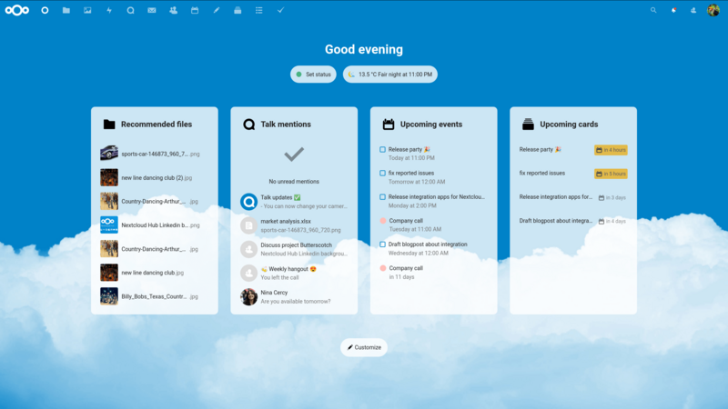

# Nextcloud Dashboard deaktivieren
Ab [Nextcloud 20](https://nextcloud.com/blog/nextcloud-hub-20-debuts-dashboard-unifies-search-and-notifications-integrates-with-other-technologies/) wird standardmässig ein Dashboard präsentiert, wenn man sich im Webinterface anmeldet. Da ich meine Nextcloud nur für Dateien, Kontakte und Kalender brauche, macht für mich das Dashboard wenig Sinn. Ich möchte gerne die Dateiansicht beim Start zurück.



Um das Dashboard beim Start zu deaktivieren, muss man die Standardanwendung des Webinterfaces ändern.

## Name der neuen Standardanwendung herausfinden
Um die Standardanwendung ändern zu können, muss man zunächst herausfinden, wie der Name der Anwendung lautet.

Dazu bewegt man am besten den Mauszeiger über das Icon der gewünschten Anwendung und schaut sich die Adresse an, die im Browser im unteren Bereich anzeigt wird. Der letzte Teil der Adresse verrät den korrekten Namen der Anwendung.


## Standardanwendung ändern
Um die gewünschte Anwendung beim nächsten Login direkt zu starten, muss man den folgenden Eintrag der Datei `config.php` hinzufügen:

```
'defaultapp' => 'files',
```
Die Datei `config.php` befindet sich im Verzeichnis `/config`. Bei mir sieht das Ende der Datei nun wie folgt aus:


Einzelne Anwendungen können auch auf Gruppen beschränkt sein. Bei einem Benutzer, der keinen Zugriff auf die neu definierte Standardanwendung hat, startet weiterhin die ursprüngliche Standardanwendung (Dashboard). Wenn ein falscher Wert eingegeben wird, wird auch die ursprüngliche Standardanwendung geöffnet. Es ist jedoch auch möglich, zusätzliche Standardanwendung zu definieren, sodass beim Benutzer in diesem Fall einfach die nächste oder übernächste Anwendungen gestartet wird.

```
'defaultapp' => 'files,photos,calendar',
```