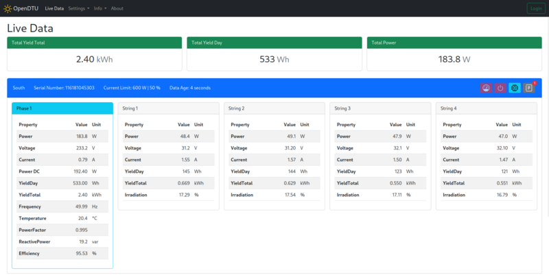
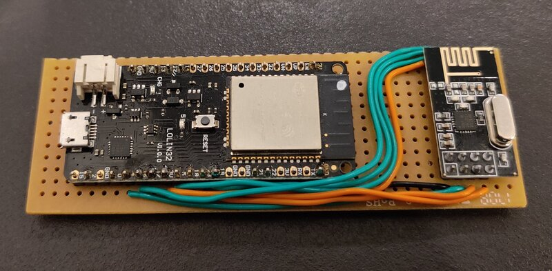
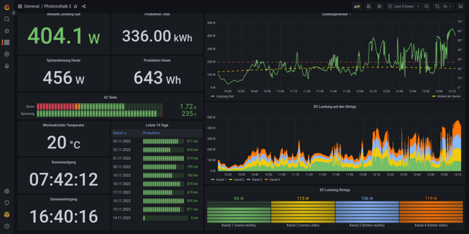

# OpenDTU - Ertragsüberwachung ohne Cloud

Vor einiger Zeit habe ich meine [Plug-&-Play-Photovoltaikanlage](https://gnulinux.ch/plug-play-photovoltaikanlagen) vorgestellt. Aus verschiedenen Gründen habe ich mich für einen anderen Wechselrichter entschieden, hauptsächlich aber um zwei separate MPPT zu haben. Ich habe einen HM-1200 von Hoymiles gekauft. Die Einspeiseleistung muss auf 600 W begrenzt werden, um den normativen Anforderungen gerecht zu werden. Dazu wird aber eine Datenübertragungseinheiten (DTU) vom Hersteller benötigt. Diese kostet je nach Model so viel ein Wechselrichter und für die Ertragsüberwachung ist man von der Cloud des Herstellers abhängig. Bei der Suche nach einer Alternative bin ich auf das Projekt [OpenDTU](https://github.com/tbnobody/OpenDTU) gestossen. Ich möchte euch das Projekt kurz vorstellen. Eine Installationsanleitung findet ihr auf der [Projektseite](https://github.com/tbnobody/OpenDTU#flashing-and-starting-up) oder in der c't 24/2022 S. 158.

Da das Projekt noch sehr jung ist, gibt es häufig Updates. Es gibt auch noch keine stabile Version. Man installiert immer den `main` branch. Allerdings läuft der ESP32 bei mir seit zwei Wochen durch und das absolut stabil.

## Technologie
Die Software steht unter der `GNU General Public License v2.0`. Der Mikrocontroller Teil wurde mit dem `PlatformIO` Framework erstellt. Die Web-Applikation basiert auf `Vue.js` und ist in `TypeScript` geschrieben.

Das Kommunikationsprotokoll wurde "reverse engineered", da es keine öffentliche Dokumentation gibt.

## Hardware
OpenDTU läuft einem ESP32 und benötigt ein NRF24L01+ Funktmodul. Den ESP32 hatte ich noch in einer Bastekiste und das Funkmodul habe ich für 2.90.- CHF gekauft. Ich habe beides auf eine Lochrasterplatine gelötet und ich warte noch auf ein 3D gedrucktes Gehäuse. Genauere Beschreibung zur [Hardware](https://github.com/tbnobody/OpenDTU#hardware-you-need) und [Verdrahtung](https://github.com/tbnobody/OpenDTU#wiring-up) findet ihr auf der Projektseite.

Hinweis: Mit dem Schwesternprojekt [Ahoy](https://github.com/lumapu/ahoy) gibt es auch eine Software für den ESP8266 und für den Arduino.

## Unterstützte Wechselrichter
Zurzeit werden die folgenden Wechselrichter unterstützt:

* Hoymiles HM-300
* Hoymiles HM-350
* Hoymiles HM-400
* Hoymiles HM-600
* Hoymiles HM-700
* Hoymiles HM-800
* Hoymiles HM-1000
* Hoymiles HM-1200
* Hoymiles HM-1500
* TSUN TSOL-M350 (Firmware abhängig)
* TSUN TSOL-M800 (Firmware abhängig)
* TSUN TSOL-M1600 (Firmware abhängig)

Sonstige Modulwechselrichter von Hoymiles nutzen einen anderen Funkstandard und womöglich auch ein anderes Protokoll. Wahrscheinlich wird es für diese in absehbarer Zeit kein Support geben.

## Funktionen
Auf der Projektseite gibt es eine [Liste](https://github.com/tbnobody/OpenDTU#features-for-end-users) mit allen Funktionen.

* Live-Daten vom Wechselrichter lesen
* Anzeigen des internen Ereignisprotokolls des Wechselrichters
* Anzeige von Wechselrichterinformationen wie Firmware-Version
* Anzeigen und Einstellen der Leistungsbegrenzung
* Funktion zum Aus- und Einschalten des Wechselrichters
* Multi-Wechselrichter-Unterstützung (bis zu 10)
* MQTT-Unterstützung (mit TLS)
* Home Assistant MQTT Auto Discovery Unterstützung
* Firmware-Upgrade über die Web-UI
* Prometheus API Endpunkt

Für mich war die Möglichkeit die Leistung auf der AC Seite zu begrenzen sowie die Ertragsdaten via `MQTT` auszulesen die wichtigsten. Noch nicht aufgeführt, aber vorhanden ist auch eine [Web-API](https://github.com/tbnobody/OpenDTU/blob/master/docs/Web-API.md). 

Erwähnenswert zur Leistungsbegrenzung ist noch, dass dies auch via `MQTT`möglich ist. Es ist denkbar, einen Nulleinspeisung zu bauen oder eine Leistungsregelung über mehrere Wechselrichter. Ich habe schon einige Ideen, was ich ausprobieren könnte :-). 

## Monitoring
Im vorhergehenden Artikel habe ich bereits meine Ertragsüberwachung beschrieben. Da ich nun viel mehr Daten zur Verfügung habe, habe ich auch mein Grafana Dashboard angepasst.

