# Frei Energie - ganz ohne Esoterik

Zugegeben, der Titel könnte provozieren. Aber es prasselt in 30 Minuten genügend Energie auf die Erde ein, um den Energiehunger der Menschheit für ein ganzes Jahr zu stillen. Diese Energie ist für jeden frei zugänglich, ohne eine Wünschelrute oder einen Energiestein, sondern mit Hilfe evidenzbasierter Wissenschaft. Ich möchte euch zeigen, wie ich auf unserem Haus eine 15 kWp Photovoltaikanlage gebaut habe und mein Wissen mit euch teilen.

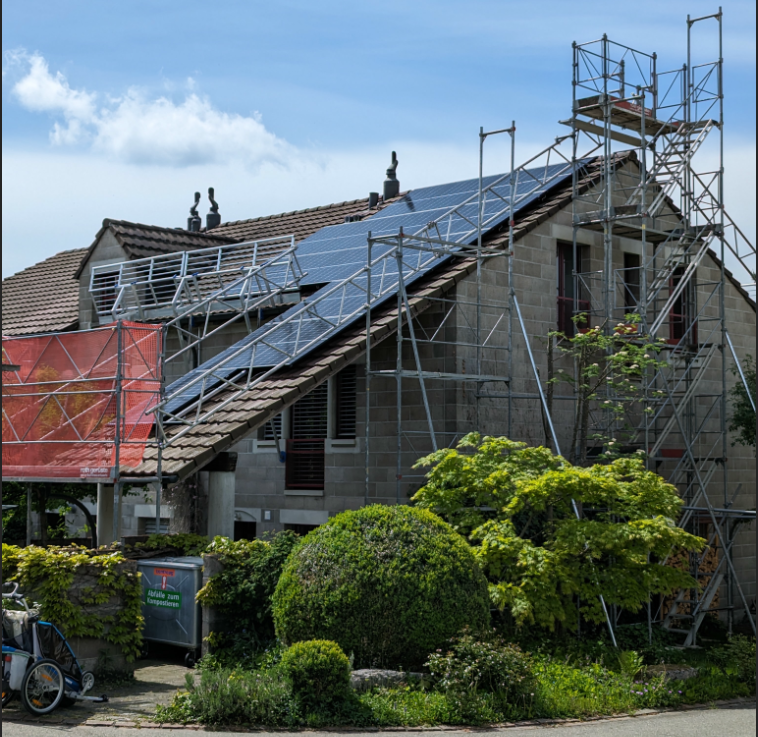

Alles begann im Januar 2022, als ich aus gebrauchten Solarpanels und einem alten Wechselrichter eine [Plug & Play-Photovoltaikanlage](https://gnulinux.ch/plug-play-photovoltaikanlagen), aka Balkonkraftwerk, gebaut habe. Diese Anlage wurde im Laufe der Zeit optimiert, und der Wechselrichter wurde durch einen Modulwechselrichter ersetzt. Das Monitoring übernahm fortan [openDTU](https://gnulinux.ch/opendtu-ertrags%C3%BCberwachung-von-hoymiles-wechselrichter-ohne-cloud) und ein Grafana-Dashboard. Zur selben Zeit war ich an einem Projekt beteiligt, um in unserer Siedlung eine grosse PV-Anlage zu realisieren. Das Projekt scheiterte allerdings an zu vielen unfachlichen Meinungen.

Das Balkonkraftwerk auf unserem Velohäuschen leistete so gute Arbeit, dass sich unsere Stromkosten halbierten. Und die Tatsache, dass es so einfach geworden ist, Strom zu erzeugen, ganz ohne mechanische Bewegung oder Verbrennung, faszinierte mich zunehmend. Ich wollte unbedingt eine grosse PV-Anlage auf unserem Dach haben. Im Jahr 2023 holte ich einige Offerten für eine Dachanlage ein. Aber da die Nachfrage wegen der Energiekrise so enorm hoch war, waren auch die Kosten viel zu hoch. Die Anlage würde ca. 30'000 bis 35'000 CHF kosten.

An einem Grillfest im Sommer 2023 fragte mich ein Bekannter, ob ich ihm beim Bau seiner Solaranlage helfen würde. Er würde es im Selbstbau mit fachlicher Anleitung machen. Ich sagte ihm zu. Im Herbst 2023 war ich dann einige Tage auf seinem Hausdach und half mit. Bereits nach dem ersten Tag war für mich klar, dass ich das auch machen will.

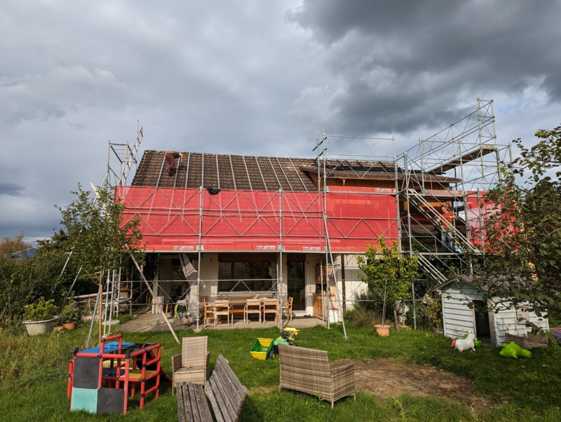

Auf dieser Baustelle lernte ich auch den Fachplaner kennen. Er bietet die Planung an und stellt das Werkzeug sowie das Fachwissen zur Verfügung. Dieses Angebot ist ähnlich zu den bekannten Solargenossenschaften. Das Material kann zum Einkaufspreis aus dem Grosshandel bezogen werden. Wenn der Selbstbauer nicht vom Fach ist, führt er auch kritische elektrische Arbeiten wie das Krimpen von Steckern aus. Auch die Bürokratie wurde vom Fachmann erledigt, da gewisse Prozesse nur für Firmen oder ähnliche Entitäten gedacht sind und nicht für Privatpersonen.

Ende des Jahres 2023 erstellte ich die ersten Studien zu unserem Haus. Es gibt verschiedene frei zugängliche PV-Rechner im Internet. Aber ich wollte ein Tool, das mir etwas mehr bietet. In der c't wurde das Programm PV*SOL vorgestellt. Das nutze ich fortan. Leider läuft es nicht auf meinem Fedora. Ich musste mit Gnome Boxes eine Windows-VM nutzen. Auch noch im selben Jahr trafen wir uns mit dem Fachplaner, und er erstellte eine Offerte für unsere Anlage.

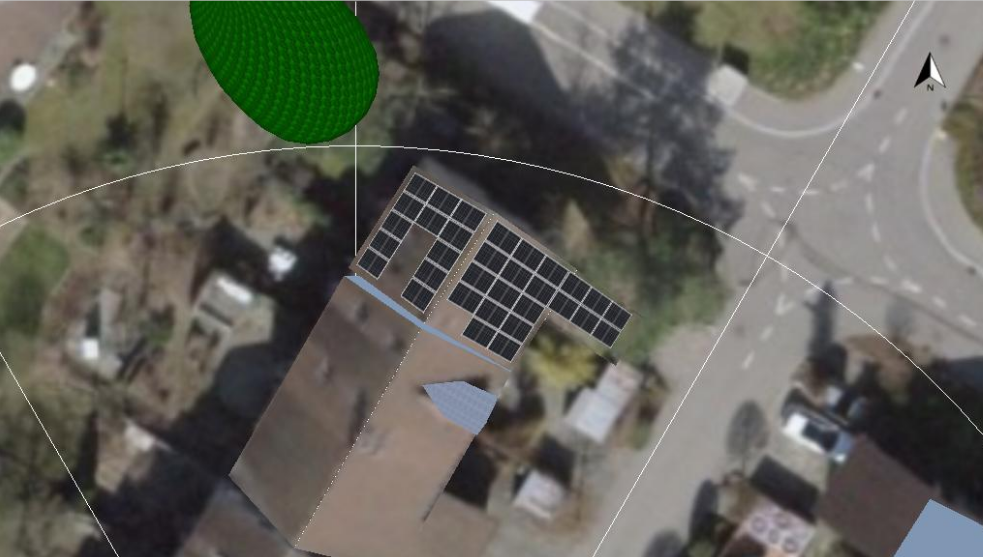

Der Preisunterschied war signifikant. Wie oben erwähnt, kostet eine schlüsselfertige Anlage ca. 35'000 CHF. Abzüglich [Einmalvergütung](https://de.wikipedia.org/wiki/Photovoltaik_in_der_Schweiz#F%C3%B6rderung_der_Photovoltaik) und Steuerersparnissen belaufen sich die Kosten immer noch auf ca. 25'000 CHF. Die Selbstbauvariante kostet mit denselben Abzügen ca. 15'000 CHF. Meine Frau und ich entschlossen uns, die Anlage selber zu bauen, und bestellten das Material im Januar 2024 mit dem Ziel, im April mit dem Bau zu beginnen.

Bis zum Baustart im April musste ich noch einige Dinge organisieren. Ich übernahm die Bauleitung selbst.

- Zum Baubeginn musste ein Gerüst stehen. Als Selbstbauer ist dies zwar nicht Pflicht, aber bei der Sicherheit sollte man wirklich nicht sparen.
- Ein Elektriker muss organisiert werden, der den Wechselstromanschluss ausführt und ihn abnimmt. Die Gleichstromverkabelung darf im Selbstbau ausgeführt werden.
- Ein Baum musste gefällt werden, der das halbe Süddach abschattete.
- Und zu guter Letzt musste ich noch ein paar helfende Hände organisieren.

Als der April da war, stand das Gerüst, und das Material war geliefert. Meine Frau und ich hatten eine Woche Urlaub, und das Wetter passte auch.

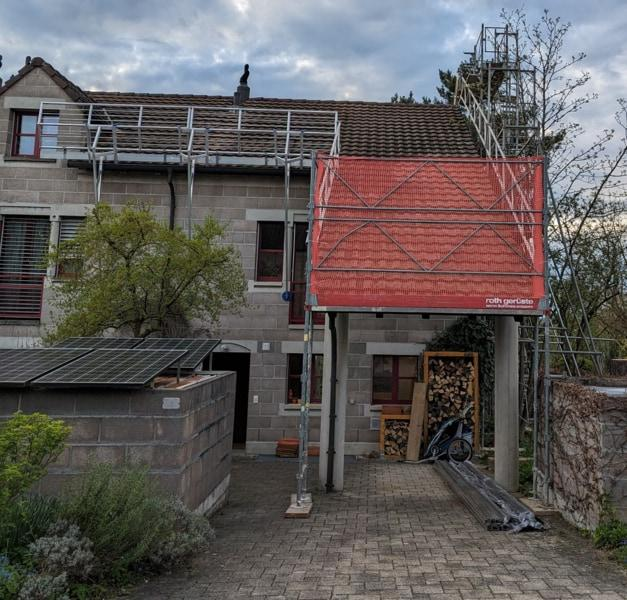

## Der Aufbau

Folgend möchte ich euch die einzelnen Schritte beim Aufbau einer PV-Dachanlage zeigen. Zu dem konkreten Vorgehen findet man leider sehr wenig oder unvollständige Informationen im Internet. Ich möchte euch zeigen, dass es sich nicht um Raketenwissenschaft handelt. Jeder mit handwerklichem Geschick ist in der Lage, eine PV-Anlage zu bauen. Natürlich muss jedes Hausdach individuell abgeklärt werden. Aber im Grundsatz wird ein Schrägdach überall gleich aufgebaut. Auch die unterschiedlichen Montagesysteme sind im Grundsatz gleich.

Die Arbeiten teilen sich ungefähr in die folgenden Arbeitsschritte auf:

- Dachhaken montieren (50 %)
- Unterkonstruktion montieren (30 %)
- Verkabelung auf dem Dach (5 %)
- Solarpanels montieren (5 %)
- Wechselrichter und Steigleitung montieren (10 %)

Bevor wir mit den Arbeiten auf dem Dach angefangen haben, haben wir anhand der Statikberechnung und dem Aufbauplan alle Dachhaken und die Modulfelder auf dem Dach eingemessen und mit Kreide markiert. Dies ist ein sehr wichtiger Schritt und muss gewissenhaft und nach Angaben der Berechnungen ausgeführt werden.

Nun beginnen wir mit den Dachhaken. Dies ist die anstrengendste und langwierigste Arbeit. Die Dachhaken verbinden die PV-Anlage mit dem Hausdach. Dazu werden die Dachhaken mit langen Schrauben mit den Dachsparren verschraubt. Der Dachhaken schaut zwischen zwei Ziegeln aus dem Dach. Damit die Ziegel weiterhin dicht abschliessen, muss ein kleines Stück vom oberen und unteren Ziegel ausgeschnitten werden. Geübte Dachdecker machen das mit einem gezielten Hammerschlag. Wir haben es mit dem Winkelschleifer und einer Diamantscheibe gemacht. Das geht schnell, präzise und auch sehr einfach. Die Dachhaken müssen in der Höhe ziemlich akkurat eingepasst werden. Da später die Last senkrecht zur Dachfläche eingeleitet wird, kann sich der Dachhaken leicht durchbiegen. Dann darf er keinesfalls auf den darunterliegenden Ziegel drücken. Das kann den Ziegel zum Brechen bringen, und das Dach wird undicht.

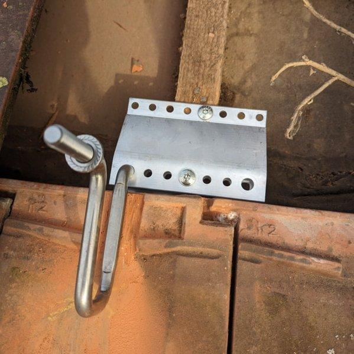
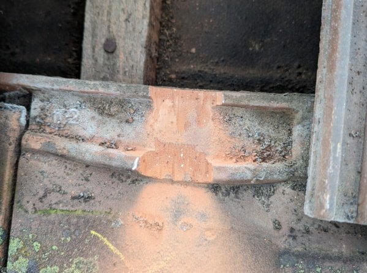
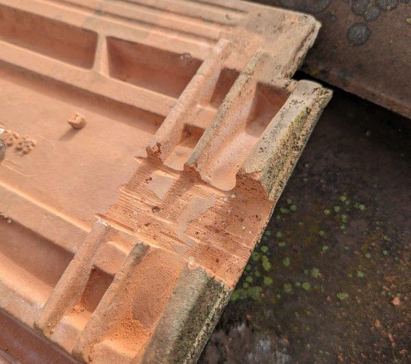
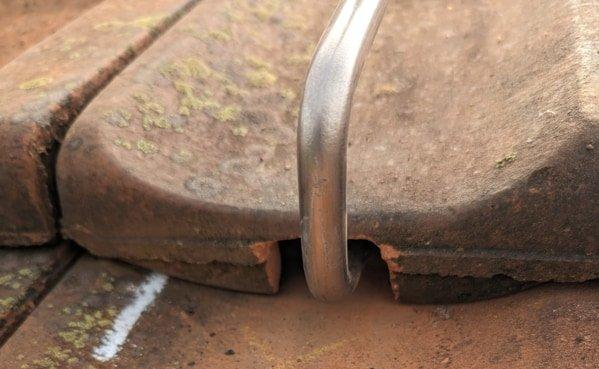

Sobald alle Dachhaken montiert sind, kann die DC-Verkabelung zwischen Unterdach und den Ziegeln erfolgen. Wir haben die Distanzen auf dem Dach zuerst ausgemessen und dann am Boden die Leitungen zugeschnitten und bereits in Elektrowellrohre eingezogen. Das macht die Arbeit auf dem Dach einfacher. Die Steigleitung vom Keller zum Dach verläuft bei uns aussen am Haus direkt neben dem Fallrohr der Dachrinne. So war nur ein kleiner Durchbruch im Keller nach draussen notwendig. Zusätzlich zu den DC-Leitungen musste auch ein Potentialausgleich vom Keller bis aufs Dach gezogen werden, an den die Aluminium-Unterkonstruktion angeschlossen wird.

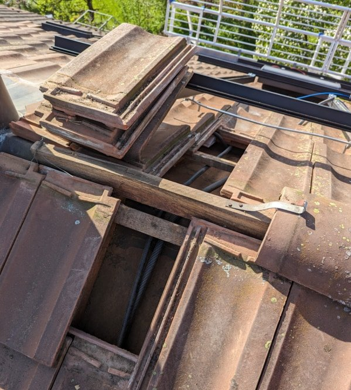
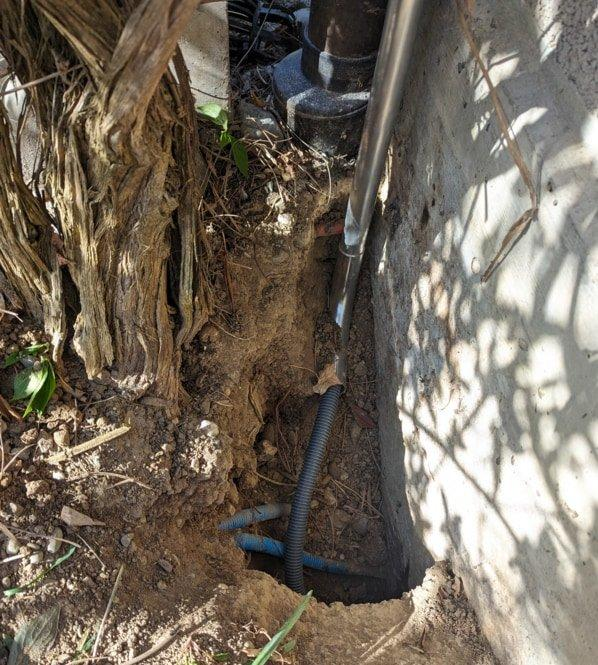

Danach hatten wir einen Tag schlechtes Wetter. Meine Frau und ich nutzten diese Gelegenheit, und wir montierten den Wechselrichter, den Generatoranschlusskasten (GAK) mit den Überspannungsableitern, die Potentialausgleichschiene und den Hauptschalter im Keller. Die Stecker auf den DC-Leitungen werden gekrimpt. Das ist im Prinzip kein Hexenwerk, allerdings muss man diese Verbindungen sehr genau und sorgfältig ausführen. Die meisten Brände entstehen, wenn diese Krimpverbindungen einen zu hohen Widerstand aufweisen. Da ich vor bald 20 Jahren eine Lehre als Automatiker abgeschlossen habe, bin ich bei Steckverbindungen im Prinzip vom Fach :-).

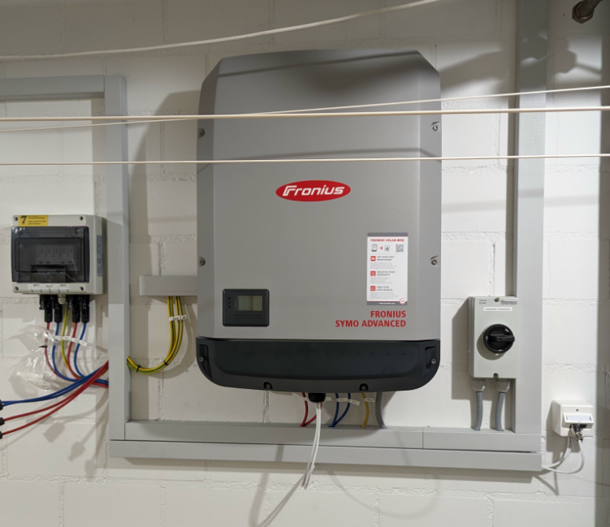

Am nächsten Tag war das Wetter wieder besser. Also machten wir uns an die Unterkonstruktion. Die Unterkonstruktion besteht aus Aluminiumprofilen. Beim Einlegesystem von Novotegra, das wir verwendet haben, werden senkrecht sogenannte C-Schienen und waagerecht darauf die Einlegeschienen montiert. Die C-Schienen werden parallel zur Dachebene ausgerichtet. Die waagerechten Einlegeschienen werden danach im korrekten Abstand zueinander auf den C-Schienen montiert. Wenn alle Schienen korrekt ausgerichtet sind, werden alle Schraubverbindungen mit dem entsprechenden Drehmoment angezogen. Die Unterkonstruktion wird dann an den Potentialausgleich angeschlossen. Dies ist im Prinzip die schönste Arbeit. Man ist viel auf dem Dach und sieht sehr schnell Fortschritt. Zugegeben, es braucht ein wenig Übung, damit am Schluss alles gut ausgerichtet ist.

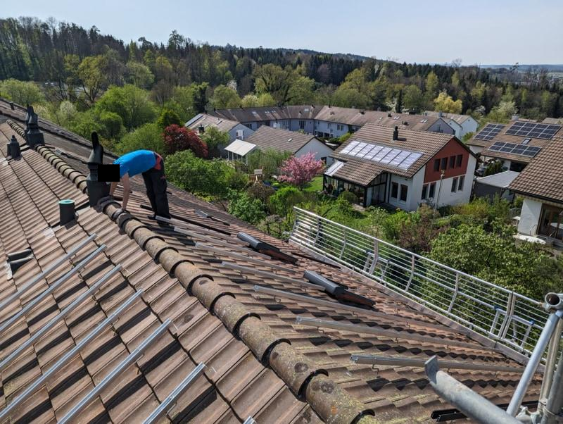
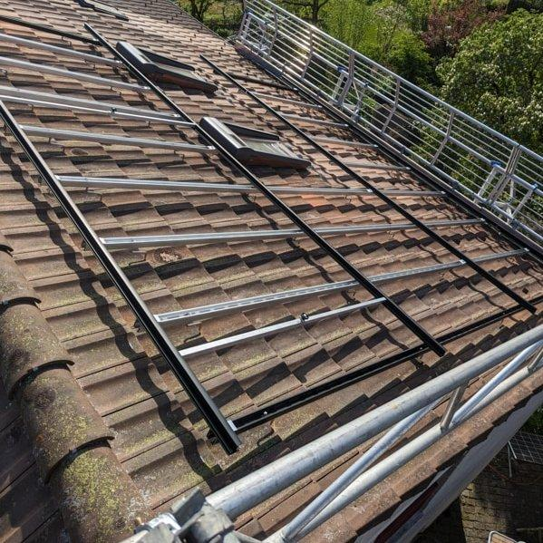

Sobald die Unterkonstruktion abgeschlossen ist, ist die Anlage eigentlich so gut wie fertig. Es fehlen nur noch die Hauptprotagonisten, die Solarpanels. Alle vorhergehenden Arbeiten haben genau sechs Arbeitstage in Anspruch genommen. Da die Solarpanels und das restliche Material bei uns unterschiedliche Liefertermine hatten, mussten wir einen Baustopp von drei Wochen einlegen. In diesen drei Wochen schloss der Elektriker noch den Wechselrichter an das öffentliche Stromnetz an. Als die 33 Solarpanels dann geliefert wurden, dauerte die Montage dieser nur noch knappe zwei Stunden. Nach der Montage wurde vom Fachplaner nochmals alles kontrolliert, und er machte noch eine Isolationsmessung auf der DC-Seite. Danach wurde der Hauptschalter eingeschaltet, und die PV-Anlage ging nach ein paar Minuten direkt ans Netz.

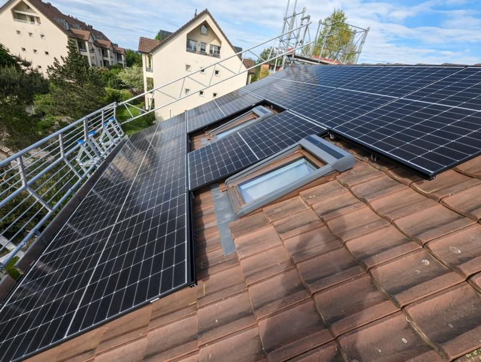
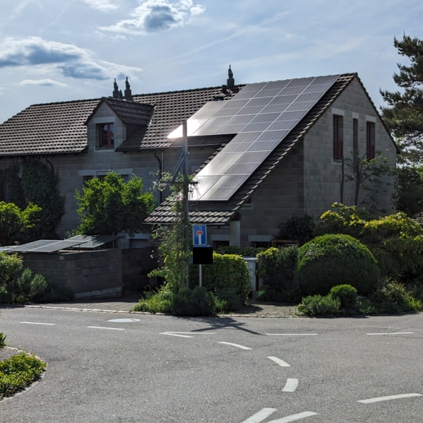

## Abnahme und Förderung

In der Schweiz gibt es im Prinzip zwei Förderprogramme. Das erste ist wie oben erwähnt die Einmalvergütung. Mit einer Einmalvergütung erhalten Anlagenbetreiber von Photovoltaikanlagen einen einmaligen Investitionsbeitrag. Dieser ist von der Grösse, Lage und Ausrichtung der PV-Analge abhängig. Diese Einmalvergütung wird jedes Jahr ein bisschen weniger und wird wohl in ein paar Jahren ganz verschwinden. Dies ist auch gut so, da sich die PV-Anlagen bereits ohne diese Förderung selber tragen. Die zweite Förderung ist eigentlich mehr eine indirekte Förderung. Seit 2013 besteht in der Schweiz die gesetzliche Pflicht, die gesamte Stromproduktion aus Kraftwerken mit einer Netzanschlussleistung von über 30 kVA mittels Herkunftsnachweis zu erfassen und unabhängig beglaubigen zu lassen. Der Hauptzweck der Herkunftsnachweise (HKN) ist es, gegenüber den Endverbrauchern Transparenz zu schaffen. Bei der Stromproduktion werden HKN erstellt, welche später gegenüber dem Endverbraucher in der Stromkennzeichnung verwendet werden. Zudem erhält Strom aus erneuerbaren Energien durch den HKN einen Mehrwert, der Produzenten für höhere Produktionskosten entschädigt. Damit man die Einmalvergütung sowie die HKN ausbezahlt bekommt, muss jede PV-Anlage von einem unabhängigen Unternehmen beglaubigt und abgenommen werden. Auch unser lokaler Energieversorger machte zusätzlich noch eine Abnahme.

## Monitoring

Bei der Auswahl des Wechselrichters legte ich grossen Wert darauf, dass ich die Überwachung der Anlage lokal ohne einen Cloud-Dienst des Herstellers bewerkstelligen kann. Da ich bereits Home Assistant nutze, sollte sich der Wechselrichter in Home Assistant integrieren lassen. Meine Wahl fiel auf einen Fronius Symo Advanced Wechselrichter. Einerseits gibt es bereits eine Integration in Home Assistant, andererseits bietet das Gerät eine Schnittstelle über Modbus TCP. Diese Schnittstelle verwendet den SunSpec-Standard. So lassen sich alle Werte problemlos und ohne Cloud auslesen.

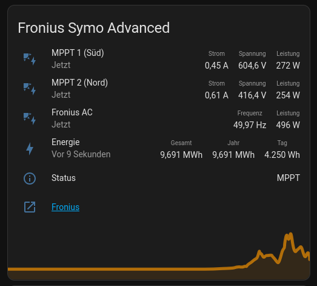

## Baukosten, Ertrag und Amortisation

Die Baukosten blieben im kalkulierten Rahmen, was mich natürlich sehr gefreut hat. Durch den Selbstbau haben wir ca. 10'000 CHF gespart. Natürlich hat es uns eine Woche Urlaub gekostet und einige Stunden an Planungs- und Einarbeitungszeit. Ich verbuche diese Zeit aber nicht als Arbeitszeit, sondern als Freizeit und Hobby.

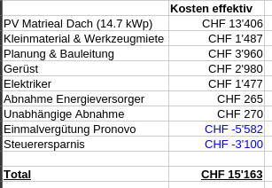

Die PV-Anlage läuft nun seit dem 02. Mai 2024 und hat bis dato 9'700 kWh Strom erzeugt. Der Jahresertrag sollte sich auf ca. 13'000 kWh belaufen. Dank dem Energie-Dashboard von Home Assistant habe ich den Ertrag sowie den Verbrauch gut im Blick.

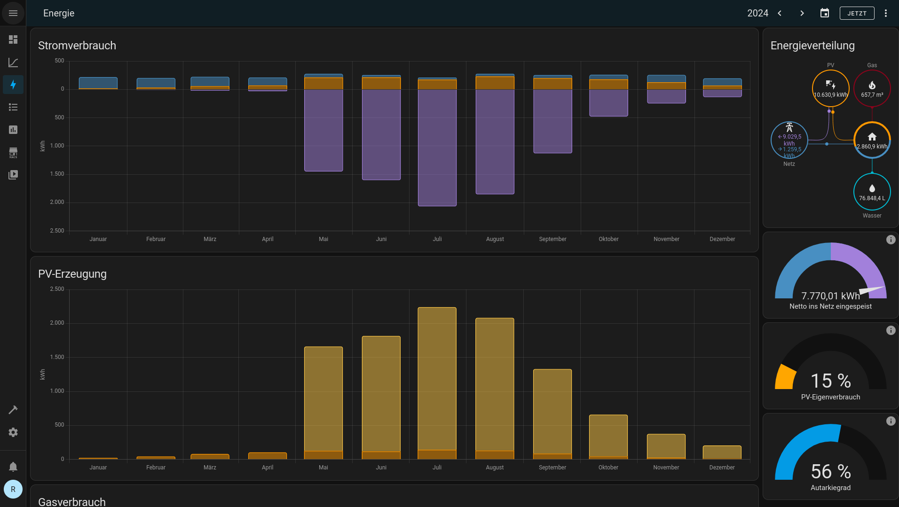

In diesem Jahr habe ich bereits 1'900 CHF Vergütung vom Energieversorger ausgezahlt bekommen sowie ca. 200 bis 300 CHF Stromeinkauf gespart. Mit den aktuellen Strompreisen und Vergütungen wird sich die PV-Anlage in sieben bis acht Jahren finanziell amortisiert haben. Das ist natürlich erfreulich, war aber keinesfalls unsere Hauptmotivation. Viel wichtiger war uns die energetische Amortisation, welche bereits in [1.5 Jahren eintreten](https://www.pv-magazine.de/2021/07/28/fraunhofer-ise-energetische-amortisationszeit-fuer-photovoltaik-dachanlagen-liegt-weltweit-zwischen-044-und-142-jahren/) wird.

## Ausblick

Das nächste Projekt, um weiter freie Energie einzusammeln und nutzbar zu machen, ist, die alte Gastherme durch eine Wärmepumpe zu ersetzen. Dazu sammle ich nun seit zwei Heizperioden Daten wie Temperaturen und Lastverläufe, ebenfalls mit Home Assistant und diversen Sensoren. Dies hat den Zweck, die Wärmepumpe präzise dimensionieren zu können. Aber dazu werde ich in einem folgenden Artikel schreiben.
