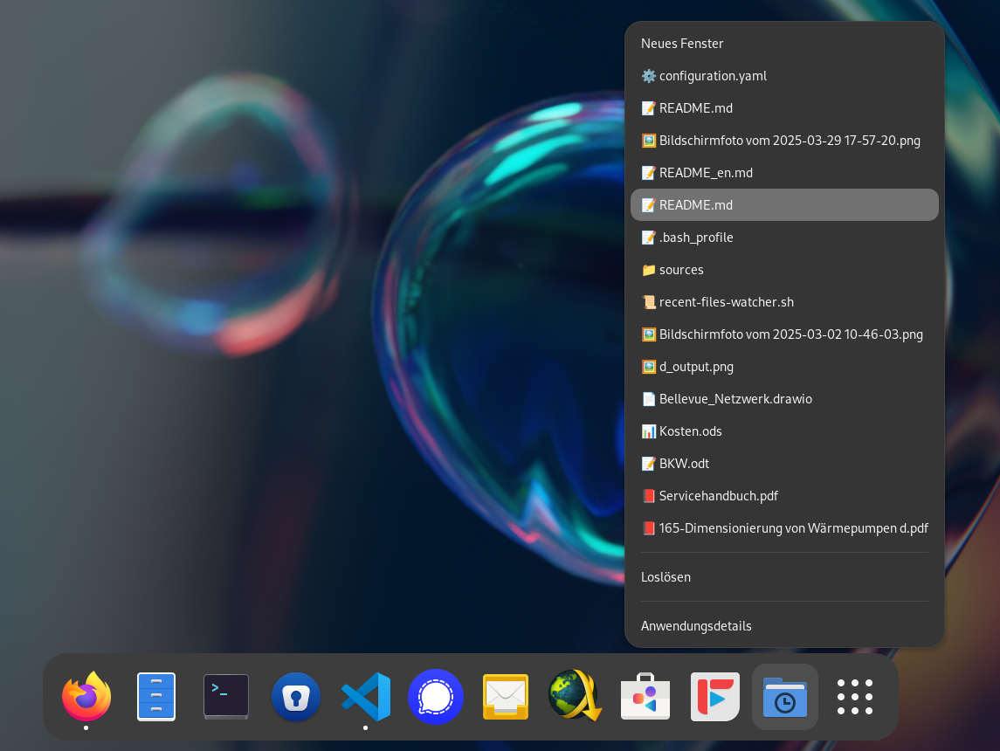

# Prompt → Skript → Zuletzt verwendet

Unter Windows kann man im Kontextmenü der Taskleiste schnell auf zuletzt verwendete Dateien zugreifen – eine Funktion, die ich oft nutze. Unter GNOME gibt es so etwas leider nicht. Also habe ich mir dieses Feature einfach selbst gebaut – mit Bash und etwas Unterstützung von ChatGPT.



## Vibe-Coding mit LLMs: Vom Zweifel zur gezielten Nutzung

Vibe-Coding ist aktuell in aller Munde. Ich war anfangs ziemlich skeptisch – vor allem wegen der bekannten Schwächen von Sprachmodellen: Halluzinationen, begrenzter Kontext, fehlendes echtes Verständnis. Ich dachte mir: Die Intelligenz muss doch immer noch vom Programmierer kommen.

Und das sehe ich eigentlich heute immer noch so. Der kreative Prozess, die Architektur und das eigentliche Verstehen – das kann (und soll) die KI einem nicht abnehmen. Trotzdem: Inzwischen schätze ich LLMs als Werkzeug sehr, vor allem beim Umsetzen von Teilaufgaben. Statt mühsam Foren durchzulesen oder Dokumentationen zu wälzen, frage ich gezielt die KI – und bekomme oft schnell eine brauchbare Antwort oder sogar direkt ein Skript.

So auch bei diesem Projekt: Ich habe meine Recherche zuerst mit ChatGPT gemacht, Ideen ausprobiert, Varianten diskutiert – und danach liess ich mir ein Bash-Skript schreiben. Wie üblich musste ich die KI von einigen Dingen überzeugen, aber schlussendlich entstand ein lauffähiges Skript.

## Was mein Skript macht

Das Skript überwacht die Datei `~/.local/share/recently-used.xbel`, in der GNOME zuletzt verwendete Dateien speichert. Es liest daraus die aktuellsten 15 Einträge, weist jeder Datei basierend auf ihrem Typ ein passendes Emoji zu (PDF, Bild, Text usw.) und generiert daraus dynamisch eine `.desktop`-Datei mit einem eigenen Kontextmenü.

Diese `.desktop`-Datei lässt sich im GNOME-Anwendungsmenü oder im Dock verwenden – genau wie jede andere App-Verknüpfung. Beim Rechtsklick auf den Eintrag erscheinen im Kontextmenü die zuletzt verwendeten Dateien – direkt verlinkt und startbereit. So lassen sich häufig genutzte Dateien mit einem Klick öffnen, ohne den Dateimanager zu bemühen.

Das Skript läuft im Hintergrund, überwacht Änderungen an der `recently-used.xbel`-Datei und aktualisiert die `.desktop`-Datei automatisch bei Bedarf. Auch ein kleines SVG-Icon wird dabei generiert, das visuell zum Menü passt.

Das Projekt findest du auf GitHub:  
[https://github.com/MrReSc/recent-files-watcher](https://github.com/MrReSc/recent-files-watcher)

## Installation und Verwendung

Damit das Skript korrekt läuft, sind nur wenige Schritte nötig:

1. **Skript speichern und ausführbar machen**

   Speichere das Skript beispielsweise unter `~/.local/bin/recent-files-watcher.sh` und mache es ausführbar:

   ```bash
   chmod +x ~/.local/bin/recent-files-watcher.sh
   ```

2. **Autostart einrichten**

   Damit das Skript bei jedem Systemstart automatisch ausgeführt wird, kannst du es in dein Profil eintragen. Öffne dazu z. B. deine `~/.bashrc`, `~/.bash_profile` oder `~/.profile` und füge folgende Zeile hinzu:

   ```bash
   ~/.local/bin/recent-files-watcher.sh &
   ```

## Disclaimer

Ich habe das Bash-Skript Zeile für Zeile gelesen und verstehe grundsätzlich, was es macht. Trotzdem bin ich nicht bei jedem Detail ganz sicher. Besonders das Debuggen fällt mir schwer, wenn ich den Code nicht komplett selbst geschrieben habe.

Trotzdem finde ich: Dieses Projekt zeigt gut, wie man mit Unterstützung von LLMs wie ChatGPT eigene Ideen umsetzen kann – auch ohne Bash-Expert:in zu sein.
