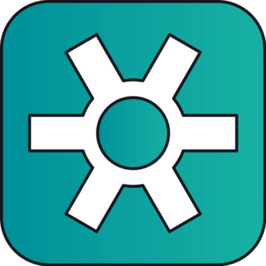
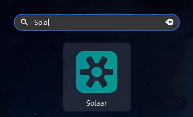
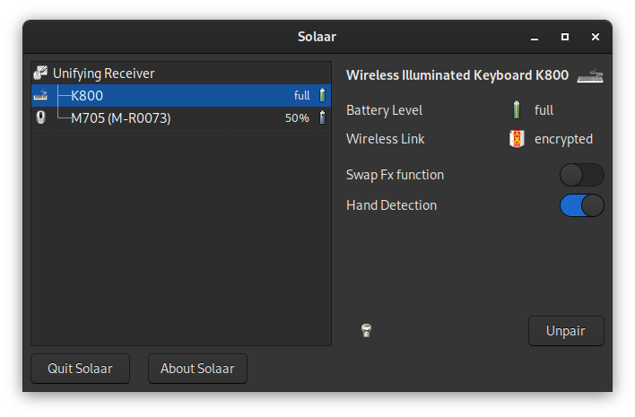

# Solaar - Geräte-Manager für Logitech Unifying Geräte
Wenn man eine Tastatur und eine Maus von Logitech besitzt, die nicht in einem Bundle gekauft wurden, dann werden zwei USB-Anschlüssen am Laptop oder PC blockiert. 

Mit einem [Unifying Receiver](https://de.wikipedia.org/wiki/Logitech#Unifying_Receiver), können bis zu sechs verschiedene drahtlose Eingabegeräte wie Tastaturen oder Mäuse verbunden werden. Die Software für die Konfiguration des Unifying Receiver wird offiziell nur für Windows und macOS angeboten. Hier kommt [Solaar](https://pwr-solaar.github.io/Solaar/) ins Spiel. Solaar unterliegt der `GNU Public License, v2` und der Quellcode ist auf [Github](https://github.com/pwr-Solaar/Solaar) verfügbar.



Solaar ist ein GNU/Linux Geräte-Manager für viele Logitech Tastaturen, Mäuse und Trackpads, die eine kabellose Verbindung zu einem USB Unifying-, Lightspeed- oder Nano-Empfänger herstellen, direkt über ein USB-Kabel verbunden werden oder eine Verbindung über Bluetooth herstellen.

Solaar kann als GUI-Anwendung oder über die Kommandozeilen verwendet werden. Beide Schnittstellen sind in der Lage, die angeschlossenen Geräte aufzulisten und Informationen zu jedem Gerät anzuzeigen, oft auch den Batteriestatus. Solaar ist in der Lage, Geräte mit Empfängern zu koppeln und die Kopplung aufzuheben, sofern dies vom Gerät und Empfänger unterstützt wird. Solaar kann auch einige veränderbare Eigenschaften von Geräten steuern, wie z. B. den  Bildlauf oder das Verhalten von Funktionstasten.

## Installation
Für einige Linux Distributionen sind [vorgefertigte Pakete](https://github.com/pwr-Solaar/Solaar#prebuilt-packages) verfügbar. Bei Fedora ist die Installation dank des fertigen Paketes sehr einfach:

```
sudo dnf install solaar
```

## Benutzung
Nach der Installation kann Solaar gestartet werden. 



Das Hauptfenster zeigt alle Logitech Empfänger und Geräte an, die Solaar erkennt. Um einen Empfänger oder ein Gerät auszuwählen, klicken man im linken Teil des Fensters darauf.



Nun können neue Geräte mit dem Empfänger gekoppelt oder nicht mehr benötigte Kopplungen aufgehoben und einzelne Einstellungen der Geräte angepasst werden. Die Bedienung ist eigentlich selbsterklärend. Leider ist die Solaar nicht auf Deutsch übersetzt. Wenn Fragen auftauchen, gibt es eine englische [Bedienungsanleitung](https://pwr-solaar.github.io/Solaar/usage). 
