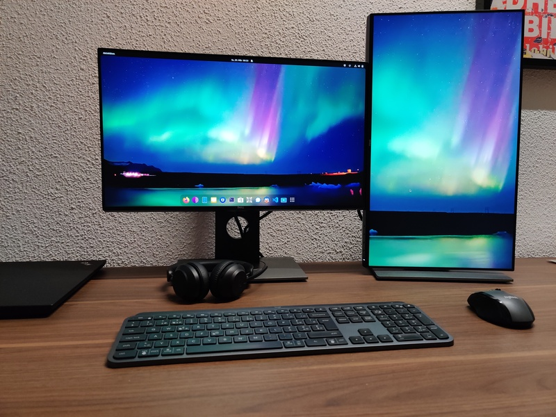
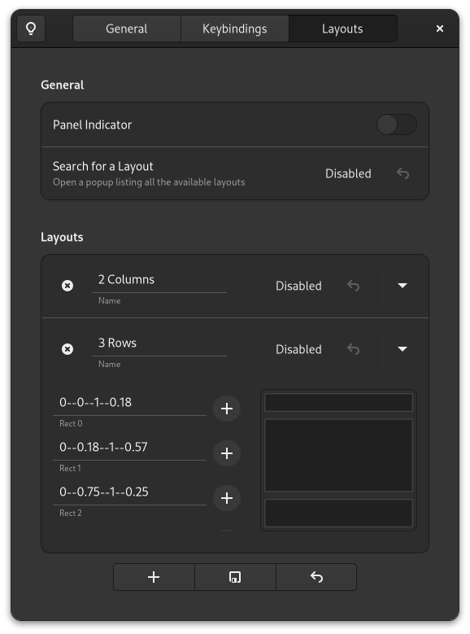
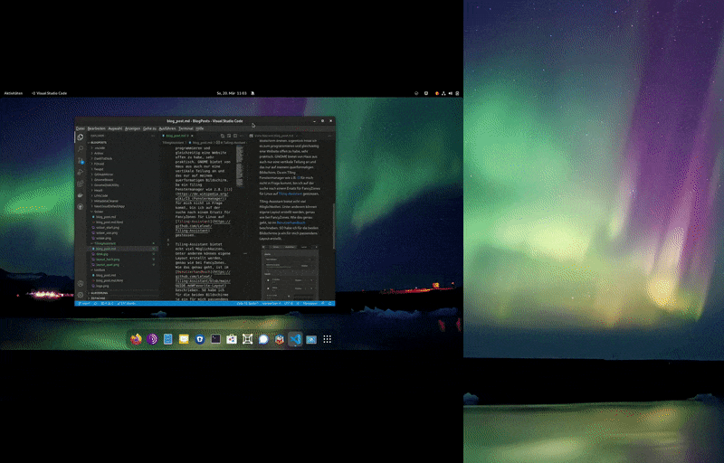

# Tailing-Assitant - FancyZones für Linux

Beruflich nutze ich ein Bildschirm im Quer- und einem im Hochformat und das Betriebssystem Windows 10. Hauptsächlich brauche ich den hochformatigen Bildschirm für die Entwicklung einer Anwendung, die dafür ausgelegt ist. Zudem ist es recht praktisch, um Dokumentationen zu lesen. Wenn ich aber mal an etwas anderem arbeite und den Hochformat Bildschirm für andere Fenster benötige, ist es immer sehr mühsam die einzupassen. Standardmässig kann Windows 10 nur das Fenster vertikal teilen, wenn man es an den Rand zieht. Bei einem hochformatigen Bildschirm bringt das aber nicht viel. Um das Problem zu lösen, kann man unter Windows die von Microsoft entwickelten [PowerToys](https://de.wikipedia.org/wiki/PowerToys) (MIT-Lizenz) installieren und mit FancyZone die Kacheln anpassen.

Da mein beruflicher Arbeitsplatz auch mein privater Arbeitsplatz ist (eigentlich ist es andersrum) und ich privat nur Linux (Fedora 35 mit GNOME) verwendet, möchte ich nicht immer den hochformatigen Bildschirm drehen. Eigentlich finde ich es um zu Programmieren und gleichzeitig eine Website offen zu haben, sehr praktisch. GNOME bietet von Haus aus auch nur eine vertikale Teilung an und das nur auf meinem querformatigen Bildschirm. Da ein Tiling Fenstermanager wie z.B. [i3](https://de.wikipedia.org/wiki/I3_(Fenstermanager)) für mich nicht infrage kommt, bin ich auf der Suche nach einem Ersatz für FancyZones für Linux auf [Tiling-Assistant](https://github.com/Leleat/Tiling-Assistant) gestossen. Die Installation kann sehr einfach über die [GNOME extension](https://extensions.gnome.org/extension/3733/tiling-assistant/) Website erledigt werden.

Tiling-Assistant bietet echt viel Möglichkeiten. Unter anderem können eigene Layouts erstellt werden, genau wie bei FancyZones. Wie das genau geht, ist im [Benutzerhandbuch](https://github.com/Leleat/Tiling-Assistant/blob/main/GUIDE.md#Favorite-Layout) beschrieben. Dort findet ihr auch alle anderen Funktionen von Tiling-Assistant beschrieben. So habe ich für die beiden Bildschirme je ein für mich passendes Layout erstellt.

So konnte ich mein Ziel, eine Kachel auf dem hochformatigen Bildschirm mit der Höhe des querformatigen Bildschirms zu bekommen, sehr einfach erreichen.

Das Einstellungsmenü von Tiling-Assistant ist leider noch nicht auf Deutsch verfügbar. Ich habe aber mal eine Übersetzung erstellt und ein [Pull Request](https://github.com/Leleat/Tiling-Assistant/pull/152) eröffnet. Das ist nebenbei eine einfache Methode zu Open-Source-Projekten beizutragen, auch wenn man nicht programmieren kann.

