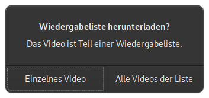
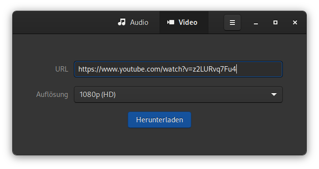
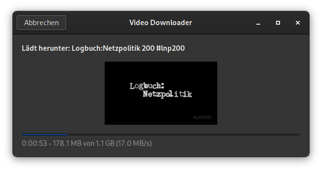

# Video Downloader - Einfaches Frontend zu youtube-dl

Mit [Video Downloader](https://github.com/Unrud/video-downloader) kann man Videos von Websites mit einer einfach zu bedienenden Benutzeroberfläche herunterladen.


Video Downloader bietet die folgenden Funktionen:

* Konvertieren von Videos in MP3
* Unterstützt passwortgeschützte und private Videos
* Download einzelner Videos oder ganzer Wiedergabelisten
* Wählt automatisch ein Videoformat basierend auf Ihren Qualitätsansprüchen

Video Downloader basiert auf `youtube-dl` und unterliegt der `GNU GENERAL PUBLIC LICENSE, v3`. Der Quellcode ist auf [Github](https://github.com/Unrud/video-downloader) verfügbar.

## Installation
Video Downloader ist als [Flatpak](https://flathub.org/apps/details/com.github.unrud.VideoDownloader), [Snap](https://snapcraft.io/video-downloader) oder auf `rpm` Paket für Fedora verfügbar.

```bash
# Flatpak
flatpak install flathub com.github.unrud.VideoDownloader

# Snap
sudo snap install video-downloader

# RPM
sudo dnf install video-downloader
```

## Benutzung
Wenn man nur die Audiospur eines Videos möchte, kann man nach der Vorwahl von `Audio` einfach den entsprechenden Link in das `URL` Feld einfügen und auf Herunterladen drücken.


Falls es sich um eine Wiedergabeliste handelt, hat man die Wahl alle oder nur das einzelne Video herunterzuladen.



Möchte man ein Video herunterladen, ist das Vorgehen identisch zum Audio. Zusätzlich kann noch die gewünschte Qualität eingestellt werden.




## Versteckte Einstellungen
Das Verhalten des Programms kann mit [GSettings](https://developer.gnome.org/GSettings/) noch angepasst werden. Das Vorgehen ist auf der [Projektseite](https://github.com/Unrud/video-downloader#hidden-configuration-options) beschrieben. Ich habe die diese Einstellungen selbst nicht getestet.

### Download Ordner
Die Voreinstellung für den Download Ordner ist `xdg-download/VideoDownloader`. Falls man das Ändern möchte, kann ein absoluter Pfad oder ein relativer Pfad wie `~/Downloads/VideoDownloader` oder [xdg-download/VideoDownloader](https://wiki.ubuntuusers.de/Homeverzeichnis/#Vorgegebene-Verzeichnisse) verwendet werden.

**Flatpak**
```bash
flatpak run --command=gsettings com.github.unrud.VideoDownloader set com.github.unrud.VideoDownloader download-folder '~/VideoDownloader'
```
**Snap**
```bash
snap run --shell video-downloader -c 'gsettings "$@"' '' set com.github.unrud.VideoDownloader download-folder '~/VideoDownloader'
```
### MPEG bevorzugen
Bevorzugt man `MPEG` Videos anstelle von freien Formaten, wenn beide mit derselben Auflösung und Bildrate verfügbar sind, kann man das auch Ändern.

**Flatpak**
```bash
flatpak run --command=gsettings com.github.unrud.VideoDownloader set com.github.unrud.VideoDownloader prefer-mpeg true
```
**Snap**
```bash
snap run --shell video-downloader -c 'gsettings "$@"' '' set com.github.unrud.VideoDownloader prefer-mpeg true
```


