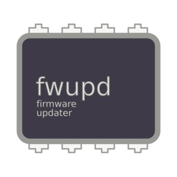
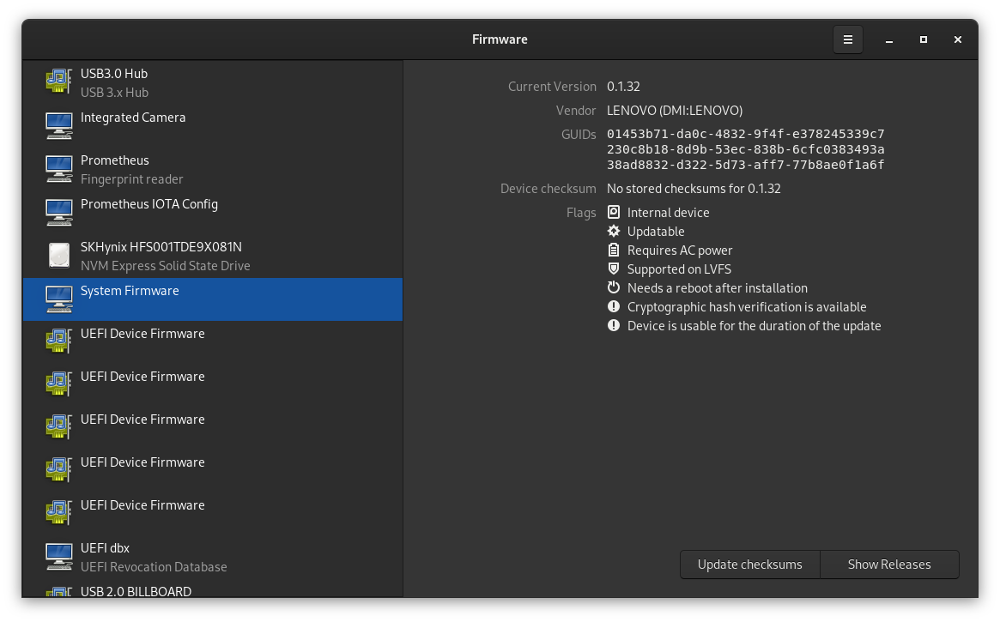
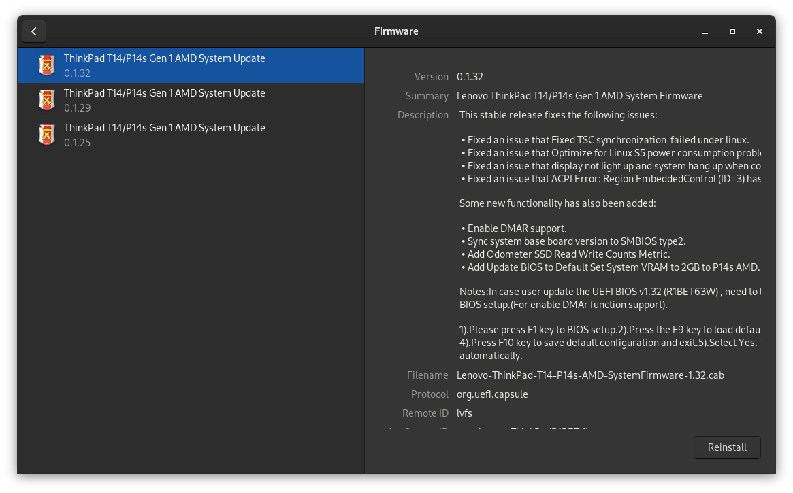

# Firmaware Updates unter GNU/Linux

Seit einigen Monaten besitze ich ein neues ThinkPad, ein `P14s AMD 1st Gen`, welches Linux zertifiziert ist und ohne Betriebssystem gekauft werden kann. Leider gab es im UEFI einen nervigen Bug. Wenn das Notebook ausgeschaltet ist, wird innert wenigen Tagen der Akku geleert. Zusätzlich zu diesem Problem wurden auch noch diverse andere Bugs gemeldet, die mich persönlich aber nicht betreffen. Im Lenovo Forum gibt es einen riesigen [Thread](https://forums.lenovo.com/topic/view/27/5037674?page=1), indem die Probleme mit dem Linux verantwortlichen diskutiert werden. Es ist schön zu sehen, dass sich bei Lenovo jemand um die anliegend er Linux Nutzer kümmert.



Als ich vor 6 Jahren mein vorhergehendes Notebook gekauft habe (Dell XPS13 Developer Edition mit Ubuntu), hatte ich ähnliche Probleme mit einem Thunderbolt 3 Dock. Leider gab es damals keinen anderen Weg, als über Microsoft Windows, um diese spezifische Firmware zu aktualisieren. Da Firmware im Vergleich zu Treibern selten unter freien Lizenzen stehen, liegen sie auch nicht dem Kernel bei. Sie werden als separate Pakete oder gar nicht zur Verfügung gestellt. Zum Glück wurde in diesem Jahr (2015) `fwupd` und `LVFS` ins Leben gerufen und die Situation besserte sich binnen kurzer Zeit. Dell war einer der ersten grossen Hersteller, die einem das Updaten der Firmware, auch ohne Redmonder Betriebssystem ermöglichten.

## LVFS
Der Linux Vendor Firmware Service ([LVFS](https://fwupd.org/)) stellt einerseits den Herstellern Ressourcen und Unterstützung zur Verfügung beim paketieren der Firmware Updates und andererseits ist er auch das Online-Repository für die Firmware Update Pakete.

Zusätzlich zu den Firmware Binärdateien müssen die Hersteller noch eine Gerätespezifische [Metadaten](https://lvfs.readthedocs.io/en/latest/metainfo.html) Datei einreichen.

Inzwischen sind viele grosse Hersteller beim `LVFS` vertreten. Unter anderen Lenovo, Dell, HP, TUXEDO Computers, Intel, Logitech und [viele mehr](https://fwupd.org/lvfs/vendors/). Unter [https://fwupd.org/lvfs/devices/](https://fwupd.org/lvfs/devices/) können alle unterstützen Geräte abgerufen werden. `LVFS` wird auch von allen grossen Distributionen verwendet, um die Metadaten für die Firmwareupdate Clients zur Verfügung zu stellen.

## fwupd
`fwupd` ist eine Open Source [Daemon](https://de.wikipedia.org/wiki/Daemon) um die Insatllation von Firmware Updates auf GNU/Linux-basierten Systemen zu ermöglichen. Er wird vom GNOME Maintainer Richard Hughes entwickelt und nutzt den `LVFS`.

Wenn dein Gerät beim `LVFS` [gelistet](https://fwupd.org/lvfs/devices/) ist, kannst du in der Kommandozeile mit folgenden Befehlen überprüfen ob Updates vorhanden sind und diese allenfalls installieren.

```
# Alle erkannten Geräte anzeigen
fwupdmgr get-devices

# Die neuesten Metadaten vom LVFS heruntergeladen
fwupdmgr refresh

# Wenn Updates für irgendwelche Geräte auf dem System verfügbar sind, werden sie angezeigt
fwupdmgr get-updates

# Alle Updates für das System heruntergeladen und angewenden
fwupdmgr update
```
Updates, die live angewendet werden können, werden sofort durchgeführt.
Aktualisierungen, die beim Hochfahren ausgeführt werden, werden für den nächsten Neustart bereitgestellt.

## Grafische Frontends
Laut dem [Arch Wiki](https://wiki.archlinux.org/title/Fwupd#Installation) gibt es folgende grafische Frontends:

* GNOME Software
* KDE Discover
* GNOME Firmware

Da ich mich mit KDE Software überhaupt nicht auskenne, möchte ich nur kurz auf die zwei GNOME Frontends eingehen.

[GNOME Software](https://wiki.gnome.org/Apps/Software) ist das Softwarecenter von der Desktopumgebung GNOME. Wird dort eine zu aktualisierende Firmware erkannt, wird diese zur Installation angeboten und beim nächsten Upgrade mit eingespielt.


[GNOME Firmware](https://gitlab.gnome.org/hughsie/gnome-firmware-updater) wird unter anderen auch von Richard Hughes entwickelt und bietet einige Möglichkeiten, die über ein reines Updaten herausgehen an.

* Upgrade, Downgrade und Neuinstallation von Firmware auf Geräten, die von `fwupd` unterstützt werden.
* Entsperren gesperrter `fwupd` Geräte
* Überprüfen der Firmware auf unterstützten Geräten
* Alle Releases für ein `fwupd` Gerät anzeigen



In der Beschreibung zu meinem spezifischen Update sieht man, dass der anfangs beschriebene Bug behoben wurde.

> • Fixed an issue that Optimize for Linux S5 power consumption problem.



## Quellen
* [https://en.wikipedia.org/wiki/Fwupd](https://en.wikipedia.org/wiki/Fwupd)
* [https://wiki.archlinux.org/title/Fwupd](https://wiki.archlinux.org/title/Fwupd)
* [https://fwupd.org/](https://fwupd.org/)
* [https://github.com/fwupd/fwupd](https://github.com/fwupd/fwupd)