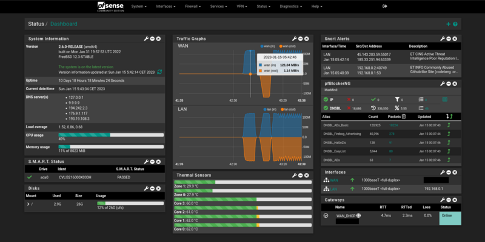

# pfSene als einarmiger Router

Das hier ist ein kurzer Erfahrungsbericht über [pfSense](https://de.wikipedia.org/wiki/PfSense) keine Installationsanleitung.

Seit knapp einem Jahr haben wir in unsrem Haus drei Unifi Access Points im Einsatz. Diese funktionieren vorbildlich. Zusätzlich dazu, hatte ich als Router ein  UniFi Security Gateway (USG). Alles zusammen kann wunderbar über den selbst gehosteten Unifi Controller verwaltet werden. Wirklich gut zu einem bezahlbaren Preis. Aber leider hatte das USG immer wieder Probleme bereitet. Nach ein bis zwei Betriebstagen gab es immer wieder Fehlfunktionen. Zum Beispiel funktionierte plötzlich die Port-Weiterleitung nicht mehr oder es gab ein Speicherüberlauf und die Netzwerkverbindungen vielen komplett aus. Nur das aus- und wieder einstecken schaffte Abhilfe. Ich hatte diese Fehler bei zwei Geräten und bin auch nicht der einzige. Bedauerlicherweise ist es wie immer - die Firma scheint sich nicht mehr für dieses altes Gerät zu interessieren und die Probleme werden nicht mehr behoben. Und hier kommt nun pfSense ins Spiel.

Auf der Suche nach einer Alternative habe ich mir [pfSense](https://de.wikipedia.org/wiki/PfSense) ein wenig genauer angeschaut. pfSense ist eine Firewall-Distribution auf der Basis des Betriebssystems [FreeBSD](https://de.wikipedia.org/wiki/FreeBSD) und des Paketfilters [pf](https://de.wikipedia.org/wiki/Pf_(Paketfilter)). Die Software steht unter der Apache-Lizenz v2. Es gibt die pfSense Community Edition (CE), die gratis ist, sowie die pfSense Plus als Bezahlversion mit offiziellem Support für Geschäftskunden. 

Die minimalen Hardwareanforderungen sehen wie folgt aus:

* 64-bit amd64 (x86-64)-kompatible CPU
* 1 GB Arbeitsspeicher
* 8 GB Festplatten-, SSD oder SD-Karten-Speicher
* einer oder mehrere Netzwerkanschlüsse
* USB-Speicher oder DVD-ROM Laufwerk zur Installation

Als ich nach einem Weg suchte, pfSense einmal auszuprobieren, stiess ich auf den Begriff "one-armed router" oder ["router on a stick"](https://en.wikipedia.org/wiki/Router_on_a_stick). Es handelt sich um eine Methode des Inter-VLAN-Routing (virtuelle lokale Netzwerke), bei der ein Router über ein einziges Kabel mit einem Switch verbunden ist. Da ich im Keller noch einen Intel NUC [D34010WYK](https://ark.intel.com/content/www/de/de/ark/products/76978/intel-nuc-kit-d34010wyk.html) aus dem Jahr 2013 hatte und mein Switch VLAN's unterstützt, schien mir das eine gute Möglichkeit.

Die Installation von pfSense via USB-Stick ist ziemlich einfach. Auch die Konfiguration des LAN und WAN Interface ist ein Kinderspiel. Ich habe mich an diese [Anleitung](https://thunderysteak.github.io/pfsense-single-nic-vlans) orientiert. Nach der Installation und Konfiguration meines Switch begrüsste mich das Webinterface von pfSense und die Internetverbindung funktionierte bereits.

Damit meine Nextcloud auch im lokalen Netzwerk über die Domain und den weitergeleiteten Port erreichbar ist, musste ich [NAT Reflection](https://docs.netgate.com/pfsense/en/latest/recipes/port-forwards-from-local-networks.html) aktivieren.

Als Adblocker habe ich [pfBlocker-NG](https://docs.netgate.com/pfsense/en/latest/packages/pfblocker.html?highlight=pfblock) installiert und konfiguriert. Den OpenVPN Server einzurichten, war schon etwas anspruchsvoller. Aber mit der Hilfe dieser [Anleitung](https://technium.ch/pfsense-openvpn-server-und-user-einrichten-tutorial/) hat es eigentlich auf Anhieb geklappt. 

Zu Testzwecken habe ich noch [Snort](https://de.wikipedia.org/wiki/Snort) installiert und mit der Hilfe der [Doku](https://docs.netgate.com/pfsense/en/latest/packages/snort/setup.html) konfiguriert. Snort ist ein freies [IDS](https://de.wikipedia.org/wiki/Intrusion_Detection_System)/[IPS](https://de.wikipedia.org/wiki/Intrusion_Prevention_System) System. Es dient der Angriffserkennung und Abwehr auf das Netzwerk. Zugegeben, meine Netzwerkkenntnisse reichen nicht aus, um Snort vollumfänglich bedienen zu können oder viele der Regeln zu verstehen. Allerdings sind die Grundeinstellungen sehr gut. Ich musste bis jetzt ca. 10 Regeln unterdrücken, damit unsere normale Internetnutzung ohne Probleme funktioniert. Es ist sehr interessant zu sehen, dass permanent an meine Internt Haustüre(n) gehämmert wird.

Die Performance des einarmigen Routers stellt sich als sehr gut heraus. Wenn ich nicht gleichzeitig grosse Daten im LAN verschiebe, kann über die Full-duplex Ethernet Verbindung mein Gigabit Glasfaseranschluss voll ausgenutzt werden. Der Stromverbrauch des alten Intel NUC liegt zwischen 5 W und 10 W. Und das wichtigste: Es läuft absolut stabil!

